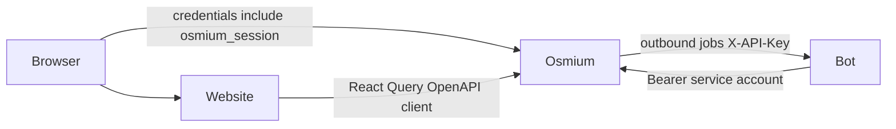

# Osmium Backend Migration Plan

This plan describes how the vZDC website (this repo) moves off its own direct
Prisma/Postgres backend and onto osmium (`../osmium`), the Rust/Axum service that
has been rebuilt to full feature parity with this site (see
`../osmium/specs/012-feature-parity-roadmap.md`, "012" below, for the exhaustive
audit of what osmium already covers, what's deliberately deferred, and what's a
non-goal). This document does not re-derive that audit — it assumes 012 as ground
truth for *what* osmium supports and focuses on *how* the website cuts over to it.

## Current Status & Remaining Work (updated 2026-07-25)

Read this first — it's the at-a-glance state. The detailed dated history lives
in §5 (Phased rollout), which is long; this section is the summary of where
things actually stand and what's left, cross-checked against osmium's spec 012.

### Done
- **Every website domain is migrated to osmium** except the deliberately-deferred
  ones below: Events, Training (sessions/appointments/assignments/requests/
  releases/OTS/lessons/progressions/indicators/solos), Feedback, Incidents, LOA,
  Staffing/SUA, Visitor Applications, Broadcasts, Discord, Emails, Staff
  Positions, Audit Log, the Website Management portal, and the Users/Roster
  read/write surface (roster listing, controller profile, self-service profile/
  settings, admin flags/OI reassignment, staff-position + fine-grained-permission
  editors).
- **Authorization is off NextAuth `Role[]` and on osmium** (`access.user_roles`
  → `RequireRole`/`RoleOnly`/`RequireStaffPosition`/`FlagGate` client gates).
  osmium auto-syncs `STAFF`/`INS`/`MTR` from VATUSA facility roles via
  `roster_sync`; `EVENT_STAFF`/`SERVER_ADMIN` are manual.
- **Identity migration ~90% done**: `getServerSession` down from ~67 → ~9
  repo-wide. The top-of-tree (root layout, Navbar, Footer, StaffTasksAlert,
  LoginButton) and essentially all self-service + staff pages now self-source
  identity from osmium's `/me`. Production build is clean; several pages are now
  statically prerendered as a side effect.

### ⚠️ Deploy gate (must happen before flipping production)
The authorization flip means osmium's `access.user_roles` must be populated
before real staff hit the flipped site, or they're locked out. Concretely:
set `ROSTER_SYNC_ENABLED=true` + `VATUSA_API_KEY` + `VATUSA_FACILITY_ID` in
prod and let one `roster_sync` tick run (auto-grants STAFF/INS/MTR); manually
grant `EVENT_STAFF` to the events team via the Staff Permissions Editor;
confirm `OSMIUM_SERVER_ADMIN_CID` is set. Verify by diffing `access.user_roles`
against the expected staff list, and watch the `[Slice5 dual-check]` console
logs in staging for any `legacy=true osmium=false` (would-be lockout) before
going live. `roster_sync` only grants roles to CIDs already in `identity.users`
(i.e. who've logged into osmium once); the rest fill in on first login.

### Remaining website work (~9 `getServerSession` sites) — all blocked, NOT mechanical
None of these is "more of the same pattern"; each needs a backend addition or a
deferred domain first:
1. **`profile/overview` + `AdminControllerInformation`** — blocked on the
   **deferred Certifications & Progression** domains (their `ProgressionCard`/
   `TrainingCard`/certs cards take the full Prisma user).
2. **`profile/training/[id]`** — needs a new osmium **training-session self-read
   endpoint** (the current `GET /training/sessions/{id}` is staff-only with no
   ownership path, so a controller can't read their own session).
3. **`profile/bookings/**` + `bookings/calendar`** — the **deferred ATC-booking
   proxy** domain (spec 012 Tier 2; hold until osmium is out of dev).
4. **`{admin,training}/controller/[cid]/edit`** — the admin controller-edit
   cluster: edit-another-user flows with no osmium equivalent yet + deferred
   certs. `ProfileEditCard` admin mode is already wired; the pages aren't.
5. **A few server actions** (`writeDossier`, admin `updateCurrentProfile`, the
   roster cron's `refreshAccountData`).
Once these land, **delete NextAuth entirely**: `auth/auth.ts`,
`auth/vatsimProvider.ts`, `app/api/auth/[...nextauth]`, `app/auth/osmium-bridge/`,
the PrismaAdapter, and collapse `LoginButton`'s dual-login to osmium-only. This
is the true end of the migration.

### Deferred domains (product decisions — build later, in this order-ish)
- **Certifications & Progression** (Users/Roster tail) — the last parity domain;
  unblocks #1 above. Progression especially needs osmium auto-advance logic that
  doesn't exist yet.
- **ATC booking proxy** (012 Tier 2) — thin osmium passthrough for
  `atc-bookings.vatsim.net`; unblocks #3.
- **Self-hosted FAA preferred-routes** (012 new feature) — download+own NASR
  data, serve search locally.

### osmium-side backlog (from spec 012 — orthogonal to the website cutover)
- **Specs 009–011 (infra hardening, NOT started)**: 009 final handler-layering
  cleanup (5 handlers still call `sqlx` directly), 010 IP rate-limiting (no
  `tower_governor` yet), 011 durable IP request tracking (depends on 010). Pure
  hardening; 009 should land before more feature work touches `admin.rs`/`emails.rs`.
- **New features not started**: GDPR self-service data export (012 — has an open
  compliance question about trainer-note redaction; confirm with compliance
  owner first), and authenticated user impersonation (012 — ships with retirement
  of the dev `login_as_cid` route). Both are "after parity" per principle 4.
  Impersonation **website UI** (start control + banner) is listed under Later
  polish below once the osmium APIs land.
- **Small osmium additions the website work above needs**: a training-session
  self-read endpoint (#2), admin edit-another-user's-profile endpoints (#4).

### Later polish & known bugs (post-migration — not blocking cutover)

Lower priority than cutover, deferred domains, and the osmium-side backlog above.
Ship when convenient after the migration is stable. Osmium-owned pieces are
cross-linked from spec 012.

**Website UI / product polish**
- [ ] **Login button label** — when signed in, show `Display name - Rating` with
  **no CID**. `LoginButton.tsx` already formats that way; verify/fix if
  `display_name` from osmium `/me` still embeds a CID.
- [ ] **Top 3 controllers (home)** — list the top 3 of *all* controllers by most
  → least hours (`TopControllersCard` + osmium stats `leaders`).
- [ ] **Stats page leaders / top 3** — same ordering bug on
  `app/controllers/statistics/...` (and any shared leaders payload).
- [ ] **Website Management look & feel** — restyle the WM portal to match the
  rest of the site (functional today; this is visual parity only).
- [ ] **Training calendar** — verify completeness / residual gaps in training
  admin calendar. `TrainingAppointmentCalendar` already uses osmium hooks; not a
  greenfield Prisma cutover — finish whatever still feels unfinished or broken.
- [ ] **Audit / log tabs UI** — restyle `AuditLogTable` toward a clean Logs table
  (timestamp, user, type/model, truncated message; sort/filter if the shared list
  components support it). Prefer existing list/DataGrid patterns. Full before/
  after JSON via an action button → dialog, not inline expand.
- [ ] **Training stats charts** — improve training-stats diagrams; add more chart
  types.
- [ ] **Dossier confidential control** — redesign the confidential checkbox in
  `DossierForm` (too tight next to Save); clearer toggle/layout.
- [ ] **Impersonation UI** — Website Management start-impersonation control;
  sticky bottom warning bar while impersonating + Stop. osmium start/stop +
  `/me` impersonation fields are the backend half (012 Worker A); this item is
  the website follow-on.
- [ ] **CDN / file manager (Website Management)** — polished file browser in WM
  (reference: dense searchable table with upload, filters, pagination, row
  actions). List files the caller is allowed to see via existing osmium
  `GET /api/v1/files` (permission-scoped); show name, size, uploaded time,
  status, **created by**, and CDN/route metadata. Row actions: copy file key,
  copy CDN URL, see logs (`GET /api/v1/admin/files/audit` or per-file audit),
  modify metadata/policy where `files.assets.update` / `.policy.update` allow,
  delete where `files.assets.delete` allows (destructive styling). Upload via
  `POST /api/v1/files` (+ import if useful). Was an explicit WM v1 non-goal in
  `website-management-spec.md` §5 — this is the deliberate later feature.
- [ ] **Profile data-export button** — add a self-service control on the profile
  (overview/settings) that downloads the caller's GDPR export via existing
  osmium `GET /api/v1/me/data-export`. Backend exists; website UI does not yet.
- [ ] **Admin mass data export (Website Management)** — multi-select users in WM
  and export several people's data in one action (zip of per-user JSON, or
  equivalent). Needs a new osmium admin endpoint (bulk/multi-CID export;
  permission-gated, audited) — self-service `/me/data-export` is single-subject
  only. See also spec 012.
- [ ] **User session manager (Website Management)** — admin UI to list and manage
  osmium auth sessions (`identity.sessions`): see active sessions per user
  (created/last-seen, IP if available, impersonation state), revoke a single
  session, and revoke all sessions for a user. Needs new osmium admin APIs
  (today only `POST /auth/logout` revokes the *current* session) —
  permission-gated + audited; never return raw session tokens. See also
  spec 012.

**Bugs to investigate / fix later**
- [ ] **Discord linking failure** — investigate end-to-end (website OAuth →
  osmium `/me/discord/*` → bot). Capture root cause before assigning a repo;
  do not assume bot-side until proven.
- [ ] **Mass email `expected string received null`** — likely Zod/null on the
  deferred Mail path (`actions/mail/**` / `MailForm`). Fix when Mail work
  resumes; may pair with osmium custom-email-send.

**Osmium / product**
- [ ] **Events OPS plan** — implement properly in osmium; rework the OPS plan
  model/API if that makes a solid implementation easier. Website already has
  ops-plan hooks/UI — treat as parity + possible redesign, not a silent bugfix.
  See also spec 012.

---

## Parallel execution plan — two workers + mandatory review gate

This is the front-end half of a single two-worker plan; the back-end half lives in
`../osmium/specs/012-feature-parity-roadmap.md` (§ "Parallel execution plan"). Two
agents run concurrently without editing the same file, and an independent **review
worker** signs off on each track before it merges.

**Reconciled current state (the "Remaining website work" list above predates
these landings).** Since 2026-07-24: Certifications & Progression, the ATC booking
proxy, and the identity/`getServerSession` tail have all landed, and
`components/EventStatistics/EventStatisticsInformation.tsx` is now a client
component on osmium hooks (`useUserByCid`/`useReceivedFeedback`/
`useUserEventPositions`/`useUserCertifications`/`useControllerTotals`/
`useControllerPositions`), landing with the training-stats work. The website
remainder is small and splits cleanly:

- **4 Prisma *enum-type-only* imports** — `components/Feedback/FeedbackTabs.tsx`
  (`FeedbackStatus`), `components/LOA/LOATabs.tsx` (`LOAStatus`),
  `components/Roster/RosterLegend.tsx` (`CertificationOption`),
  `components/VisitorApplication/VisitorApplicationTabs.tsx`
  (`VisitorApplicationStatus`). These import status enums from
  `@/generated/prisma/browser` but do **no** Prisma queries — trivial swaps to
  local string-literal / osmium types, part of deleting the generated client.
- **Legacy Prisma logging** — `actions/log.ts`, `lib/log.ts`, `lib/db.ts`. `log()`'s
  only remaining caller is `actions/mail/general.ts` (deferred Mail), and osmium
  now self-audits server-side, so these retire *with* Mail, not before.
- **Mail domain (deferred)** — `actions/mail/**`, `app/admin/mail/page.tsx`,
  `components/Mail/**`. Blocked on a not-yet-built osmium custom-email-send
  endpoint; product-deferred. In **neither** active track.
- **NextAuth deletion + login/logout flip** — the true end of the migration.

### Track split (front-end halves)

- **Worker A — website half: the NextAuth endgame.** Owns, exclusively:
  `app/api/auth/[...nextauth]/`, `app/auth/osmium-bridge/`,
  `app/api/dev-seed-session/`, `components/Navbar/LoginButton.tsx`, `auth/auth.ts`,
  `auth/vatsimProvider.ts`, the PrismaAdapter wiring, and the `next-auth` entry in
  `package.json`. Collapse `LoginButton`'s dual-login to osmium-only and delete
  NextAuth. **This is a *gated final step*, not a from-day-one task** — it cannot
  complete until every other website Prisma/next-auth consumer is gone.
- **Worker B — website half: domain cleanup toward Prisma-client deletion.** Owns,
  exclusively: the 4 enum-type-swap components above, plus verifying the
  EventStatistics migration that just landed. Goal: reach a state where nothing
  outside deferred Mail imports `@/generated/prisma` or `@/lib/db`, so the client
  can be dropped.

### Shared front-end files (coordination)

- **`lib/osmium/**` (typed hook layer)** — append-only; each worker adds hooks for
  its own domain, no reordering of the other's.
- **`package.json`** — Worker A owns the `next-auth` removal; Worker B does not edit
  dependency lines. Any hook-layer deps Worker B needs are additive.

### Cross-worker dependency edge

Worker A's **NextAuth deletion depends on Worker B's cleanup landing first**, and on
the deferred **Mail** domain (its `getServerSession` + Prisma logging chain) being
resolved — otherwise `auth/auth.ts` / the PrismaAdapter / `lib/db.ts` still have live
consumers. So the two front-end halves are **not symmetric**: Worker B (and Mail)
must finish before Worker A's half can close. Until then Worker A's osmium track
(auth/infra hardening + impersonation) is its real parallel work; the website
NextAuth deletion is the joint *finish line*, executed after both tracks + review.

### Mandatory review-worker gate

Same rule as the osmium side: **no track merges on the implementing agent's
say-so** — a fresh review worker signs off first. Front-end review scope per track:

1. **`next build` is clean** and `npx tsc --noEmit` passes (no `timeout` on macOS —
   run `tsc` directly).
2. **No regressions in identity gating** — spot-check `RequireRole` / `RoleOnly` /
   `RequireStaffPosition` / `FlagGate` still resolve via osmium `/me`; watch for any
   would-be lockout (cf. the `[Slice5 dual-check]` history).
3. **Visual/flow parity** — Material UI preserved, flows unchanged (principle 1);
   verify the migrated screen in the browser, don't assume.
4. **No stray `@/generated/prisma` / `@/lib/db` / `next-auth` imports** outside the
   deferred Mail set; for Worker A's final step, confirm the generated Prisma client
   and NextAuth are actually deleted, not just unreferenced.
5. **Deploy gate re-checked** — the `access.user_roles` population gate above still
   holds before any production flip.

Only after both workers' tracks (osmium + website) pass review does the final
**NextAuth deletion** land, completing the migration.

## Guiding principles (from product direction)

1. **UI stays close to the original, not literally identical.** Keep
   Material UI as the component library (hard constraint) and stay close to
   the site's current flow and feel — this isn't a redesign. But it's not
   pixel-for-pixel either: when the current UI doesn't map cleanly onto
   osmium's actual shape, judge which side is wrong. If it looks like osmium
   just missed something while being built, fix osmium (asking first per
   "endpoint change approval" below). If the difference is deliberate or a
   genuine architecture difference, adapt the website UI instead. Be
   thoughtful about which case applies, not reflexive.
2. **Performance and code reusability improve**, not regress. A single typed
   client + hook layer replaces ~60 bespoke `actions/*.ts` files each doing their
   own Prisma queries.
3. **Parity first.** Every feature the live site has today must work at least as
   well against osmium before anything new ships.
4. **New osmium-only features ship last**, after parity is done and verified —
   not interleaved with the migration.
5. **Dead features are removed cleanly**, not stubbed out or left half-migrated.
6. **When implementation is unclear**, check `../osmium` (from this repo) or
   `../website` (from osmium) before guessing, or ask.

## Decisions already made

Three architectural questions were resolved before/while writing this plan;
the rest of the document is written assuming these:

- **Osmium becomes the sole identity authority.** The website's NextAuth/VATSIM
  provider is retired. Login redirects into osmium's VATSIM OAuth
  (`GET /api/v1/auth/vatsim/login` → `/callback`), and osmium's `osmium_session`
  cookie (set on osmium's own host) is the only session that matters. The
  browser holds it and sends it directly to osmium; the website never re-derives
  roles/permissions itself.
- **Client-side data fetching with React Query (TanStack Query), not Server
  Actions as a proxy layer.** Client components call osmium's API directly
  (with `credentials: 'include'`), using a typed hook layer built on
  `@tanstack/react-query`. Next.js Server Actions are not the migration
  boundary — components will be touched, domain by domain, as part of each
  phase below.

---

## 1. Current state (summary — see full detail in prior research, not repeated here)

- **Website today**: Next.js App Router, NextAuth + hand-built VATSIM OAuth
  provider (`auth/vatsimProvider.ts`), Prisma/Postgres accessed directly from
  ~60 files under `actions/`, no existing API client of any kind pointed at
  osmium (`OSMIUM_URL`, `swr`, `@tanstack/react-query`, `openapi-fetch` — none
  present in `package.json` as of this writing). 73 top-level `components/`
  directories map close to 1:1 with domains/Prisma models, which is exactly
  what makes "swap the data layer, keep the component" tractable.
- **Osmium today**: `/api/v1/*` routes across ~20 handler files, VATSIM OAuth +
  stateful session cookie (`osmium_session`, `SameSite=Lax`, no `Domain`
  attribute — host-only) or bearer tokens for machine clients, dotted
  permission paths (`training.lessons.update`, see
  `../osmium/docs/route-permissions.md`), JSON responses in `snake_case` by
  default (confirmed: `total_pages`, `has_next`, `additional_trainer_count`,
  etc. — no blanket `rename_all = "camelCase"` on public DTOs), shared
  pagination envelope (`items`/`total`/`page`/`page_size`/`total_pages`/
  `has_next`/`has_prev`), and a `CorsLayer` in `src/config.rs` that **already**
  supports `allow_credentials(true)` plus an env-configured origin allowlist
  (`CORS_ALLOWED_ORIGINS`) — most of the cross-origin plumbing already exists,
  it just needs the website's origin added.
- **Parity status**: per 012, all four gap tiers are closed. The only
  explicitly deferred (not dropped) items are the **ATC booking proxy** and
  **self-hosted FAA preferred-routes data** — both stay on their current
  website-side implementation (or absent, for the latter) until osmium ships
  them. Explicit non-goals (safe to delete, not migrate): Airport/Runway/
  RunwayInstruction/TraconGroup + route-practice pages, `CommonMistake`,
  `Version`/`ChangeDetail` (changelog).

---

## 2. Required osmium-side changes before website work starts

These are gaps found while planning the website side that aren't covered by
012 (which audited feature/data parity, not the auth hand-off mechanics). File
these against osmium before or alongside Phase 0:

1. ~~**No post-login return URL.**~~ — **done.** `GET /api/v1/auth/vatsim/login`
   now accepts a `return_to` query param (absolute URL), stored in a new
   `osmium_oauth_return_to` cookie (same TTL/flags as the existing OAuth state
   cookie) across the OAuth round-trip, and `vatsim_callback` redirects there
   instead of the hardcoded `/api/v1/me` once login completes. Origin is
   validated against `config::configured_allowed_origins()` (i.e.
   `CORS_ALLOWED_ORIGINS` — reused rather than adding a new env var, since it's
   the same trust boundary) to prevent open-redirect abuse; an invalid/missing
   `return_to` at login time is a 400, while an invalid/stale cookie at
   callback time is logged and falls back to `/api/v1/me` rather than failing
   the whole login. See `src/handlers/auth.rs` (`validate_return_to`,
   `vatsim_login`, `vatsim_callback`) and `src/config.rs`
   (`configured_allowed_origins`); docs updated in
   `../osmium/docs/api/auth.md`. Covered by new unit tests in
   `src/handlers/auth.rs`'s test module.
2. ~~**CORS origin allowlist.**~~ — **already configured.** `CORS_ALLOWED_ORIGINS`
   in osmium's (gitignored) `.env.prod`/`.env.cutover` already contains
   `https://vzdc.org,https://api.vzdc.org`, and `VATSIM_REDIRECT_URI` is
   already `https://api.vzdc.org/api/v1/auth/vatsim/callback` — both match the
   real prod hostnames (website: `vzdc.org`, API: `api.vzdc.org`). This also
   means `return_to` targets on `https://vzdc.org` will validate correctly
   with zero additional osmium-side config.
3. ~~**Confirm cookie scope is sufficient.**~~ — **confirmed, with a correction
   to how it's used (see 3.1/3.2 below).** `vzdc.org` and `api.vzdc.org` share
   the same registrable domain, so they're **same-site** to each other even
   though they're different origins — a browser `fetch()` from JS running on
   `vzdc.org` to `api.vzdc.org` with `credentials: 'include'` *does* carry the
   `SameSite=Lax` `osmium_session` cookie (same-site requests are exempt from
   Lax's cross-site restrictions; only genuinely cross-*site* fetches are
   blocked). So direct client-side calls work with zero cookie changes, as
   originally assumed. **What's wrong is the SSR-cookie-forwarding idea** in
   the original 3.2: the cookie is host-only for `api.vzdc.org`, so it is
   **never sent to `vzdc.org` in the first place** — there's nothing in the
   Next.js server's incoming request to forward, and no way to read it in
   middleware or a server component. See the corrected 3.1/3.2.
4. **OpenAPI spec as the client-generation source.** Osmium already serves one
   at `/docs/api/v1/openapi.json` (`src/docs/openapi.rs`). Confirm it's complete
   enough (all routes, all response/request schemas) to drive codegen — spot
   check a couple of domains before committing to it as the generation source
   in Phase 0.

---

## 3. Target architecture

### 3.1 Identity & sessions

- Website login button/redirect points at osmium's
  `GET /api/v1/auth/vatsim/login?return_to=<current-page>`.
- Osmium completes VATSIM OAuth, sets `osmium_session`, redirects back to
  `return_to` (once item 2.1-#1 above is implemented).
- NextAuth is removed: `auth/auth.ts`, `auth/vatsimProvider.ts`, and the Prisma
  `Account`/`Session`/`VerificationToken` models are deleted once nothing
  references them. `DiscordOauthState` and the website's own Discord link flow
  (`actions/discordLink.ts`, `app/api/discord/*`) are also retired in favor of
  osmium's existing `/me/discord/*` family (`link/start`, `link/complete`,
  `unlink`) — osmium already owns this, it was just unused by the website.
- **Route protection can't be server-side.** `osmium_session` is host-only for
  `api.vzdc.org` and is never sent to the Next.js server at `vzdc.org` — there
  is no cookie for middleware or a server component to read, so
  `getServerSession()`-style gating (what `app/layout.tsx` does today) has no
  equivalent. Auth state is resolved **client-side only**: a top-level client
  component calls `GET https://api.vzdc.org/api/v1/me` (via the shared React
  Query hook) on mount and redirects to login on a 401. Protected pages render
  a brief loading state before that check resolves, instead of today's clean
  server-side redirect — a real, accepted UX trade-off of osmium owning
  identity on its own origin, not an oversight.
  - *Optional UX polish, not a security boundary*: after a successful login
    redirect lands back on `vzdc.org`, the website can set its own ordinary
    (non-httpOnly, `vzdc.org`-scoped) "looks logged in" cookie purely to let
    middleware skip the loading flash on subsequent navigations. This is
    **never** trusted for authorization — a forged or stale version of it
    only ever causes a wasted client-side redirect-to-login, since the real
    check is always the client-side `GET /me` call against osmium.
  - Role-gated UI (buttons, admin nav items) reads from osmium's resolved
    permission set (`GET /api/v1/me` includes roles; `GET
    /api/v1/admin/access/catalog` gives the full catalog for building a
    permission-name → UI-affordance map), replacing today's hardcoded
    `session.user.roles.includes("STAFF")` checks scattered across
    `actions/*.ts`.

### 3.2 Data fetching layer

- **Typed client, generated, not hand-written**: use `openapi-typescript` +
  `openapi-fetch` (or equivalent) against osmium's `/docs/api/v1/openapi.json`
  to generate a typed client into `lib/osmium/generated/`. Regenerate whenever
  osmium's API changes; never hand-edit generated output.
- **Domain hook layer**: hand-written React Query hooks in
  `lib/osmium/hooks/<domain>.ts` wrapping the generated client per
  domain (`useEvents`, `useEvent(id)`, `useCreateEventPosition()`, etc.). This
  is the actual reusability win: one hook per operation, used by every
  component that needs it, instead of one bespoke Prisma query per call site.
- **Data shape**: osmium's wire format is `snake_case`. Do **not** ask osmium to
  globally reshape its serialization to match the site's current camelCase
  Prisma-derived types — that's a blast-radius change to a feature-complete
  backend for a cosmetic win. Components migrated in each phase adopt the
  `snake_case` field names osmium actually returns; the generated types make
  this a compile-time-checked rename, not a source of silent bugs.
  ("Keep the UI the same" means visual/behavioral parity, not identical
  internal prop names.)
- **First paint / SSR — split by whether the data needs auth**:
  - **Public, unauthenticated data** (publications, public event listings):
    a server component can still fetch it directly from osmium server-to-server
    (no cookie involved at all, since these routes need none) and hand it to
    the client tree as React Query `initialData`/hydration, giving real SSR/SEO
    for the pages that actually benefit from it.
  - **Anything requiring the user's own session** (profile, training, admin —
    the vast majority of the app): there is no cookie available server-side to
    fetch with (see 3.1), so this is **client-side only**, full stop. This
    isn't a loss in practice — none of these pages are indexed or shared, so
    SSR/SEO was never a real requirement for them; a brief loading state on
    first render is the honest cost of the decoupled-origin architecture, not
    a shortfall against today's behavior.
  Mutations and revalidation happen client-side always, regardless of domain.
- **What replaces Server Actions**: mutations become direct client-side calls
  (POST/PATCH/DELETE against osmium, via the same generated client) with
  optimistic updates / `mutate()` calls, not `'use server'` functions. Server
  Actions remain only where a server-only secret is genuinely required (there
  shouldn't be many — check case by case, e.g. anything still proxying a
  third-party API server-side, like the deferred ATC booking proxy).

### 3.3 What stays put

- Component directory structure and JSX/visual layout: unchanged.
- `lib/email.ts`, `lib/captcha.ts` client-side score check, VATUSA-facing pieces
  that osmium now owns (`actions/vatusa/*`) get deleted once osmium's
  equivalents are confirmed wired (roster sync, solo-cert sync, etc. — cross-
  check against 012 before deleting each one, since job-triggered sync is
  different from request-time sync).

### 3.4 Three-system architecture (Osmium + Website + Discord bot)

This section is the source of truth for how the three services fit together
after cutover. Phase 7 implements the website-facing half of it; route-level
bot contracts live in
[`../discord-bot/docs/architecture/integration-with-osmium.md`](../discord-bot/docs/architecture/integration-with-osmium.md)
and osmium's integration overview in
[`../osmium/docs/architecture/integrations.md`](../osmium/docs/architecture/integrations.md).

#### Ownership

| System | Owns |
|---|---|
| **Osmium** | System of record: users, ACL/permissions, events, training, Discord config bundle, durable outbound job queue, controller stats/events, Discord account link (`/me/discord/*`). |
| **Website** | Next.js UI only. After cutover it never delivers Discord messages itself — it calls osmium; osmium enqueues jobs the bot consumes. |
| **Discord bot** | Discord gateway/edge: slash commands, message delivery, guild validation, staffup cursor, break-board / impromptu local state. Pulls config and domain data from osmium; receives delivery jobs from osmium. |

#### Auth paths

- **Humans (browser):** VATSIM OAuth on osmium → host-only `osmium_session` on the API host → website JS calls osmium with `credentials: "include"` (see 3.1). Phase 0b still chains NextAuth for unmigrated Prisma paths until Phase 8 collapses dual-login.
- **Bot → Osmium:** service-account bearer (`Authorization: Bearer …`), verified against osmium's hashed service-account credentials (`GET /api/v1/auth/service-account/me`). See `../osmium/docs/operations/service-accounts.md`.
- **Osmium → Bot:** shared key on outbound job HTTP (`X-API-Key` / `Authorization: Bearer`), osmium `BOT_API_SECRET_KEY` must match bot `BOT_API_SHARED_KEY`.

#### Key flows

- **Discord announcements.** Admin UI → osmium `POST /api/v1/admin/notifications/announcements` (optional email + `send_discord`) → `integration.outbound_jobs` row of type `discord.announcement` → outbound-job runner POSTs to bot `/announcement` → bot resolves logical channel `announcements` from the Discord config bundle and posts. **Target:** website never hits the bot directly for this.
- **Event position publish.** Event admin → osmium `POST /api/v1/events/{id}/publish/discord` → job `discord.event_positions_published` → bot `/event_position_posting` → bot re-fetches event + positions from osmium and posts to `event_position_posting` channels.
- **Staffup (live controlling).** Osmium stats sync writes controller events → bot staffup worker polls `GET /api/v1/stats/controller-events` → embeds to the logical `staffup` channel. Cursor is bot-local (`STAFFUP_CURSOR_PATH`), not website state.
- **Discord account link.** Controllers link/unlink via osmium `/me/discord/link/start`, `/complete`, `/unlink` (website Profile UI already on this path as of Phase 7). Bot may later DM on successful link; that is bot-side polish, not a website concern.
- **Role sync.** Bot already implements join / periodic / slash-command / `POST /role_sync` webhook flows (`discord-bot/src/services/role_sync.rs`): lookup Discord user on osmium → `compute_roles` → apply guild role diff. **Osmium does not yet expose** the admin lookup / role-mapping / compute-roles routes the bot client expects, and does not yet enqueue calls to bot `/role_sync`. Until those land, role sync cannot run end-to-end against production osmium.

#### Explicitly *not* Discord

- **Site change-broadcasts** (`/admin/broadcasts`, `/broadcasts/me`) are in-app notices with agree/seen semantics. They are not Discord announcements and do not enqueue bot jobs.
- **Staffing requests** are the ARTCC event-staffing workflow (admin decide/approve). They are unrelated to Discord **staffup** (live controlling presence embeds).

#### Cross-service env (only the wires between systems)

| Side | Vars |
|---|---|
| **Website → Osmium** | `NEXT_PUBLIC_OSMIUM_API_URL` (must be same-site with the cookie host; prefer `localhost` over `127.0.0.1` locally). |
| **Osmium (browser CORS / return_to)** | `CORS_ALLOWED_ORIGINS` includes the website origin. |
| **Osmium → Bot** | `BOT_API_BASE_URL`, `BOT_API_SECRET_KEY` (used by the outbound-job dispatcher). |
| **Bot → Osmium** | `OSMIUM_BASE_URL`, `OSMIUM_BEARER_TOKEN`. |
| **Bot inbound** | `BOT_API_SHARED_KEY` (must equal osmium's `BOT_API_SECRET_KEY`). |
| **Discord OAuth (link)** | Osmium `DISCORD_CLIENT_ID` / `DISCORD_CLIENT_SECRET` / `DISCORD_REDIRECT_URI` for `/me/discord/*`. |

Legacy website `BOT_API_BASE_URL` / `BOT_API_SECRET_KEY` still exist for a few direct website→bot call sites (see gaps below); those vars should disappear from the website once those paths are deleted.

#### Current gaps (close under Phase 7 residual / companion osmium work)

1. **Website still calls the bot directly** for Discord announcements (`actions/discord.ts` → `/announcement`) and training-channel creation (`actions/trainingAssignment.ts` → `/create_training_channel`). Target architecture: always go through osmium outbound jobs (or an osmium-owned training-channel enqueue if that surface is kept).
2. **Legacy Discord config Prisma paths** under `app/web-system/discord-configs/**` and old `components/DiscordConfig/*` may still exist beside the migrated Website Management UI — delete in Phase 8 cleanup once nothing references them.
3. **Osmium missing bot role-sync APIs** the discord-bot client already codes against (Discord lookup by Discord ID, admin list/unlink, role-mappings, `compute-roles/{cid}`). No role-mapping table/routes on osmium's router yet.
4. **Osmium does not enqueue/call** bot `POST /role_sync` yet, even though the bot HTTP surface is ready.

---

## 4. Reusable per-domain migration pattern

Applied identically for every domain in the phased rollout below, so it only
needs to be described once:

1. Confirm the domain's full osmium surface against `../osmium/docs/api/<domain>.md`
   and cross-check any open questions against 012's tier notes for that domain.
2. Regenerate the typed client if osmium's OpenAPI spec changed since last pull.
3. Write/extend `lib/osmium/hooks/<domain>.ts` — one hook per read, one mutation
   hook per write, matching what the domain's components actually need (don't
   pre-build hooks nothing calls yet).
4. For each component/page under `components/<Domain>/` and `app/.../<domain>/`
   currently importing from `actions/<domain>.ts`: swap the import for the new
   hook(s), update field references for the `snake_case` shape, keep JSX
   structure untouched unless a field is simply gone (see step 6).
5. Manually verify in-browser (dev server) — golden path + the domain's edge
   cases — before removing the old code path. Follow this repo's existing
   convention: no claiming a UI migration is done without exercising it in a
   browser.
6. Delete `actions/<domain>.ts` (and any Prisma queries it contained) once the
   domain is fully cut over and verified. Don't leave a dead file "just in
   case" — this repo's git history is the fallback, not dead code.
7. If the domain has fields/features with no osmium counterpart per 012's
   non-goals, drop them from the UI in this same pass (see Section 6) rather
   than migrating them and removing them later.

---

## 5. Phased rollout

Ordered by risk and size — smaller/read-heavy domains first to prove the
pattern, then the two largest surfaces (training, events) once the hook
layer and auth bridge are trusted.

**Phase 0a — Foundational scaffolding (no auth changes, purely additive)**
`lib/osmium/generated/` + codegen script against osmium's OpenAPI spec,
`@tanstack/react-query` dependency + `QueryClientProvider`, and the
**publications** public read surface (`GET /publications`,
`/publications/{id}`, `/publications/categories` — no session required) as the
reference-domain proof of concept. This deliberately needs zero changes to
`auth/`, `app/layout.tsx`, or anything session-related — it proves the
codegen → hooks → component-swap → browser-verify pattern in isolation before
touching the highest-blast-radius piece of the migration.

**Phase 0b — Auth bridge (revised: chain, don't replace, until Phase 8)**

**Correction found while implementing this phase**: the original plan above
(remove NextAuth now, replace `app/layout.tsx`'s `getServerSession()` with a
client-side `/me` check) undercounted the blast radius. NextAuth isn't just
read by pages — **42 files under `actions/`** call `getServerSession`/
`authOptions` to authorize *writes* against Prisma directly (create events,
submit training records, approve LOAs, etc.), plus 65 files in `components/`
and 41 in `templates/`. None of those are migrated yet (that's Phases 1–7).
Deleting NextAuth now would break most of the site's actual write paths, not
just add a loading flash to page rendering.

**Revised approach — chain both logins, defer full NextAuth removal to Phase 8:**
NextAuth stays fully intact and untouched (`auth/`, all 238 dependent files)
until every domain that depends on it is migrated. In the meantime, login is
changed to establish *both* sessions in one user-facing click:

1. `components/Navbar/LoginButton.tsx`'s `handleSignIn` now redirects to
   osmium's `GET /api/v1/auth/vatsim/login?return_to=<website origin>/auth/osmium-bridge?dest=<original page>`
   instead of calling NextAuth's `signIn()` directly.
2. Osmium completes its own VATSIM OAuth, sets `osmium_session`, and redirects
   to `/auth/osmium-bridge` (new page, `app/auth/osmium-bridge/page.tsx`).
3. That page immediately calls NextAuth's `signIn('vatsim', { callbackUrl: dest })`
   on mount — NextAuth runs its own full VATSIM OAuth round trip exactly as it
   does today — and on success lands back on the page the user started from.
4. `logout()` now also calls osmium's `POST /api/v1/auth/logout` before
   NextAuth's `signOut()`, so a "logout" click ends both sessions together —
   otherwise a stale `osmium_session` cookie would leave osmium-backed
   components looking logged in after the user thinks they've logged out.

**Known UX cost, accepted as transitional**: osmium (`VATSIM_CLIENT_ID=1364`)
and the website's NextAuth provider (`VATSIM_CLIENT_ID=1211`) are registered
as *separate* VATSIM Connect applications, and VATSIM tracks OAuth consent per
`(user, client_id)` pair — so a user will see **two** "Authorize this
application" screens back-to-back on login during this period, not one. This
goes away once NextAuth is fully retired (Phase 8) and osmium's login becomes
the only step.

**Verified**: the redirect mechanics end-to-end, by clicking the real login
button in a running dev instance — confirmed osmium's origin validation,
`return_to` cookie round-trip, and the browser correctly landing on VATSIM
Connect's real dev-sandbox sign-in page. **Not verified**: completing an
actual VATSIM sign-in and confirming both sessions coexist afterward — that
needs real (or dev-sandbox test) VATSIM credentials, which requires a human;
do this manually before considering Phase 0b done.

**`app/layout.tsx`'s `getServerSession()` call is untouched in this phase** —
it still works exactly as before since NextAuth is still fully intact. It only
gets replaced with the client-side `/me` check (Section 3.1) as the very last
step of Phase 8, once nothing else depends on NextAuth anymore.

**Phase 1 — Read-heavy / low-write domains**

Surveyed all four domains in full before writing code (publications admin
CRUD, stats, users/roster, files) and found real gaps in three of them —
each was a genuine decision point, not just a data-shape mapping, so scope
narrowed considerably after checking with the user:

- ~~**Publications admin CRUD**~~ — **deferred entirely, own future effort.**
  The website has no "publications" concept at all today — it's pure
  File/FileCategory CRUD backed by UploadThing (a third-party host), with
  none of osmium's `status`/`effective_at` fields, and a separate "Broadcast"
  admin feature links directly to the `File` model. Migrating this properly
  needs either new UI fields (a new feature, which per stated priorities
  should come last, not now) or a real file-storage migration off UploadThing
  onto osmium's own CDN — a genuine infra decision, not a UI swap. Revisit
  once that decision is made.
- **Stats — fully migrated.** `GET/PATCH /api/v1/admin/stats/prefixes` →
  `lib/osmium/hooks/stats.ts`, `StatisticsPrefixesForm.tsx`,
  `app/admin/stats-prefixes/page.tsx`; `actions/statisticsPrefixes.ts` deleted.
  The full controller-hours page tree (`app/controllers/statistics/{layout,
  [year]/page,[year]/[month]/page,[year]/[month]/[cid]/page}.tsx` +
  `StatisticsTable`/`StatisticsTimeSelector`/`ControllingSessionsTable`) is
  also migrated, plus the stats portion of `app/controllers/[cid]/page.tsx`
  (a public controller profile page that reused the same components — its
  Prisma-based identity lookup via `ProfileCard` is untouched, that's
  users/roster territory). `lib/hours.ts`'s `getAllTimeHours`/`getMonthLog`/
  `getTotalHours`/`getControllerLog` deleted (no remaining callers);
  `getMonthHours`/`getTop3Controllers` kept (still used by `app/admin/overview`
  and the homepage — out of scope here).

  Two real osmium gaps were found and fixed along the way (both additive,
  no existing endpoint behavior changed):
  - **Raw per-session list** — `stats.controller_activations` already stored
    exactly this data (`position_name`, `facility_name`, `started_at`,
    `ended_at`, `active_seconds`, `is_primary`); just no endpoint exposed it.
    Added `GET /api/v1/stats/controller/{cid}/positions` (paginated, public,
    with optional `year`/`month` date-range filtering — added mid-implementation
    once it became clear the page needed it, not a separate approval round
    since the endpoint wasn't yet "settled" from the user's perspective).
  - **ARTCC-wide monthly breakdown** — the year view's "Monthly Totals" table
    (summed across every controller, by month) had no endpoint; `history` is
    per-controller only. Added an optional `monthly: MonthlyBucket[]` field to
    the existing `GET /api/v1/stats/artcc` response, populated only for the
    full-year view (`all_time=false`, no `month`) — purely additive.

  **UI clarification applied**: show only `active_hours`, not `online_hours` —
  the former is exactly the site's existing "hours" concept (per-facility
  active-controlling time), the latter is new/broader connected-time tracking
  with no site equivalent.

  **Bug found and fixed during implementation** (not an osmium issue): the
  per-controller page initially derived its 6 summary cards from
  `controller/{cid}/totals`, which is always all-time — didn't match the
  page's own "{year} Statistics" / "{month}, {year} Statistics" heading. Fixed
  by deriving the cards from `controller/{cid}/history`'s monthly buckets,
  summed over the viewed range, matching the original site's year/month-scoped
  behavior exactly.

  **Infra fix applied globally**: `lib/osmium/QueryProvider.tsx` now sets
  `networkMode: 'always'` and `retry: false` as defaults. Found via this
  domain's testing — a query that legitimately 404s (e.g. viewing a
  nonexistent CID) could get stuck cycling between `fetching`/`paused`
  indefinitely instead of ever settling into a renderable error state,
  independent of real network conditions. `retry: false` also means a 404
  surfaces immediately instead of retrying a request that will never succeed.

  Verified end-to-end in a real browser against a real local Postgres for
  every case: year view, month view, per-controller view (all-months and
  single-month), monthly aggregation across multiple controllers, the raw
  session list, and the not-found error path. Admin-gated prefixes CRUD used
  osmium's dev-only CID impersonation (`DEV_LOGIN_AS_CID_ENABLED`); the public
  stats endpoints needed no auth at all. `actions/trainingStats.ts` and
  `EventStatistics/*` remain confirmed **out of scope** — different domains
  entirely (training pass-rate stats, and a 5-domain controller-profile
  dashboard), not this migration.
- ~~**Users/roster**~~ — **still paused overall; dossier confidentiality gap
  fixed, VATUSA push gap remains.** Found real, unmigrated functionality with
  no safe path forward yet: osmium has no VATUSA push for training-record
  sync, solo-cert sync, or roster-removal-with-reason (confirmed via source
  grep, not assumed) — dropping the website's own
  `actions/vatusa/{training,controller,roster}.ts` calls for those without a
  replacement would silently stop VATUSA from being updated. Also found: no
  bulk-purge endpoint (`purgeControllers`), no single endpoint covering the
  purge-assistant page's cross-domain aggregate (training hours + log hours +
  LOA + broadcast count) — **these two remain open**, and the VATUSA push gap
  still blocks starting this domain. **Dossier confidentiality was a
  confirmed oversight, now fixed**: added `is_confidential` to
  `feedback.dossier_entries` (migration `0038`), a new
  `POST /api/v1/users/{cid}/dossier` endpoint (didn't exist before at all —
  only reads existed), and `training.dossier_confidential.read` gating
  visibility (granted to `ATM`/`DATM`/`TA`, matching the website's exact
  current restriction) — applies even to the subject viewing their own
  dossier, since confidential entries aren't necessarily meant for them.
  Verified end-to-end: a plain `STAFF` user sees only non-confidential
  entries (`total: 1`), a server-admin sees both (`total: 2`), both roles can
  create entries including confidential ones. The dossier *view* itself isn't
  wired into the website yet — that's part of the still-paused users/roster
  domain — but the osmium-side blocker for it is gone.
- **Files** — not reached; folded into the publications-admin deferral above
  since they share the same UploadThing/storage question.

**Phase 2 — Small write-heavy domains** (complete: feedback + incidents UI done, api-keys had nothing to migrate)
feedback, incidents, api-keys (if exposed anywhere in the website UI today).

- **api-keys**: confirmed no consuming UI exists on the website at all —
  nothing to migrate. The consuming UI is specified separately in
  [`website-management-spec.md`](./website-management-spec.md) (new
  SERVER_ADMIN-only Website Management portal; not part of parity
  migration).
- **Roster access decision (prerequisite, resolved)**: feedback's
  controller-picker needs a controller list, which surfaced that osmium's
  `GET /users`/`GET /users/{cid}` required auth + `users.directory.read`
  while the live site's roster/staff pages are fully public. Made public by
  policy (matching the live site exactly) — see Section 3.1-adjacent note:
  this is a route-gate change, not a private-field change; `full` (private)
  info is still gated by self-match or `users.directory_private.read`
  exactly as before. Verified anonymous + self-view + private-field hiding
  all work correctly.
- **Systemic OpenAPI bug found and fixed (14 endpoints)**: the same
  annotation-vs-extractor mismatch that caused the original `ListXQuery` bug
  (Phase 0a) turned up in 14 more places across `emails`, `org` (loa/solo-
  cert/staffing/sua admin lists), `files`, `training` (sessions/
  appointments), `integrations`, `broadcasts`, `admin` (audit/visitor-apps),
  and `feedback`/`incidents` themselves — found via a full-codebase sweep,
  not just the two domains being worked on. All were legitimate combined
  query structs (pagination + filters), just referenced by the wrong type in
  the doc annotation — a pure documentation/codegen-accuracy fix, no
  request/response behavior changed. `cargo test` green, website types
  regenerated, verified via direct OpenAPI JSON inspection.
- **Feedback schema gap found and fixed (approved)**: `FeedbackItem` had no
  denormalized submitter/target cid/name, unlike sibling `IncidentItem`
  (which already has `reporter_cid`/`reporter_name`/`reportee_cid`/
  `reportee_name`) — an oversight, not a deliberate simplification. Added
  `submitter_cid`, `submitter_name`, `target_cid`, `target_name` to
  `FeedbackItem` (joins `identity.users` twice on list/find/decide; `null` on
  the immediate `POST` response, same as incidents' own insert). Also
  extended `FeedbackListQuery`/`GET /api/v1/feedback` with `submitter_cid`,
  `submitter_name` (contains), `target_cid`, `target_name` (contains) so the
  admin table keeps its current controller/pilot filtering capability.
  `cargo test` green, verified end-to-end against real Postgres (create →
  list with each filter → decide, plus `GET /users/{cid}/feedback`), website
  types regenerated, `tsc --noEmit` clean. Docs (`docs/api/feedback.md`) and
  Bruno collection (`Bruno/osmium/feedback/*`, `Bruno/osmium/users/
  get_user_feedback.yml`) updated.
- **Feedback filter parity gap found and fixed (same approved change)**: while
  building the admin table, found `FeedbackListQuery` also lacked
  `controller_position` and rating filters that the site's current admin
  table already supports (position contains-match, full numeric rating
  operators via Prisma). Added `controller_position` (contains) and
  `min_rating`/`max_rating` (inclusive range — the website maps `=`/`<`/`>`/
  `<=`/`>=` onto this pair) to complete "match today's site" for this same
  endpoint. Verified end-to-end, docs/Bruno updated alongside the cid/name
  change above.
- **Roster listing never excluded roster-hidden users or filtered to active
  controllers (approved)**: building the feedback controller-picker
  surfaced that `org.v_user_roster_profile` never joined
  `identity.user_flags`, so `GET /api/v1/users` returned every user
  (visitors, pilot-only accounts, roster-hidden users) with no way to filter
  to controllers — a real gap since `controller_status` itself is only
  visible in the gated `full` block, so even a client-side workaround wasn't
  possible. Added `hidden_from_roster` to the view (migration `0039`) and a
  `controllers_only` query param to `GET /api/v1/users`; the listing (not
  `GET /api/v1/users/{cid}`, which is unaffected) now excludes roster-hidden
  users unless the caller can view the private directory. Also fixed the
  same `params(...)` annotation-vs-extractor mismatch (pure docs/codegen
  fix) on `GET /api/v1/users/{cid}/feedback`, found during this same pass.
  Verified end-to-end against real Postgres (anon vs. privileged listing,
  hidden-flag exclusion, controller-only filter), docs/Bruno updated.
- **New osmium endpoint added (approved): `GET /api/v1/feedback/{feedback_id}`**.
  There was no single-item feedback GET at all (only list/create/patch);
  the admin and self-service detail pages both need to fetch one record by
  id. Added one unified route (not split admin/self like incidents' own
  `GET /api/v1/admin/incidents/{incident_id}`), reusing `list_feedback`'s
  existing can-read-all/submitter/target scoping — visible to staff, the
  submitter, or the target; anything else (or a bad id) is a `404`, not a
  distinguishing `401`/`403`. Verified all four visibility branches against
  real Postgres. Docs, Bruno (`get_feedback.yml`), and the OpenAPI
  registration were updated.
- **Feedback hooks and page migration: done.** `lib/osmium/hooks/feedback.ts`
  (`useFeedbackList`, `useFeedbackItem`, `useCreateFeedback`,
  `useDecideFeedback`, `useReceivedFeedback`) and `lib/osmium/hooks/users.ts`
  (`useRosterControllers`, using `controllers_only=true`) replace
  `actions/feedback.ts` entirely for this domain. Migrated: `FeedbackForm`
  (controller picker now cid-based via osmium's roster, self excluded
  client-side; submission posts straight to osmium — submitter inferred
  from session), `FeedbackTable` (admin `DataTable` wired directly to
  `GET /api/v1/feedback`, including the rating-operator → min/max mapping
  and the cid-or-name single-box filter logic for controller/pilot columns),
  `FeedbackDecisionForm` (release/stash via `useDecideFeedback`),
  `FeedbackCard` (reads `submitter_cid`/`submitter_name`/`target_cid`/
  `target_name` directly — **dropped "Pilot Email" from the admin view**,
  since `FeedbackItem` has no email field and fetching it separately per
  view wasn't worth the round trip; a deliberate UI simplification, not a
  gap), and all four pages (`/feedback/new`, `/admin/feedback/[id]` as a full
  client component, `/profile/feedback` and `/profile/feedback/[id]` as
  server components that resolve the session server-side and hand the cid to
  new client components `ReceivedFeedbackList`/`ReceivedFeedbackDetail`).
  The profile pages intentionally keep the site's pre-existing
  RELEASED-only, target-only restriction as a website-side check even though
  the new `GET /feedback/{feedback_id}` endpoint itself would allow the
  target to see any status — matches today's behavior exactly.
  `actions/feedback.ts` and the old `FeedbackTable` Prisma wiring are now
  fully unused (deletion deferred to Phase 8's blanket Prisma-removal pass,
  per the existing convention of not doing partial cleanup mid-phase).
  Verified end-to-end in-browser against real osmium + a locally seeded
  website Postgres (submission with roster picker → admin table with
  denormalized columns → release → profile received-feedback list →
  detail), using directly-seeded `Session`/`User` rows to simulate a NextAuth
  session (no real VATSIM OAuth available in this sandbox) and osmium's
  dev-login-as-cid for the osmium side.
- **Incidents: fully migrated (schema + UI), Phase 2 now complete.**
  Surveying the current site (mirroring the feedback survey) found incidents
  had the *same* `reportee_id`-vs-cid shape problem feedback started with,
  plus the same missing reporter/reportee filter gap — both approved and
  fixed the same way: `CreateIncidentRequest.reportee_id` → `reportee_cid`
  (resolved server-side via `access_repo::find_user_id_by_cid`, the more
  commonly-used sibling of `feedback_repo`'s own copy), and
  `reporter_cid`/`reporter_name`/`reportee_cid`/`reportee_name` added to
  `ListIncidentsQuery` for both `GET /api/v1/incidents` and
  `GET /api/v1/admin/incidents`. Also fixed the same params-annotation bug
  (pure docs/codegen fix) that's turned up repeatedly this session.
  Unlike feedback, incidents already had a working single-item admin GET
  (`GET /api/v1/admin/incidents/{incident_id}`) and its own admin-scoped
  `UpdateIncidentRequest` — no new endpoint needed there. `IncidentTabs.tsx`
  (an Active/Closed toggle) turned out to be dead code, never wired into
  `app/admin/incidents/page.tsx` — left alone, not part of the migration.
  Migrated `lib/osmium/hooks/incidents.ts` (`useAdminIncidentList`,
  `useIncidentItem`, `useCreateIncident`, `useCloseIncident`),
  `IncidentReportForm` (controller picker via the same `useRosterControllers`
  feedback already uses — unlike feedback, incidents never excluded self
  from the picker, so that behavior was preserved exactly), `IncidentTable`
  (same cid-or-name single-box filter logic as `FeedbackTable`),
  `IncidentCloseButton` (now just `{closed: true}`, no resolution text —
  matches today's site; osmium's `resolution` field is new-feature-only and
  out of scope), and both pages (`/incident/new` gained a login gate
  mirroring feedback's, since the old page had none and would have silently
  hit a raw 401; `/admin/incidents/[id]` converted to a full client
  component). Dropped "Reporter Email" from the detail view for the same
  reason feedback dropped "Pilot Email" — `IncidentItem` has no email field.
  osmium's own `admin_update_incident` already sends the `incident.closed`
  email itself server-side, so the website's old `sendIncidentReportClosedEmail`
  Prisma-era action is now redundant (left unused, same Phase-8-deferred
  cleanup convention as `actions/incident.ts` generally).
  A background session (spawned as a follow-up, not yet approved/landed)
  is tracking the same self-report-prevention gap feedback just got fixed
  with — `create_incident` doesn't yet reject reporting yourself.
  Verified end-to-end in-browser: submission with the roster picker (dates
  entered via the calendar-popup UI, since typing into the segmented
  date-time field proved unreliable for automated input) → admin table with
  denormalized reporter/reportee columns → detail page → close, using the
  same seeded-session technique as feedback's verification.

**Phase 3 — Broadcasts / welcome-messages / captcha (complete)**

- **Captcha**: no osmium changes needed — `POST /api/v1/captcha/verify`
  already matched the website's needs exactly. `lib/captcha.ts` rewritten to
  call it directly; `actions/captcha.ts` now unused (Phase 8 cleanup).
- **Welcome messages**: no osmium changes needed either. Added
  `lib/osmium/hooks/welcome-messages.ts` (content read/update,
  self read/acknowledge) and migrated `WelcomeMessageDialog` (now
  self-contained, no props) and `WelcomeMessagesForm`. Found and fixed a
  stale-closure bug in the form: a `useEffect(() => {...}, [data])` seeding
  local edit state re-fired and stomped in-progress user edits on every
  background refetch (e.g. window-focus regain), even with identical
  server data — fixed with an `initialized` guard so the sync only runs
  once. `app/layout.tsx`'s old `prisma.welcomeMessages.findFirst()` call
  (one of two Prisma calls blocking every page load locally) is gone.
- **Broadcasts — recipient targeting added to osmium (approved)**: broadcasts
  had no recipient concept before this — `GET /broadcasts/me` returned every
  broadcast to every user, unlike the live site's explicit "Broadcast To"
  picker. Added `web.change_broadcast_recipients` (migration `0040`) and a
  new `GET /api/v1/admin/broadcasts/{broadcast_id}` detail route returning
  each recipient's cid/name/seen_at/agreed_at. `GET /broadcasts/me` and the
  `seen`/`agree` self-service routes are now recipient-scoped (`404` for a
  non-recipient poking a valid id). `exempt_staff` now also *inserts* every
  `STAFF`-role user as a recipient (pre-marked agreed), not just an
  agreed-state row, so the broadcast shows up in their own history too.
- **Recipient targeting — corrected to named groups, resolved server-side
  (approved, superseding an initial cid-based design)**: the first pass
  added `recipient_cids: Vec<i64>` and had the website resolve individual
  controllers client-side, on the assumption that osmium's roster listing
  (`GET /api/v1/users`) only exposes a single collapsed `role`
  (`STAFF`/`USER`/admin tier), not the granular `INSTRUCTOR`/`MENTOR` role
  set the live site's "Broadcast To" groups need. That assumption was
  wrong — `access.user_roles` is a real many-to-many table (`INS`/`MTR`
  are registered roles alongside `STAFF`), the roster view just never
  surfaced it per-user; `src/email/audience.rs`'s existing role-filtered
  audience resolution already proved the query pattern works. Corrected
  per direct user feedback (a screenshot of the live site's actual picker:
  a "Groups" category listing All Rostered Controllers/Home Observers/
  Home S1/S2/S3/Home C1-C3/Instructors/Mentors/Visiting Controllers/All
  Training Staff, selected as named-group chips — never individual people).
  `CreateChangeBroadcastRequest.recipient_cids` replaced outright with
  `recipient_groups: Vec<String>` (fixed keys: `ALL`, `HOME_OBS`,
  `HOME_S1`, `HOME_S2`, `HOME_S3`, `HOME_C1_C3`, `VISITING`,
  `INSTRUCTORS`, `MENTORS`, `ALL_TRAINING_STAFF`; unknown key → `400`).
  New `broadcasts_repo::resolve_recipient_group_user_ids` resolves the
  requested groups to a concrete user-id set in one query (rating/
  controller_status for the Home/Visiting tiers, `access.user_roles` for
  Instructors/Mentors/All Training Staff), scoped to users with an active
  controller status and `receive_email` enabled — the same base pool the
  live site's own group computation used. Resolution happens once, at
  creation, into the same immutable `change_broadcast_recipients` snapshot
  — later role/rating changes don't retroactively touch an already-posted
  broadcast. `BroadcastRecipientPicker` is now a plain fixed-options
  Autocomplete (no roster fetch at all) matching the live site's picker
  exactly. Verified against real Postgres: `HOME_S3` resolved to only the
  matching seeded controller, `ALL` resolved to every active controller,
  an invalid group key returned `400`. `cargo test` green throughout.
  Docs (`docs/api/broadcasts.md`), Bruno (`create_broadcast.yml`), and the
  website hook/component/plan-doc references to `recipient_cids` were all
  updated to `recipient_groups` alongside this fix.
- **Website UI migrated**: `lib/osmium/hooks/broadcasts.ts` (admin list/
  detail/create/update/delete, self list/seen/agree), `BroadcastTable`
  (admin `DataTable`, "Reviewed" column shows `agreed_count`/`seen_count`
  as two separate numbers rather than a fraction — osmium's `seen_count`
  includes agreed users, since agreeing implies having seen it, so a
  fraction would double-count), `BroadcastForm` (recipient picker + exempt
  toggle only on create; read-only per-recipient seen/agreed table on
  edit, replacing the old two-dialog agreed/not-agreed viewer buttons),
  `BroadcastDeleteButton`, `BroadcastRecipientPicker` (new, group-based),
  and the self-service `BroadcastViewer`/`BroadcastDialog` (now
  self-contained, driven by `useMyBroadcasts()` instead of a `user` prop)
  plus `app/profile/broadcasts/page.tsx`. `actions/broadcast.ts` and
  `actions/broadcastViewer.ts` are now fully unused (Phase 8 cleanup).
  Verified end-to-end in-browser: create with a named group → table →
  forced self-service review dialog → "Reviewed" confirm → admin detail
  page recipients table shows the seen/agreed timestamp → delete.
- **File picker confirmed already correct, no change needed**: the
  "File (optional)" dropdown uses `usePublications()` → the public
  `GET /api/v1/publications` route, which already hardcodes
  `status = 'published' AND is_public = true AND effective_at <= now()`
  server-side (`publications_repo::count_publications`/
  `fetch_publications` with `public_only = true`) — it was never possible
  to pick a draft/unpublished/non-public file through this picker.

**Phase 4 — Events (complete)**
Public event listing/detail, admin event CRUD, positions (assign/lock/unlock/
publish), ops-plan, TMIs, preset positions, Discord publish trigger. Largest
"admin tool" surface after training — do this before training since it's
somewhat more self-contained (fewer cross-domain reads than training has into
stats/certifications).

**Survey found a much bigger gap than any prior phase**: osmium's `EventPosition`
only exposed `callsign`/`requested_slot`/`assigned_slot` — none of
`requested_position`, `requested_secondary_position`, `notes`,
`requested_start_time`/`end_time`, `final_position`, `final_start_time`/`end_time`,
`final_notes`, `controlling_category`, or the `is_instructor`/`is_solo`/`is_ots`/
`is_tmu`/`is_cic` flags, despite the DB table already having every one of these
columns. Named preset-position bundles (`events.event_position_presets`) and
ops-plan file attachments (`events.ops_plan_files`) had tables but zero API.
Several `events.events` columns (`banner_asset_id`, `hidden`, `archived_at`,
`manual_positions_open`) weren't creatable/updatable. User approved closing all
of this (plus a lifecycle-automation job) before any UI work starts — see
`../osmium/docs/api/events.md` for the full current API surface, not
duplicated here. Highlights:

- `EventPosition`/`CreateEventPositionRequest`/`UpdateEventPositionRequest`
  (renamed from `AssignEventPositionRequest`) now cover the full column set.
  `POST /events/{id}/positions` is self-service by default; passing a
  different `user_id` is the admin "manual add" path (requires
  `events.positions.assign` in addition to the base self-request permission)
  and immediately sets `status: ASSIGNED` plus any `final_*` fields supplied.
  `PATCH .../positions/{id}` is now a general-purpose update (reassign,
  finalize, toggle `published` per-position, change `status`) — assigning a
  real `user_id` without an explicit `status` still defaults to `ASSIGNED`
  automatically, to match the endpoint's original behavior (confirmed via
  the existing `event_staff_flow_works_end_to_end` integration test, updated
  to the new request shape).
- New `Event` fields (`banner_asset_id`, `hidden`, `positions_locked`,
  `manual_positions_open`, `archived_at`) plus `UpdateEventRequest.archived:
  bool` (archives/un-archives via a boolean toggle rather than writing the
  timestamp directly).
- New standalone `GET/POST /api/v1/event-position-presets` +
  `GET/PATCH/DELETE .../{preset_id}` for named preset bundles — admin-only,
  gated by new `events.presets.read/create/update/delete` permissions.
- New `GET/POST /events/{id}/ops-plan/files` + `DELETE .../{file_id}` for
  ops-plan file attachments — listing is public (matches the live site's
  public ops-plan page), mutation gated by new
  `events.ops_plan_files.create/delete`.
- **Real pre-existing permission gaps found and fixed** (migration `0041`):
  `STAFF` was missing `events.items.create`, `events.items.delete`, and
  `events.positions.delete` — every prior STAFF-gated events test passed
  anyway because dev/test sessions use `SERVER_ADMIN`, which bypasses
  `role_permissions` entirely and never exercised the real grant. `EVENT_STAFF`
  (a real role the live site's events-admin section gates on alongside STAFF)
  had **zero** permission grants at all. Both fixed; `EVENT_STAFF` now mirrors
  STAFF's full events permission set.
- **Auto-lock/auto-archive turned out to already exist**, just not wired to
  run automatically: `org::jobs::lock_events_near_start`/`archive_ended_events`
  (used by the pre-existing on-demand `POST /admin/jobs/event_automation/run`
  endpoint) already implement the live site's exact 24h-pre-start-lock /
  24h-post-end-archive semantics, respecting `manual_positions_open` and
  clearing `banner_asset_id` on archive. Added `src/jobs/event_lifecycle.rs`
  (`EVENT_LIFECYCLE_ENABLED`/`EVENT_LIFECYCLE_INTERVAL_SECS`, default 300s)
  reusing that same sweep on the same `Job` trait interval-spawn pattern as
  `roster_sync`/`stats_sync`, writing to the same `job_runs` history (job name
  `event_automation`) so manual and automatic runs show up together. Verified
  live: the job ran automatically 5 times on its configured schedule during
  this session and locked a real position on its first tick.
- **Website-side Discord event-publish logic removed per explicit instruction**
  (a new Discord bot now talks to osmium directly): deleted
  `components/EventManager/SendDiscordEventDataButton.tsx`,
  `components/Event/EventPromotionalMessageSendButton.tsx`,
  `app/api/events/week/route.ts` (the weekly-reminder cron route), and the
  `sendDiscordEventPositionData`/`sendEventPromotionalMessage` functions from
  `actions/discord.ts` (its third function, `sendAnnouncement`, is a general
  staff feature unrelated to events — left in place). Removed the now-dead
  imports/usages from `EventPositionsTable.tsx`/`EventTable.tsx` (still
  Prisma-based; not yet migrated). **Gap, not yet built in osmium**: there is
  no osmium equivalent for the "promotional announcement" or "weekly reminder"
  Discord messages — only the single position-publish path has an osmium
  queue (`POST /events/{id}/publish/discord` → `integration.outbound_jobs`,
  job type `discord.event_positions_published`, no in-process consumer;
  presumably the new bot polls it). Flagged for a later pass, not built now.
- Verified end-to-end against real Postgres: `cargo test` green (including a
  DB-connectivity gotcha worth remembering — see below), full CRUD lifecycle
  for events/positions/presets/ops-plan-files curl-tested, hide/archive/
  unarchive toggles confirmed, permission grants confirmed in
  `access.role_permissions`, lifecycle job confirmed running automatically.
- **Pre-existing, unrelated test failures found while running the full suite
  with a real DB, since fixed**: `publication_visibility_rules_hold_with_real_db_state`
  expected `400` for a draft publication fetched publicly, but
  `fetch_publication(.., public_only: true)` filters at the SQL layer, so the
  handler can only ever see "not found" for both a genuinely absent row and a
  non-public one — matches the same hidden-resource-reads-as-404 convention
  used elsewhere (events). Fixed the test's expectation to `404`, not the
  handler. `create_incident_rejects_self_submission` was a real gap —
  `create_incident` had no self-report guard despite
  `docs/api/incidents.md` already documenting the `400` rule (the same check
  feedback already had); added the missing `reportee_id == user.id` check.
  Full suite green after both fixes (all unit + integration tests).
- **Discord promotional-announcement/weekly-reminder gap — still open,
  deliberately left as a flag, not built**: osmium has a generic
  `POST /api/v1/admin/notifications/announcements` (queues a
  `discord.announcement` outbound job + optional email from a
  title/body_markdown/details_url triple), but no event-specific "generate a
  promotional message from this event's data" or "weekly digest of this
  week's events" endpoint — the old website features this replaced were both
  event-data-driven, not freeform. Decided not to build event-specific queue
  endpoints for this speculatively; the new Discord bot may end up handling
  this entirely on its own by polling `GET /api/v1/events` directly, in which
  case there's no real osmium gap here at all. Revisit once the bot's actual
  needs are known.
- **Website UI migration done**: public event list/calendar/detail/signup,
  ops-plan view, profile event history, admin event CRUD (`EventForm` —
  including a restored real-time per-step validation status icon and a
  banner-by-URL option that downloads the image server-side via a new osmium
  `POST /api/v1/files/import` endpoint — see below), the event position
  preset CRUD, and the full event manager page (`EventPositionsTable`,
  position finalize/publish/lock, preset selector, ops-plan/TMI/free-text/
  files forms) all migrated off Prisma onto the hooks in
  `lib/osmium/hooks/events.ts`/`files.ts` and browser-verified end-to-end
  (including a caught-and-fixed `DataGrid` zero-width regression in
  `EventTable`/`EventPositionPresetTable`).
- **New osmium endpoint added for the UI migration**: `POST
  /api/v1/files/import` (`src/handlers/files.rs`) fetches a caller-supplied
  URL server-side and stores it as a normal file asset (same shape as a
  direct upload), so "banner by URL" produces a real CDN asset instead of
  just storing the raw URL string like the old site did. Guarded against
  SSRF (host resolved and checked against private/loopback/link-local/
  multicast ranges, `http(s)`-only, no redirects followed, `image/*`
  content-type required, existing `FILE_MAX_UPLOAD_BYTES` cap enforced).
  Verified via curl (happy path, SSRF rejection, non-image rejection) and
  from the browser end-to-end.
- **Deliberately not migrated in this phase**: `EventStatisticsInformation`'s
  cross-domain Certification/SoloCertification reads (`components/
  EventStatistics/*`) — out of scope for the events domain itself, deferred
  to whichever phase covers that cross-domain statistics/certification
  surface.

**Phase 5 — Training (COMPLETE — every page/component fully migrated and
browser-verified, except two pieces deliberately deferred alongside the
still-paused Users/Roster domain: the Certifications card/grid and
progression-completion tracking, see end of phase for why)**
The biggest domain: assignments, OTS recommendations, lessons + rubrics,
appointments, sessions (+ additional trainers), progressions, performance
indicators, dossiers, releases/requests. Do this last among "existing
features" phases specifically because of its size — the hook-layer pattern
and auth bridge should be fully proven by the time this starts.

**Survey found osmium much further along than any prior phase** — unlike
events, most of the hard logic already exists: `upsert_training_session`
already replicates the website's entire complex session pipeline (tickets,
rubric scores, PI snapshot, roster-change-driven cert grants, solo-cert
removal, dossier entries, conditional release-request creation, OTS
recommendation sync), and lessons/rubrics/appointments/progressions/PI
templates are all full CRUD already. Real gaps found and decided on:

- **Assignments were read/create-only** — no `GET` single, no `PATCH`
  (reassign trainer), no `DELETE`; `other_trainer_ids` could be written but
  never read back; `created_by_actor_id` existed in the schema but was never
  populated. **Approving a trainer-release request had no way to actually end
  the assignment** it was releasing the student from, since there was no
  assignment-delete capability at all. Assignment-requests and
  release-requests also had no self-cancel or admin-delete route (only
  list/create-self/decide). **User approved building all of this now** — see
  below.
- **Certifications are read-only** (`GET /users/{cid}/certifications`), no
  bulk-upsert for the manual cert-grid editor, and **zero CRUD for
  `CertificationType`** at all. These technically belong to the still-paused
  Phase 1 users/roster domain, not Training itself, but Training's
  controller-profile page depends on them directly. **User decided: keep
  deferred** — migrate everything else in Training but leave the
  certification-grid editor and `CertificationType` admin pages on the old
  Prisma path until users/roster itself unpauses.
- **VATUSA push** (training-record sync, solo-cert sync) has no osmium
  equivalent — same blocker already accepted for the paused users/roster
  phase; `vatusa_id` on a session is import-only/read-only in osmium's model.
  **User decided: proceed anyway, accept as a known open gap** — same call
  already made once for users/roster, not worth blocking this large a phase
  on it twice.
- **Discord promotional-announcement/weekly-reminder gap carries over
  unresolved from Phase 4** — see that phase's own writeup; still just a flag,
  not built, pending the new bot's actual needs.
- `CommonMistake` (2 DB tables, zero API on either side) — confirmed already
  an explicit non-goal (Section 1), nothing to build.

**Backend work completed** (osmium): assignment `GET /training/assignments/{id}`
(now includes `other_trainer_ids`, joined via array_agg), `PATCH` (reassign
primary trainer and/or full-replace other trainers, validated against
duplicates/self-reference/nonexistent users), `DELETE`; `created_by_actor_id`
now populated on create. `DELETE /training/assignment-requests/{id}` and
`DELETE /training/trainer-release-requests/{id}` added with a data-dependent
self-cancel exception (the submitting student can cancel their own still-
`PENDING` request with no permission check at all; anyone else, or a already-
decided request, needs the new `.delete` permission) — mirrors the existing
`training.dossier_confidential` data-dependent-authorization pattern rather
than a blanket `RequirePermission
`. **Approving a release request
(`PATCH .../trainer-release-requests/{id}` with `status: APPROVED`) now
deletes the assignment for that request's student as part of the same
transaction** — there'd be nothing left for approval to have accomplished
otherwise; a missing assignment is not an error. New permissions
(`training.assignments.update`/`.delete`, `training.assignment_requests.delete`,
`training.release_requests.delete`) added via migration `0042` and granted to
`STAFF` (the only role currently holding the sibling read/create/decide
permissions on these resources — confirmed by querying
`access.role_permissions` directly, same verification method used in Phase 4).
Also found and documented (not changed): the historical `training.manage`
"umbrella" permission described in `docs/api/training.md` no longer exists in
the permission catalog at all — migration `0027_hierarchical_permissions`
was a one-time flattening that expanded it into individual leaf grants for
whichever roles held it at the time (`STAFF`) and then deleted the coarse
permission names outright; the docs were stale on this point and have been
corrected.

New `tests/training_assignments.rs` (3 tests, all passing against real
Postgres): full assignment CRUD lifecycle including the duplicate/self-
reference rejection, self-cancel vs. admin-delete on assignment-requests, and
confirming release-request approval actually deletes the assignment. Full
`cargo test` suite green throughout (no regressions).

**Rubric criteria ordering fixed**: `sort_order` is now exposed on
`LessonRubricCriteriaDetail`/create/update (optional on create — computed as
"next value" if omitted; settable directly on update). Cell ordering
(`training.lesson_rubric_cells.sort_order`) deliberately left alone — cells
are naturally ordered by `points` already, which is the meaningful order for
a grading scale, so exposing a second, redundant ordering field wasn't worth
it. Caught and fixed a related latent bug while making this change:
`insert_ots_recommendation_note` (the session-submission auto-create-on-pass
path in `sessions.rs`) constructed the same `OtsRecommendationRow` struct via
a `RETURNING` clause that didn't select the columns the row type now
requires — `sqlx::query_as` with a runtime string doesn't compile-time-check
column matching, so this would have been a runtime failure the first time a
lesson with `notify_instructor_on_pass` was passed. Fixed with the same
`WITH inserted AS (...) SELECT ... JOIN identity.users` CTE pattern used
elsewhere, and verified end-to-end via curl (create lesson → submit session
marking it passed → confirm the returned `ots_recommendation` has real
`student_cid`/`student_name`, then cleaned up the test data).

**Found and closed a domain-wide foundational gap**: `GET /api/v1/users`
(the public roster listing) exposed no role information at all — only
cid/name/rating, or private profile fields for privileged callers, never
roles. Nearly every Training form needs to pick a trainer/instructor from a
list (OTS assign, session instructor picker, appointment trainer picker,
assignment primary/other-trainer pickers), and none of them could be built
without this. **User approved adding a `role` query filter to the existing
endpoint** rather than a narrow training-only one. Implemented as
`?role=<name>` checked via `exists (select 1 from access.user_roles ...)`
against a user's *full* role set — not the single derived "primary role"
the listing already shows per item — so a user who is both `STAFF` and `INS`
is still matched by `role=INS`. Verified against real Postgres (temporarily
granted a role to a seed user, confirmed the filter returns them, confirmed
it returns nothing before the grant). **Important naming correction made
while implementing this**: osmium's actual role catalog uses the old
website's `StaffPosition`-style abbreviations (`INS` for instructor, `MTR`
for mentor, etc.), not the `Role` enum names (`INSTRUCTOR`/`MENTOR`) — the
two enums were unified into one `access.roles` table. Docs/comments were
written with the wrong example names initially and corrected once this was
caught via `psql`, not assumed.

**Found and fixed a second denormalization gap while building the OTS UI**:
`OtsRecommendationSummary` only exposed `student_id`/`assigned_instructor_id`
(raw internal ids), unusable for a list UI — the same class of gap fixed
repeatedly in earlier phases (feedback, incidents, events). Added
`student_cid`/`student_name`/`assigned_instructor_cid`/
`assigned_instructor_name` via `identity.users` joins across list/fetch/
insert, verified via curl and in-browser. `TrainingAssignment`/
`TrainingAssignmentRequest`/`TrainerReleaseRequest` likely have the same gap
(only `student_id`, no denormalized name) — not yet fixed, since it wasn't
blocking anything built so far; revisit when their own UI is built.

**Website UI migration: started, two domain slices complete.**
`lib/osmium/hooks/training.ts` (new, comprehensive — covers assignments,
assignment/release requests, OTS, lessons/rubrics, appointments, sessions,
progressions/steps, PI templates/categories/criteria, progression
assignments, dossier) and `lib/osmium/hooks/users.ts` gained
`useUsersByRole`. **OTS Recommendations fully migrated and browser-verified
end-to-end** (list with denormalized student/instructor names, create via
`useRosterControllers`-backed student picker, instructor-assign dropdown via
the new `role=INS` filter, delete) — chosen as the first slice since it was
the smallest fully self-contained piece. Dropped the "latest instructor-only
appointment" chip column from the old admin table (a cross-domain N+1
enrichment — appointment list items don't expose per-lesson identifiers,
only counts — matching the same simplification pattern used repeatedly in
Events).

**Lessons + Rubrics fully migrated and browser-verified end-to-end**
(create lesson → add rubric criteria → add cell → read-only detail view with
rubric grid → edit page → delete lesson). Migrated: `LessonForm`,
`LessonTable` (client-side `DataGrid` over `useTrainingLessons`, same
established pattern as `EventPositionPresetTable`), `LessonDeleteButton`,
`LessonCard` (rewritten as a client component — osmium has no single-lesson
`GET`, only list/create/update/delete, so it finds-by-id over the already-
fetched list, acceptable since the lesson catalog is a small bounded set),
`LessonRubricGrid` (now fetches via `useLessonRubric` but keeps its external
`{lessonId, scores}` prop contract unchanged so the not-yet-migrated
`TrainingSessionInformation` caller in the Sessions domain keeps working
as-is until its own phase), `LessonPerformanceIndicatorForm` (simplified —
the PI template id is just a field on the lesson row in osmium, so this
dropped the old separate `getLessonPerformanceIndicator` fetch and now does a
full-lesson `PATCH` with only that field changed), `LessonRubricCriteriaForm`/
`LessonRubricCriteriaDeleteButton`, `LessonCriteriaCellForm`/
`LessonCriteriaCellDeleteButton`. New `LessonEditView`/
`LessonCriteriaDetailView`/`LessonCriteriaCellDetailView` client components
(thin async server-component page wrappers pass the route param down),
matching the established thin-wrapper convention. **Roster Modifications
section dropped entirely from the migrated lesson-edit page** — it's tightly
coupled to `CertificationType`, which is the same Certifications/roster
domain the user already decided to keep deferred; osmium has no CRUD API for
lesson roster changes at all (`training.lesson_roster_changes` is
internal-only, driving cert grants + dossier text on ticket PASS), consistent
with that deferral rather than a new gap. `LessonRubricGridInteractive`
(the *editable* scoring grid used only by the Sessions ticket form) was
deliberately left untouched — updating its prop shape to osmium's field names
now would break its only current caller, which is still Prisma-based pending
its own Sessions-phase migration.

**Found and fixed a real, pre-existing backend bug while setting up browser
verification** (unrelated to Lessons, but blocked testing every domain in
Training equally): `ensure_operating_initials` in `src/repos/users.rs`
(part of the dev/session login-bootstrap path used by every real and
dev-impersonation login) retried the next operating-initials candidate on a
unique-constraint collision by simply looping to the next SQL statement in
the *same* transaction — but Postgres aborts an entire transaction after any
statement error (`25P02`, "current transaction is aborted"), so the very
first collision silently poisoned every later candidate attempt too, and the
whole login returned a bare 500 with nothing in the logs (the final fallback
`Err(ApiError::Internal)` wasn't behind a `.map_err` with logging, unlike
every other error site in that file — found only by bisecting with temporary
`tracing::error!` calls added and then fully reverted). **Fixed** by giving
each candidate attempt its own `SAVEPOINT` via sqlx's nested-transaction
support (`tx.begin()` on a `Transaction`, using `sqlx::Acquire`), so a
collision only rolls back to that savepoint instead of the whole outer
transaction. Reproduced with the existing dev seed data (two seed users whose
name-derived initials collided) and confirmed fixed via `cargo test` (full
suite green) and a live curl/browser login. This was already a live landmine
for any login where the first name-derived initials happened to collide with
an existing user — not something introduced by this session's changes, just
first triggered by it.

**Assignments + Assignment Requests + Trainer Release Requests fully migrated
and browser-verified end-to-end** (manual assignment-request creation →
express interest → staff creates the assignment from the request, which
deletes the request → view/edit the assignment (primary/other trainer
pickers, with live primary/secondary student counts computed client-side from
the full assignments list) → student submits a release request → staff
approves it, which deletes the assignment). Real backend gaps found and
closed, same pattern as the denormalization work done for Lessons/OTS:

- **Denormalization**: `TrainingAssignment` gained `student_cid`/
  `student_name`/`student_controller_status`, `primary_trainer_cid`/
  `primary_trainer_name`, and a structured `other_trainers: [{id, cid, name}]`
  (additive — the original `other_trainer_ids` stays for update-validation
  use). `TrainingAssignmentRequest` and `TrainerReleaseRequest` got the same
  three `student_*` fields. All three now use a `Row -> Model` conversion in
  their repo layer (a correlated `json_agg` subquery for the trainer list,
  parsed via `serde_json::from_value`) instead of a direct `sqlx::FromRow` on
  the API-shaped struct, matching the pattern already used for
  `TrainerReleaseRequestRow`.
- **Interested trainers were trackable but not listable**: the
  add/remove-interest endpoints already existed and wrote to
  `training.training_assignment_request_interested_trainers`, but nothing
  ever read that table back out — no way to render "who's interested" or
  compute "have I already expressed interest" for the request-detail page.
  Added `interested_trainers: [{id, cid, name}]` to
  `TrainingAssignmentRequest` via the same join pattern.
- **Manual/backdated assignment-request creation didn't exist at all**: the
  create endpoint always used `student_id: user.id` (self-request only), so
  the old "Manual Trainer Request Form" (staff logging a request that
  actually came in through another channel, with a backdated timestamp) had
  no backend support whatsoever. Added optional `student_id` +
  `submitted_at` to `CreateTrainingAssignmentRequestRequest`: omitted, it's
  the existing self-request path (`training.assignment_requests.self.request`);
  set to someone else's id, it now requires a new
  `training.assignment_requests.create` permission (migration `0043`,
  granted to `STAFF`) and validates the target user exists. Data-dependent
  check in the handler body (not a blanket `RequirePermission
`), same
  style as the existing self-cancel exception.
- **Caught and fixed a second instance of the "runtime-only column
  mismatch" bug class** while adding the release-request denormalization:
  `insert_release_request_from_session` (the pass-triggered auto-create path
  in `sessions.rs`) built the same `TrainerReleaseRequestRow` via a
  `RETURNING` clause that no longer matched the row's new columns — same
  root cause as the OTS one from the Lessons phase, fixed with the same
  `WITH inserted AS (...) SELECT ... JOIN` CTE pattern.

New `tests/training_assignments.rs` cases (now 7 total, all green): the two
new denormalized-field assertions folded into the existing CRUD test, plus
`assignment_request_interest_is_listed_with_trainer_details` and
`assignment_request_manual_creation_requires_create_permission`. Full
`cargo test` suite green throughout.

Frontend: `TrainingAssignmentTable`/`Form`/`DeleteButton`/
`ToggleExpressInterestButton` rewritten; trainer picker merges
`useUsersByRole('INS')` + `useUsersByRole('MTR')` client-side (no backend
"OR" support needed) and computes primary/secondary counts from the already-
fetched assignments list rather than a dedicated aggregate endpoint. Dropped
the old "Last Session"/"Future Session" columns and the "Create Discord
Channel" button from the assignments table — same cross-domain-N+1 and
Discord-deferred reasoning as prior phases, not new decisions. Collapsed
`HomeTrainerAssignmentRequestsTable` + `VisitTrainerAssignmentRequestsTable`
(two near-identical 137-line files) into one
`TrainerAssignmentRequestsTable` parametrized by `controllerStatus`, filtered
client-side over the same list query. `TrainerReleaseRequestApproveButton`/
`DeleteButton` switched from the old Prisma model's `studentId`-keyed calls
to osmium's `request.id`-keyed ones. **Left out of this slice on purpose**:
`components/Profile/AssignedTrainerRelease*`/`AssignedTrainerRequest*` and
`TrainerSideRequestButton` (self-service release/request buttons used only
from `app/training/your-students/page.tsx`, a large page that's its own
future migration unit, not touched here).

**A real cross-system id/cid pitfall caught before it shipped**: the
request-detail page's "have I already expressed interest" check originally
compared the *website's* NextAuth `session.user.id` (a Prisma id) against
osmium's `interested_trainers[].id` (an osmium identity id) — these are
different id spaces for the same person now that osmium is a separate auth
backend. Fixed by comparing CID instead (`session.user.cid` vs
`interested_trainers[].cid`), which is the one identifier guaranteed
consistent across both systems. Worth checking for on every future page that
does a "is this me" comparison against osmium data returned to an
already-migrated NextAuth-session page.

**Appointments + Training Calendar fully migrated and browser-verified
end-to-end** (create via API → view in admin table with lesson-identifier
chips → open the read-only info dialog from both the table and the calendar
→ toggle "only show my appointments" → delete). Unlike every other Training
sub-domain touched so far, appointments came into this phase **already fully
denormalized** (`student_cid`/`name`, `trainer_cid`/`name`,
`estimated_duration_minutes`/`estimated_end` computed server-side) — the
survey's "full CRUD already" note held up. Two real, smaller gaps found and
closed the same way as before:

- **List items had `lesson_count`/`additional_trainer_count` but not the
  actual lesson/trainer lists** — fine for a single detail fetch (which
  already did a second query), but the old admin table's "Lesson(s)" chip
  column and the calendar's info-dialog popup both need the full list *per
  row*, and neither can afford an extra request per appointment. Added
  `lessons: [{id, identifier, name, location, duration}]` and
  `additional_trainers: [{trainer_id, trainer_cid, trainer_name,
  description}]` to `TrainingAppointmentListItem`, both correlated
  `json_agg` subqueries in the same list query — identical pattern to the
  `TrainingAssignment.other_trainers` fix from the Assignments phase, right
  down to the `Row -> Model` conversion needed to parse the JSON column.
- New `tests/training_appointments.rs` covers full CRUD plus both new
  denormalized fields; full `cargo test` suite green throughout.

**Frontend scope turned out smaller than expected once surveyed**: of the 8
`components/TrainingAppointment/*` files, only `TrainingAppointmentTable`,
`TrainingAppointmentDeleteButton`, `TrainingAppointmentInformationDialog`,
and `TrainingAppointmentCalendar` are reachable from `/training/appointments`
or `/training/calendar`. `TrainingAppointmentFormDialog` (the only
create/edit UI for appointments) and `TrainingAppointmentAdditionalTrainerForm`
turned out to be used *exclusively* from `app/training/your-students/page.tsx`
— already identified as its own deferred migration unit — so neither was
touched; they're still fully Prisma-based and still work for that page.
`CompletePreparationButton`/`SessionJoinInstructionsButton` are likewise
used only from `app/profile/overview/page.tsx`, a Profile-domain page not
in scope here. **Net effect: there is currently no create/edit UI for
appointments outside the your-students page** — acceptable since that's
where the feature already lived; nothing regressed, nothing new was added.
`TrainingAppointmentDeleteButton` is shared by both the migrated admin table
and the still-Prisma your-students page; its prop type was loosened to
accept `start: string | Date` so it type-checks against both callers, but
functionally the your-students page's delete button now calls osmium's
DELETE endpoint with a Prisma-space id that doesn't exist there — a known,
accepted breakage (consistent with "freely break things until release")
that resolves itself whenever your-students gets its own migration pass.
Calendar event coloring by student rating switched from the old
Prisma-numeric-rating switch to a VATSIM-code (`OBS`/`S1`/`S2`/`S3`/`C1`)
switch fed by `useRosterControllers()`, matched by cid — same color mapping,
just keyed differently.

**Performance Indicators (Templates/Categories/Criteria) turned out to
already be fully migrated** — found while surveying this slice; every
component and page under `components/PerformanceIndicator*` and
`app/training/indicators` was already using the osmium hooks with zero
Prisma references remaining. Not something done in this session; just
previously-completed work that hadn't been reflected here. No action taken.

**Progressions + Progression Steps + Progression Assignments fully migrated
and browser-verified end-to-end** (create progression → add step → view in
table with correct step/student counts → view read-only detail → assign a
student → verify in assignments table → edit the assignment → delete
assignment → delete progression, which cascades its steps). Backend needed
zero changes — `TrainingProgressionItem`/`TrainingProgressionStepItem` are
flat CRUD models and `ProgressionAssignmentItem` already carries
`cid`/`display_name`/`progression_name`. Everything else was resolved with
client-side cross-referencing over already-fetched, bounded lists (same
pattern as Lesson/rubric cross-referencing): lesson identifiers on progression
steps, next-progression names and step/student counts on the progression
table (counted from the full `useTrainingProgressionSteps()` /
`useProgressionAssignments()` lists, matching the primary/secondary trainer
count pattern from the Assignments phase), and controller_status for the
assignments table's chip coloring (merged from `useRosterControllers()` by
cid, same as the appointments calendar's rating coloring).
`ProgressionAssignmentStatusButton` (per-step pass/fail against training
sessions) was dropped from the migrated table — it's a genuine Sessions-domain
dependency, not a simplification; the file is left in place, unreferenced,
to revive once Sessions is migrated. `ProgressionAssignmentForm` (used by
create-progression, create-assignment, and edit-assignment) has a single
shared "create" endpoint that upserts, matching the original 1-per-student
Prisma model, so the same hook covers both flows.

**Found and fixed a real bug via browser verification**: the edit-assignment
flow's progression Autocomplete rendered empty instead of pre-filled. Root
cause — `useState(() => allProgressions.find(...))` computed its initial
value once, on mount, from `useTrainingProgressions()`'s data *before* that
query had resolved (the parent view only gated on a *different* hook,
`useProgressionAssignments()`, being loaded — not this one). Fixed with a
`useEffect` that re-syncs the selection once the progressions query
resolves, same fix already applied earlier to
`LessonPerformanceIndicatorForm`. Audited the other new forms with a similar
"pre-select from async data" shape (`TrainingProgressionForm`'s next-progression
picker, `TrainingProgressionStepForm`'s lesson picker) — both are safe
because their parent views already gate on the *same* query key the form
re-reads, so React Query serves already-resolved cached data on the form's
first render. Worth checking for on every future prefilled-Autocomplete form:
the bug only appears when the form's own data hook isn't the same one its
parent already waited on.

**Training Sessions fully migrated and browser-verified end-to-end** (create
via UI — student picker, rubric-scored ticket, Performance Indicator
marking — through to the OTS-recommendation cascade firing correctly; edit,
confirming the PI "full-replace" contract resends the existing snapshot
correctly; list with cid-scoped student filtering; detail view; delete).
This was the last and largest piece of Training's core assignment/session
pipeline. `actions/trainingSession.ts` (the whole Prisma create/update/
list/delete file, including its VATUSA-sync side effect on delete — an
already-accepted gap, same as elsewhere in Training) deleted once its last
caller was migrated.

Real bugs found and fixed during this slice (frontend, not osmium):
`Autocomplete` components built from a `useQuery` result need explicit
`isOptionEqualToValue`, or selecting an option silently fails to display
once the backing array is recomputed on the next render (two pickers in
`TrainingSessionForm` were missing it); MUI `DataGrid` `dateTime` columns
need a `valueGetter` to convert osmium's ISO strings into `Date` objects,
or the grid throws and refuses to render any rows; a pre-existing
`IconButton` nested inside `AccordionSummary` produced invalid `<button>`-
in-`<button>` HTML and a hydration error, fixed with `component="span"` +
`stopPropagation()`.

**Dossier viewer/form fully migrated and browser-verified** (`DossierTable`/
`DossierForm`, both converted to self-contained client components using
`useDossier`/`useCreateDossierEntry` instead of taking Prisma data as
props from `AdminControllerInformation.tsx`). The old "start message with
`^` for confidential" text-prefix convention is retired in favor of
osmium's proper `is_confidential`/`confidential` boolean field, surfaced as
a real checkbox in the form — a deliberate UI improvement (principle #1),
not just a rename, since osmium modeled this better than the original.
Confidentiality visibility is fully server-side now (osmium omits
inaccessible confidential entries from the list query entirely, keyed off
`training.dossier_confidential.read`), so the old client-side
`ableToViewConfidential` staffPositions check in `AdminControllerInformation.tsx`
was removed as dead weight, not replaced.

**Real, accepted gap found and shipped anyway (user decision, not a bug)**:
`writeDossier` in `actions/dossier.ts` is not only the manual form's old
backend — `actions/role.ts`, `actions/certifications.ts`, and
`actions/user.ts` (profanity-filter violations on profile edits) all call
it too, to auto-log dossier entries when those still-Prisma actions run.
Since osmium and the website use **separate Postgres databases**
(`osmium` vs `website_6`), those three call sites keep writing to the old
DB while the now-osmium-backed dossier viewer only reads from the new one
— so role changes, cert changes, and profanity violations become invisible
in the dossier view until Users/Roster (which owns those three files) is
migrated. **User explicitly chose to ship this gap** rather than defer the
whole Dossier slice or have those three files write to osmium too — same
class of accepted transitional gap as VATUSA sync elsewhere in Training.
`actions/dossier.ts` itself is therefore **not deleted** (still load-bearing
for those three callers); only `DossierForm.tsx` stopped using it.

**`app/training/your-students/page.tsx` (the release-request/appointment side
of it) fully migrated and browser-verified end-to-end** (create an
appointment via the dialog, confirm it appears in the header table and
drives the "Future Session" chip on the Primary Students table, edit it,
request release for a student as the trainer, delete the appointment) —
this was the larger/riskier of the two remaining Training pages. Backend
gap found and closed first: osmium's release-request creation endpoint
(`POST /training/trainer-release-requests`) was self-only (empty body) —
`TrainerSideRequestButton` needs a trainer to request release *for* a
student, not themselves. **User approved** adding an optional `student_id`
to `CreateTrainerReleaseRequestRequest`, mirroring the exact pattern already
used for assignment-request creation: omitted/own id needs only
`training.release_requests.self.request`; another student's id needs the
new `training.release_requests.create` (migration `0044`, granted to
`STAFF` — same audience as the assignment-request precedent). New cargo
test `release_request_manual_creation_requires_create_permission`; full
suite green.

**Email side effects on appointment create/update/cancel/prep-complete
dropped as an accepted gap, by user decision** — matches what already
implicitly happened in every other completed Training sub-phase; confirmed
osmium's appointment endpoints don't send email themselves either, so this
was already a real (if previously undocumented) gap, not a new one.

**ATC-booking proxy kept, as planned in Section 1's deferred-items list** —
`actions/atcBooking.ts` (the third-party `atc-bookings.vatsim.net` proxy,
holds `ATC_BOOKING_TOKEN`) is untouched and still used by the unrelated
`/profile/bookings` feature area. `actions/trainingAppointment.ts` was
trimmed from a full Prisma CRUD file down to two small retained server
actions (`syncAppointmentAtcBooking`, `deleteAppointmentAtcBooking`) that
call the untouched proxy — the only reason any server action survives here
at all, since the appointment record itself now lives in osmium and is
created/updated/deleted with a pure client mutation
(`useCreateTrainingAppointment`/`useUpdateTrainingAppointment`/
`useDeleteTrainingAppointment`). The orchestration is a 2-step dance from
`TrainingAppointmentFormDialog`'s submit handler: create/update the
appointment in osmium first (to get a real id), then call the retained
action to sync the ATC booking (only actually calls the external API when
a "live", `location === 1` lesson is present), then a follow-up `PATCH` to
attach the resulting `atc_booking_id` — relying on osmium's real update
semantics here (confirmed by reading the handler, not assumed): `lesson_ids`/
`student_id`/`start`/`notes`/`environment` are always full-replace, but
`atc_booking_id`/`double_booking`/`preparation_completed`/
`warning_email_sent` use omit-to-preserve/explicit-value-to-set semantics,
so the follow-up patch doesn't need to resend those three booleans.
**Verified live in-browser, including the `location === 1` ("live" lesson)
path** — created an appointment against the dev-seeded `S1` lesson, which
has `location: 1`, so the ATC-booking sync did fire a real request to
`https://atc-bookings.vatsim.net/api/booking`. It failed cleanly
("Error creating ATC booking: Missing Bearer Token" — the local `.env`'s
`ATC_BOOKING_TOKEN` isn't a working credential in this dev environment), and
critically the failure mode worked exactly as designed: the appointment
itself still saved successfully, a separate clear error toast surfaced the
booking failure without blocking the save, and no real booking was created
on VATSIM's side (the request was rejected before anything was persisted
there). Confirms the graceful-degradation path, not just the happy path.

**Real gap fixed in `TrainingAppointmentFormDialog`/`TrainingAppointmentDeleteButton`
themselves**, not osmium's fault: `useMutation`'s `mutateAsync` return type
carries the same `T | undefined` looseness noted elsewhere in this plan for
`{data, error}`-shaped hook results — needed an explicit `if (!result) throw`
guard before touching `result.*` properties, same class of fix as
`TrainingSessionTable`'s `DataGrid` `dateTime` `valueGetter` fix from the
Sessions phase.

`app/profile/overview/page.tsx` is the one piece left in Training. It
shares `actions/trainingAppointment.ts`'s `completePreparation` (now
removed — `CompletePreparationButton.tsx` is a known, intentionally
deferred compile break until that page's own pass, same "accepted
transitional breakage" pattern used throughout this migration) and the
now-fully-migrated release-request hooks (`AssignedTrainerReleaseButton`/
`AssignedTrainerReleaseCancelButton` were migrated alongside
`TrainerSideRequestButton` in this same pass, since all three shared the
now-deleted `actions/trainingAssignmentRelease.ts`).

**`app/profile/overview/page.tsx` fully migrated and browser-verified**
(closing out Phase 5) — request/cancel a training assignment request as a
student, get assigned then request/cancel release, an upcoming appointment
card appears with a real join-blocked-until-prep flow that correctly
unlocks "Join Session" after completing preparation. Discovered
`useMe()` (`GET /api/v1/me`, keyed off the *osmium* session cookie) partway
through this pass — a cleaner way to resolve "who is the current user in
osmium's terms" than the cid-cross-referenced-against-roster-pool pattern
used in Sessions/your-students, since it needs no extra roster/role-list
fetches. Used here for `AssignedTrainersCard`/`UpcomingTrainingAppointmentCard`;
not worth retrofitting into already-shipped, verified code elsewhere, but
worth using directly in any future "my own data" component.

Migrated: `AssignedTrainersCard` + its four action buttons (all now osmium
hooks), `FeedbackCard` (→ `useReceivedFeedback`, Feedback already migrated
in Phase 2), `EventsCard` (→ `useUserEventPositions`, Events already
migrated in Phase 4 — UI simplified since osmium's `UserEventPositionItem`
has no requested-vs-published distinction, only `final_position`/
`final_start_time`), `TrainingCard` (just its own session-count query),
`CompletePreparationButton`/`SessionJoinInstructionsButton` (the latter
purely presentational; the former does the same full-replace `PATCH`
pattern as the appointment form dialog), and the page's inline "Training
Appointment" card, extracted into a new self-contained
`UpcomingTrainingAppointmentCard`. `actions/trainingAssignmentRequest.ts`
deleted once its last two callers (`AssignedTrainerRequestButton`/`Cancel`)
migrated — its other three exports were already dead, superseded by the
earlier Assignments-phase migration, same shape as the
`trainingAssignmentRelease.ts` deletion from the your-students pass.

**Two pieces deliberately left on the Prisma path, matching the
already-established Certifications precedent from earlier in this phase**:
- `CertificationsCard` — owned by the still-paused Users/Roster domain.
- `ProgressionCard`/`ProgressionCompleteButton` — a **new instance of the
  same class of gap found during Dossier** (osmium and the website use
  separate databases). osmium's `training.progression_assignments` table
  (built during the earlier Progressions phase) is a separate, manually-
  managed store with no auto-advance logic; the *actual* live progression
  tracking — auto-advance on passing all required sessions, plus the emails
  — still lives entirely in `actions/progressionAssignment.ts`'s Prisma
  `User.trainingProgressionId`, which is also written by an unrelated
  roster-sync webhook (`app/api/update/roster/route.ts`) this migration
  must not touch. Migrating just the display card would show stale/wrong
  progress with no way to keep it correct short of porting the whole
  auto-advance system (and the webhook's dependency on it) to osmium — out
  of scope for a UI pass. Applied the same judgment as Certifications
  without re-asking, since it's the identical shape of gap already settled
  once in this phase; documented here in case that judgment should be
  revisited.

Also found while investigating: `components/Admin/TrainingMenu.tsx`'s
sidebar "Home Requests"/"Visitor Requests"/**and two more not originally
flagged**, "OTS Recommendations"/"Trainer Release Requests" — all four
badge counts were still direct Prisma queries despite their underlying
domains (assignment-requests, OTS, release-requests) having been migrated
earlier in this phase, so the counts had gone stale. Fixed by extracting
all four into a new `TrainingMenuLiveBadges` client component (self-fetches
`useOtsRecommendations`/`useTrainingAssignmentRequests`/
`useTrainerReleaseRequests`); `soloCertifications` and the `TA:` name
subheading correctly stayed server-side Prisma (Users/Roster territory).
Also fixed the release-requests badge to count only `status === 'PENDING'`
(the original counted every request ever, decided or not, since osmium
confirmed decided release requests are never deleted, only status-updated —
likely a pre-existing bug in the original Prisma count, not a regression).

Separately worth a standalone decision, not a migration:
`components/ProgressionAssignment/ProgressionAssignmentStatusButton.tsx` is
still orphaned dead code (nothing renders it, confirmed via repo-wide grep)
— decide delete-vs-resurrect whenever the Progressions/Sessions coupling it
implies is revisited.

**Phase 6 — Workflows / org admin (complete: staffing requests, SUA
requests, LOAs, visitor applications, controller lifecycle,
roles/staff positions, and background job admin all done — the last item
shipped as part of the full Website Management portal build-out, see
below)**
LOAs, staffing requests, SUA requests, controller lifecycle, visitor
applications, roles/staff positions, background job admin.

**Website Management portal (`website-management-spec.md`) fully built and
browser-verified, 2026-07-23**, all six WM-0 through WM-5 phases: scaffold +
SERVER_ADMIN gate (via osmium `/me` `server_admin` flag, not NextAuth
WEB_TEAM/WM), Discord config port (osmium already had full CRUD except
config-delete — added `DELETE /api/v1/admin/integrations/discord/configs/{config_id}`
to osmium, cascades via existing DB FK), API Keys UI (list/create/detail/
revoke with one-time secret reveal), Access Control + Audit Log (reused
`UserPermissionsCard`/`PermissionsPicker` from the staff-permissions-editor
work), Email Platform (templates/preview/send/outbox/resubscribe), and
final `/web-system` removal (`app/web-system/**`,
`components/DiscordConfig/**`, `WebSystemAdminMenu.tsx`,
`actions/discordConfig.ts` deleted; permanent redirects added for every old
route including Discord subroutes). This closes out the "background job
admin" Phase 6 item and supersedes the plan's earlier assumption that it'd
be a small standalone `/admin/jobs` page — the user chose to build the full
portal instead.

Follow-up **not** done as part of this (flagged, not acted on): the
`SyncTimes` Prisma model and its writers (`app/api/update/stats/route.ts`,
`actions/lib/sync.ts`) are now safe to remove per the condition noted below
(Website Management's Overview reads osmium's job endpoints), but that's a
separate, riskier cleanup — touches the Prisma schema and still-active
sync-writing endpoints, not just page removal. Do before starting it.

**Staffing requests fully migrated and browser-verified end-to-end** (submit
as a plain controller → appears in the admin table for both `STAFF` and
`EVENT_STAFF` → name-filter the table → view detail → close, which deletes
it and live-updates the sidebar badge count to zero). Chosen as the first
Phase 6 slice since survey showed it was the smallest, most self-contained
domain (single Prisma model, ~130-line action file, osmium already had
list/create/delete per `../osmium/docs/api/workflows.md`) — proves the
pattern for this phase the same way OTS Recommendations did for Training.

Real backend gaps found and closed (all **user-approved**):
- **Permission mismatch vs. the live site's access model**: the live site
  gates `/events/admin/staffing-requests` to `EVENT_STAFF` or `STAFF`, but
  osmium's admin list/delete endpoints were gated by borrowed Users-domain
  permissions (`users.directory.read`, `users.controller_status.update`)
  that only `STAFF` held — confirmed via `access.role_permissions` that
  `EVENT_STAFF` had neither, so an events-staff-only user would have been
  silently locked out of a page they can access today. Fixed by adding
  dedicated `org.staffing_requests.read`/`.delete` permissions (osmium
  migration `0045`), granted to both `STAFF` and `EVENT_STAFF` — consistent
  with this migration's general preference for fine-grained per-domain
  permissions over reusing unrelated ones (mirrors training/events/dossier
  precedent), and avoids widening `EVENT_STAFF`'s access to unrelated
  Users-domain admin surfaces (solo-cert CRUD, SUA admin list) that also
  gate on those two borrowed permissions.
- **Filter/column parity gap**: osmium's admin list only filtered by `cid`
  and `StaffingRequestItem` had no `email` field, vs. today's table which
  searches cid-or-name in one box and shows a separate Email column. Added
  `email` to `StaffingRequestItem` (joins `identity.users`, same pattern as
  every other denormalization fix this migration) and a `display_name`
  contains-filter to `ListStaffingRequestsQuery`/`GET /admin/staffing-requests`.
  No migration needed (email already existed on `identity.users`, just
  wasn't selected before).
- New `tests/org_staffing_requests.rs` (full create → self-list → admin-list
  denormalization → filter match/non-match → permission-denied → delete
  lifecycle, both `STAFF` and `EVENT_STAFF` covered) plus two
  `permission_gates.rs` anonymous-401 cases. Full `cargo test` suite green
  throughout (58 total across both new files plus existing suites).

**No new single-item GET endpoint added for the admin detail page** — unlike
Feedback/Incidents earlier in the migration, this queue naturally stays
small (closing a request *is* deleting it, there's no archive), so the
detail page finds-by-id over the already-fetched admin list
(`useAdminStaffingRequests({pageSize: 200})`), mirroring the `LessonCard`
precedent from Training rather than requesting a new backend route.

Frontend: `lib/osmium/hooks/staffing.ts` (new — `useMyStaffingRequests`,
`useAdminStaffingRequests`, `useCreateStaffingRequest`,
`useDeleteStaffingRequest`); `StaffingRequestForm`/`FormWrapper` (create,
still reads display-only name/email/cid from the NextAuth session prop,
same as other still-dual-session pages this migration); `StaffingRequestTable`
(single combined "User" search box mapped to cid-numeric-or-display_name,
same pattern as `IncidentTable`/`FeedbackTable`); the `[id]` detail page and
`StaffingRequestDecisionForm` (converted to a full client component, same
convention as `/admin/incidents/[id]`); a new `EventsMenuStaffingBadge.tsx`
client component replacing `EventsMenu.tsx`'s stale Prisma
`staffingRequest.count()` badge (same "live badge" fix pattern as
`TrainingMenuLiveBadges` — `EventsMenu.tsx` itself stays a server component
for its unrelated `EC:` subheading lookup, still Prisma/Users-Roster
territory). `actions/staffingRequest.ts` deleted (no remaining callers).

**SUA (Special Use Airspace) requests fully migrated and browser-verified
end-to-end** (submit a mission with an FL000-FL180 airspace block → redirect
to the detail page by real id → also look the same mission up by its
human-readable mission number → confirm the Delete button only appears for
the submitter → delete → confirm the mission is gone (`404` on re-fetch) and
the public feed no longer needs it). Chosen as the second Phase 6 slice —
smaller than staffing requests (self-service only; the live site has no
admin SUA page at all, so none was built here either, per the
parity-first/no-new-features principle).

Real backend gaps found and closed, all **user-approved**:
- **Public "upcoming missions" feed had no osmium equivalent**:
  `app/api/sua/route.ts` is a public, unauthenticated JSON feed (missions
  starting in the next 2 hours, limit 10) with a real external-consumer risk
  (likely a controller-client plugin, not just this website) — and it also
  performs the "expire missions >1h past end" cleanup as a side effect of
  being polled, matching the site's disclaimer text about automatic
  deletion. Migrating self-service creation to osmium without an equivalent
  would have made this feed silently go stale — the same "separate
  database" class of gap as Dossier/Progression, but with a live external
  consumer instead of just an internal display. Added
  `GET /api/v1/sua/upcoming` (public, no auth, same 2h/limit-10 window,
  expires old missions on each read) and pointed the website route at it via
  a thin server-side proxy that maps osmium's snake_case response back to
  the *exact* legacy camelCase JSON shape (`missionNumber`, `suaBlockId`,
  `user: {cid}`, etc.) — deliberately preserving wire compatibility for an
  unknown external consumer rather than adopting osmium's native casing,
  unlike internal React hooks elsewhere in this migration (which do adopt
  snake_case freely, since those consumers are this codebase's own
  components).
- **No public single-mission lookup existed**: `/sua/details?missionId=X`
  has never been gated to the submitter on the live site — only the Delete
  button was — since a controller who's only been given a mission number
  needs to look it up without necessarily being logged in as the submitter.
  osmium had no equivalent (`GET /sua/me` is self-only;
  `GET /sua/upcoming` is windowed to 2 hours and public but wouldn't find a
  mission outside that window). Added
  `GET /api/v1/sua/{mission_id}` (public, no auth, matches either the
  internal id or the human-readable `mission_number`, mirrors the exact
  legacy exposure), returning the same `PublicSuaMissionItem` shape as the
  upcoming feed (omits `user_id`).
- **Stale/wrong example in `docs/api/workflows.md` found while implementing**
  (pure docs fix, not a behavior change): the SUA create-body example used
  `"bottom_altitude": "SFC"` / `"top_altitude": "FL180"`, but the real
  validation (`is_valid_flight_level`) requires exactly 3 ASCII digits —
  that example would have actually failed against the real endpoint. Fixed
  the doc and the matching Bruno collection example to `"000"`/`"180"`.
- New `tests/org_sua_requests.rs` (2 tests: full self-service lifecycle
  including altitude-format/duration/2-active-cap validation and
  cross-user delete rejection; and the upcoming-feed's windowing +
  expire-on-read behavior, seeding an already-expired mission directly via
  SQL to prove it gets deleted and excluded). Full `cargo test` suite green
  throughout.

Frontend: `lib/osmium/hooks/sua.ts` (new — `useMySuaRequests`,
`useSuaMission`, `useUpcomingSuaMissions`, `useCreateSuaRequest`,
`useDeleteSuaRequest`); `SuaRequestForm` (airspace-block parsing from
`FormData` moved client-side, still keyed by the same `SUAS` env var list of
named airspace blocks); `app/sua/details/page.tsx` converted to a full
client component (`useSuaMission` + `useSearchParams`, same
`/admin/incidents/[id]` convention used for staffing requests), ownership
check switched from comparing NextAuth's Prisma id to comparing
`useMe().cid` against the mission's `cid` — the same "compare by cid, not
by internal id" lesson learned earlier in this migration, since the two
id-spaces don't line up across NextAuth/osmium. `SuaRequestDeleteButton`
migrated to `useDeleteSuaRequest`. `actions/sua.ts`,
`actions/mail/sua.ts` (the `sendMissionCreatedEmail` side effect — dropped
as an accepted gap, same "email side effects not ported" precedent as
Training appointments; osmium's create endpoint doesn't send email either),
and the now-fully-dead `templates/SuaRequest/MissionCreated.tsx` email
template were all deleted.

**Local-dev-only gap found and fixed while testing, not a migration bug**:
this sandbox's `website/.env` had `SUAS=` (empty), so the airspace-block
table rendered a single row with an empty identifier — osmium's stricter
`airspace.identifier` validation correctly `400`s on that (Prisma's old
version had no such check and would have silently stored a block with an
empty identifier). Set `SUAS=R-6608A,R-6608B,R-6608C` in this sandbox's
`.env` for realistic testing going forward; not a code change.

**LOAs fully migrated and browser-verified end-to-end** (request an LOA as
a plain controller → appears on the profile overview card and the admin
table → approve as `STAFF` → modify as the submitter, confirming it resets
back to `PENDING` and clears the prior decision → self-cancel from the
profile card → confirm the admin table shows `INACTIVE`). Third Phase 6
slice — chosen next since osmium's LOA surface was already the most
complete of the remaining sub-domains per `docs/api/workflows.md`.

Real backend gaps found and closed, both **user-approved**:
- **No self-service LOA cancellation existed at all**: the live site lets a
  user close/cancel their own LOA from any status via a "Close LOA" button
  (used on the profile overview page), but osmium's only status-changing
  route besides self-update was the admin-only `decide_loa`. A plain user
  had no way to withdraw their own LOA. Added
  `POST /api/v1/loa/{loa_id}/cancel` (self-only, ownership-checked in the
  handler body like the existing self-cancel pattern for training
  assignment/release requests) — sets the caller's own LOA to `INACTIVE`
  from any non-`INACTIVE` status, deliberately leaving
  `decided_at`/`decided_by_actor_id` untouched since this isn't a staff
  decision (mirrors the auto-expiration job's own `expire_loa_row`).
- **Self-update only worked while `PENDING`**: `PATCH /loa/{loa_id}`'s SQL
  had `where ... and status = 'PENDING'`, so editing an `APPROVED` LOA
  silently 404'd — but the live site's Modify page explicitly supports this
  ("This will CANCEL your previous LOA if it was approved"), and `LoaForm`
  reuses the same edit flow for both create and modify. Relaxed the WHERE
  clause to `status not in ('INACTIVE', 'EXPIRED')`, so update still resets
  the LOA to `PENDING` (clearing any prior decision) for `PENDING`,
  `APPROVED`, or `DENIED` — full parity restored, no UI compromise needed.
- **Filter parity gap** (same shape as staffing requests/SUA, applied
  without re-asking): admin LOA listing only filtered by `status`/`cid`, no
  name search, vs. today's combined cid-or-name box. Added a `display_name`
  contains-filter to `ListLoasQuery`/`GET /admin/loa`.
- **Docs inaccuracy caught and fixed in passing** (pure docs fix):
  `docs/api/workflows.md` claimed LOA decisions accept `EXPIRED` as a
  settable value, but `normalize_loa_admin_status` never actually accepts
  it and the real auto-expiration job sets `INACTIVE`, not `EXPIRED` —
  corrected the docs rather than building a status value nothing produces.
- New `tests/org_loas.rs` (full self-service + admin lifecycle: duration
  validation, create → approve → self-update-while-approved resets to
  PENDING → cross-user update/cancel rejected with `404` → re-approve →
  self-cancel → rejected once `INACTIVE` → admin filter match/non-match).
  `cargo test` green throughout (full suite, no regressions).

**`app/api/update/loa/route.ts` deliberately left on Prisma** — this
external cron endpoint (`deleteExpiredLoas` in `actions/loa.ts`) is the
same "separate database" class of gap as Dossier/Progression/the SUA public
feed, but its migration to osmium's existing `loa_expiration` job is
already tracked under this same Phase 6's "Sync status chips" task (see
below), not duplicated here — `actions/loa.ts` was trimmed to keep only
this one still-load-bearing export, everything else (create/update/
approve/deny/list) deleted along with the email side effects that backed
them (`sendLoaApprovedEmail`/`DeniedEmail`/`DeletedEmail` and their
templates — dropped as an accepted gap, same precedent as Training
appointments/SUA; only `sendLoaExpiredEmail` survives since the cron route
still needs it).

Frontend: `lib/osmium/hooks/loa.ts` (new); `LOAForm` (shared create/modify
component, now calls `useCreateLoa`/`useUpdateLoa` depending on whether a
`loa` prop is passed); `app/profile/loa/request/page.tsx` split into a thin
server wrapper (still needs `getServerSession` for the NextAuth-only
`noRequestLoas` flag) plus a new client `LoaRequestView` component for the
osmium active-LOA check — **not** `useSession()` client-side, since this
app has no `<SessionProvider>` mounted (a real bug caught during browser
verification: `useSession()` throws without one); `/modify/page.tsx` is a
full client component (no NextAuth flag needed there). `LoaDeleteButton`
now serves two genuinely different call sites with one `admin?: boolean`
prop — the profile overview card (self-cancel) and the admin table (staff
closing *anyone's* LOA, which must go through `decide_loa` with
`status: INACTIVE`, not the new owner-only self-cancel route). `LOATable`
migrated to the same cid-or-name single-box filter pattern as
`StaffingRequestTable`/`IncidentTable`. `admin/loas/[id]/page.tsx` is now a
client component finding-by-id over `useAdminLoas({pageSize: 200})`, same
precedent as staffing requests' detail page. The profile overview's inline
LOA card was extracted into a new `ActiveLoaCard.tsx` client component
(same "extract into its own osmium-backed component" pattern as
`UpcomingTrainingAppointmentCard`).

**Visitor applications fully migrated and browser-verified end-to-end**
(submit as a plain `controllerStatus: NONE` user → appears in the admin
table → view detail → reject with a reason → confirms status/reason render
correctly → sidebar badge count updates live). Fourth Phase 6 slice —
osmium's self-service + admin surface was already essentially complete
(including full membership activation and VATUSA sync on approval), so this
was mostly wiring, not building.

**Real backend bug found and fixed** (not a gap — the admin list endpoint
was completely broken): `admin_list_visitor_applications`'s count query
referenced a non-existent table, `training.visitor_applications`, instead
of the real `org.visitor_applications` — every call would 500. Moved the
count into a proper `user_repo::count_visitor_applications` alongside the
existing list function (matching the count+list pairing used everywhere
else in this codebase) and fixed the schema name. Caught by the new
integration test actually exercising the admin list against a real DB,
which the existing `permission_gates.rs` coverage (401-only, no-DB) never
would have.

**Filter parity gap** (same shape as staffing/SUA/LOA, applied without
re-asking): added `cid`, `display_name`, and `home_facility` filters to
`ListVisitorApplicationsQuery`/`GET /admin/visitor-applications`, matching
today's table's cid-or-name-or-facility search.

**Two stale docs claims caught and fixed** (pure docs fixes, not behavior
changes):
- `docs/api/admin.md` claimed visitor-application approval was restricted
  to `ATM`/`DATM`/`TA`/`ATA` roles specifically — no such check exists in
  `decide_visitor_application`, and none of those roles hold the
  permission; only `users.visitor_applications.decide` (granted to
  `STAFF`) gates it, matching the live site's actual `STAFF`-wide `/admin`
  gating. Corrected to describe the real permission-based gate.
- Confirmed (undocumented until now) that approving already fully
  activates the applicant's membership in the same transaction
  (`controller_status: VISITOR`, `membership_status: ACTIVE`,
  `visitor_home_facility`, welcome message enabled) — added this to the
  docs since it wasn't previously written down anywhere.

**Progression auto-assignment on approval remains a deliberate, accepted
gap** (not re-asked about — identical shape to the Certifications/
Progression deferral already settled earlier in this migration): the live
site's `addVisitor` also auto-assigns a training progression flagged
`autoAssignNewVisitor: true` and emails about it; osmium's approval path
doesn't, since progression tracking is still Users/Roster/Prisma territory
this migration hasn't touched. Email side effects (accepted/rejected
notifications) also dropped, same "not ported" precedent as everywhere
else — osmium's decide endpoint doesn't send email itself either.

**Real incident during verification, not a migration design flaw — a live
external write happened and was caught, disclosed, and resolved.**
Approving a visitor application calls VATUSA's real `manageVisitor` API
(`sync_approved_visitor_to_vatusa`, `POST https://api.vatusa.net/v2/...`)
using `VATUSA_API_KEY` from osmium's `.env`. While writing the integration
test for this domain, the approve step passed with a real `200 OK` —
which is only possible if that call actually reached VATUSA's live
production API and succeeded, for a fake test cid (`10000100`). Flagged
this immediately to the user rather than continuing (see
`osmium_website_migration_plan` memory for the exact reasoning) **before**
attempting to browser-verify approval for a second fake cid. **User
confirmed the key had in fact been live**, rotated `.env`'s
`VATUSA_API_KEY` to a genuine VATUSA sandbox/dev credential (responses
confirmed via the sandbox's `"testing":true` field), and asked that osmium
be restarted and the new key verified before continuing. Also fixed the
test itself: it no longer calls the real HTTP approve path at all (which
has no test-mode bypass) — it now calls `user_repo::decide_visitor_application`
directly to verify the membership-activation side effect deterministically,
with a comment explaining why. **The pre-existing fake test cid
(`10000100`) may have actually been added to VATUSA's real ZDC visiting
roster by the original test run — this needs checking/cleanup on the
VATUSA side directly, which is outside what any of these tools can do.**

Frontend: `lib/osmium/hooks/visitor.ts` (new); `VisitorForm` (checkbox
agreement validation moved client-side, unchanged UX); `app/visitor/new/page.tsx`
split into a thin server wrapper (keeps the NextAuth-sourced
`controllerStatus`/`rating` eligibility gates — `rating` check is
dev-mode-bypassed, matching the page's existing behavior) plus a new client
`VisitorApplicationView` for the osmium pending-check; `VisitorApplicationTable`
(cid-or-name-or-home-facility combined filter, dropped the Email column —
same precedent as Feedback/Incidents, `VisitorApplicationItem` has no email
field); `admin/visitor-applications/[id]/page.tsx` (client component,
find-by-id over `useAdminVisitorApplications({pageSize: 200})`, enriches
with the applicant's rating via `useUserByCid` since that's not on the
application item itself but is directly relevant to the eligibility
decision); `VisitorApplicationDecisionForm` (rejection reason now
`required` client-side, matching osmium's actual server-side requirement —
the live site had made it optional, a real UX gap this closes rather than
works around). New `PendingLoaBadge`/`PendingVisitorApplicationsBadge`
client components replace `AdminMenu.tsx`'s last two stale Prisma badge
counts (same "extract into its own live component" pattern as
`PendingFeedbackBadge`/`PendingIncidentsBadge`/`TrainingMenuLiveBadges`) —
the LOA badge had gone stale during the LOA slice and was only caught now.
`actions/visitor.ts`, `actions/mail/visitor.ts`, and `templates/Visitor/*`
deleted; the now-orphaned `addVatusaVisitor` export removed from
`actions/vatusa/roster.ts` (its sibling `removeVatusaController` stays —
that's controller-lifecycle territory, not yet migrated).
`components/VisitorApplication/VisitorApplicationTabs.tsx` is dead code
(never wired to any page, confirmed via repo-wide grep) — same as
`IncidentTabs.tsx` found earlier in this migration; left alone, not part
of this pass.

**Sync status chips (facility admin + training admin overview) fully
migrated and browser-verified end-to-end**, chosen ahead of controller
lifecycle per explicit user direction. All 6 chips now read osmium's job
framework (`GET /api/v1/admin/jobs`) instead of Prisma `SyncTimes`:

| Chip | UI | Osmium job |
|---|---|---|
| Roster Sync | Facility admin | `roster_sync` (pre-existing continuous worker) |
| Statistics Sync | Facility admin | `stats_sync` (pre-existing continuous worker) |
| Solo Endorsement Sync | Facility admin | `solo_expiration` |
| Events Sync | Facility admin | `event_automation` (pre-existing) |
| LOA Sync | Facility admin | `loa_expiration` |
| Appointments Sync | Training admin | `appointments_sync` |

Real gaps found and closed, all **user-approved** (asked via
`AskUserQuestion`, Recommended option was to drop chips with no scheduled
equivalent, but the user chose to build real workers instead):
- **`loa_expiration`/`solo_expiration` had on-demand admin-trigger logic but
  no scheduled worker** — added `src/jobs/loa_expiration.rs` and
  `src/jobs/solo_expiration.rs`, mirroring `event_lifecycle.rs`'s existing
  `Job` trait + `crate::jobs::spawn()` pattern exactly. Both the new
  interval worker and the existing `POST /admin/jobs/{name}/run` endpoint
  now call the same shared `execute_loa_expiration`/`execute_solo_expiration`
  functions, so manual and automatic triggers share one `job_runs` audit
  history.
- **`appointments_sync` had no osmium equivalent at all** — this was the
  real gap (environment round-robin assignment, double-booking detection,
  12h-advance warning emails, ported from the legacy site's
  `/api/update/appointments` cron). Built `src/jobs/appointments_sync.rs`:
  a pure, unit-tested `assign_environments` function (LIVE/CLASSROOM
  lessons bypass the rotation entirely; everything else round-robins across
  `TRAINING_ENVIRONMENTS`, checking each slot's most-recently-assigned
  appointment's end time + `BUFFER_TIME` minutes; unavoidable overlaps are
  flagged `DOUBLE_BOOKED`) plus the scheduled worker wiring. The
  12h-warning email reused an already-built-but-never-triggered template
  (`training.appointment_warning` / `AppointmentWarningTemplate`) found via
  a codebase search rather than being built from scratch. New env vars
  `TRAINING_ENVIRONMENTS`/`BUFFER_TIME` added to `.env`/`.env.example`/
  `.env.prod.example`/`.env.cutover.example`, mirroring the website's own
  values so behavior is identical to the legacy cron. Covered by a new
  integration test (`tests/appointments_sync_job.rs`) exercising all four
  cases (LIVE/CLASSROOM shortcut, round-robin reuse, double-booking,
  12h-window warning-email flagging) against a real DB via the admin
  `POST /admin/jobs/appointments_sync/run` endpoint.

Frontend: new `lib/osmium/hooks/jobs.ts` (`useJobs()`, polls
`GET /api/v1/admin/jobs` every 60s) and a shared `SyncStatusChip` client
component (`components/Admin/SyncStatusChip.tsx`, takes `jobName`/`label`)
replacing all 6 per-chip `<Card>` blocks in both overview pages; chips key
off `last_success_at` (closest osmium equivalent of the old single
`SyncTimes` timestamp), same `getChipColor`/`getMinutesAgo` thresholds as
before. `prisma.syncTimes.findFirst()` reads dropped from both pages; the
`SyncTimes` model itself is untouched, still deferred to WM-5/Phase 8 per
Section 6.

While re-running the full `cargo test` suite (not run since this work
began), found and fixed two of **this session's own test bugs**, not
backend regressions: `tests/org_loas.rs` asserted `cid` on a self-service
LOA create/list response, but `insert_loa`/`list_my_loas` deliberately
return `null::bigint as cid` for self-service endpoints (the caller already
knows their own identity; only admin-facing joined queries populate it,
and the website never reads `.cid` off self-service LOA objects) — fixed
the over-asserting test rather than the backend. Same file's `submitter`/
`other_user` test fixtures were also missing `auth.profile.read`, which
`GET /loa/me` requires — added it.

**Controller lifecycle (Roster Purge Assistant) fully migrated and
browser-verified end-to-end**, chosen next per explicit user direction.
Survey found the live site has no single-controller "change status" UI at
all — the only manual mutator of `controllerStatus` is the ATM/DATM-only
bulk **Purge Assistant** (`app/admin/purge-assistant`), which lists
under-threshold-hours controllers over a date range and bulk-transitions
selected ones to `NONE` (VATUSA roster removal + cleanup + email). Osmium
already had most of the backend (`PATCH /admin/users/{cid}/controller-lifecycle`)
from an earlier phase; this pass closed the real gaps and rebuilt the
frontend against it.

**User-directed addition, not discovered independently**: the user
explicitly asked for a *dedicated* permission gating the purge/removal
path, separate from the general status-update permission `STAFF` already
holds broadly. Added `users.controller_status.delete` (`UsersControllerStatusDelete`),
granted only to `ATM`/`DATM` (migration `0046`, mirroring the `ATM`/`DATM`-only
precedent already used for `training.dossier_confidential.read`), and wired
it as an *additional* manual `ensure_permission` check inside
`update_controller_lifecycle` specifically when the target status is `NONE`
— every caller still needs the base `users.controller_status.update`, but
only ATM/DATM can actually purge. `docs/route-permissions.md` documents the
conditional gate.

Real gaps found and closed, all **user-approved** (scope agreed via
`AskUserQuestion`: "backend gaps + full Purge Assistant rebuild"; VATUSA
testing agreed as "sandbox key only, never touch real roster in tests"):
- **No VATUSA roster removal** — added `remove_from_vatusa_roster` in
  `handlers/org.rs`, the DELETE counterpart of `sync_approved_visitor_to_vatusa`
  (`manageVisitor/` path variant when the prior status was `VISITOR`). Follows
  the exact same call-ordering precedent as visitor-application approval:
  the external call happens *before* the local DB transaction and its
  failure aborts the whole request via `?`, rather than running best-effort
  after a commit — verified in an integration test by clearing
  `VATUSA_API_KEY` (so the call fails fast on its own "unconfigured" check,
  503, with zero real network traffic) and asserting the local status is
  unchanged afterward. Also verified live in-browser against the real
  VATUSA sandbox key: a fake dev CID correctly got rejected
  (`"testing":true, "Invalid staff CID"`, sandbox 400 → osmium 503) with the
  local DB confirmed unchanged.
- **No removal email** — new `roster.removed` RSX template
  (`src/email/rsx/templates/roster.rs`) + schema entry, sent best-effort
  after the transition commits.
- **No bulk roster-activity endpoint** — the Purge Assistant's selection
  table needs hours/broadcasts/join-date across the *whole* roster at once;
  osmium's stats endpoints were per-CID only. Built
  `GET /admin/roster/purge-candidates` (`src/repos/org/roster_purge.rs`):
  controlling hours from `stats.controller_monthly_rollups` (`live`
  environment only — sweatbox time never counted toward inactivity purges,
  matching the legacy stats feed), training hours given/received from
  `training.training_sessions`, unseen-broadcast counts from
  `web.change_broadcast_recipients`/`_user_state`, bounded to a
  `[year, start_month..end_month]` window. **One deliberate correction, not
  a strict parity port**: `has_active_approved_loa` reflects an LOA that is
  approved *right now* (`start <= now <= end`), not "has ever had one
  approved" — the legacy Prisma `every()` check effectively never
  re-included someone once any past LOA had been approved, which reads as
  an original bug rather than intended behavior; documented in
  `docs/api/workflows.md` rather than silently replicated.

Frontend: `lib/osmium/hooks/controllerLifecycle.ts` (new — `usePurgeCandidates`,
`useUpdateControllerLifecycle`); `app/admin/purge-assistant/page.tsx` reduced
to a thin server wrapper (NextAuth `staffPositions` ATM/DATM check +
current-user cid, both passed as props — matching this migration's
established server-wrapper/client-child split); `PurgeAssistantTable.tsx` +
`RosterPurgeSelectionForm.tsx` consolidated into one new
`PurgeAssistantView.tsx` client component, since moving to React
Query eliminated the need for the old URL-query-param round trip between
them. Threshold/LOA-inclusion filtering moved client-side (instant, no
refetch) since the bulk endpoint returns full period activity rather than
a pre-filtered set. **Real bug caught and fixed during browser
verification, not a migration artifact**: `onRowSelectionModelChange`
(copied faithfully from the legacy component) assumed the old
`GridRowId[]` shape, but the installed `@mui/x-data-grid` (v8) uses the
newer `GridRowSelectionModel = {type, ids: Set<GridRowId>}` object — every
purge attempt silently sent zero selected controllers. Confirmed via
`javascript_tool`-driven interaction (the `computer` tool's known
click-registration flakiness recurred here too) reading the button's own
`textContent` ("Purge 0 controllers"/"Purge  controllers") rather than
trusting a screenshot. Fixed by reading `Array.from(model.ids, Number)`.
This looks like a pre-existing bug in the legacy component too (same cast),
not something this migration introduced — the legacy site may have had the
same issue depending on which `@mui/x-data-grid` version it ran.
`actions/controller.ts`, `actions/mail/controller.ts`,
`templates/Controller/RosterStatusChange.tsx` deleted; `actions/vatusa/roster.ts`
deleted entirely now that its sole export (`removeVatusaController`) has no
remaining callers (its sibling `addVatusaVisitor` was already removed in
the visitor-applications pass).

**Staff permissions editor fully migrated and browser-verified
end-to-end**, per the pre-written spec in
[staff-permissions-editor.md](./staff-permissions-editor.md) — that spec
was thorough enough that a fresh survey found nothing already built and no
open design questions besides one explicit confirmation (grant the new
`access.*` management permissions to all of `STAFF`, matching the spec's
own recommendation and accepted as the deliberate bootstrap path for who
can administer ACLs).

Backend (osmium), both gaps the spec called out:
- **First-login-only baseline** — `ensure_user_login_access`
  (`src/handlers/auth.rs`) previously called `replace_user_permissions`
  with the fixed baseline list on *every* login, silently wiping any
  admin-granted permission the moment that user logged in again. Fixed by
  detecting insert-vs-update in `upsert_login_user`'s `on conflict ...
  returning` via Postgres's `xmax = 0` trick (`LoginUserRow.was_new_user`),
  threaded through both login paths (`vatsim_login`, `login_as_cid`) so the
  baseline is seeded once, on the login that first creates the
  `identity.users` row, and never touched again. `SERVER_ADMIN` sync stays
  unconditional/idempotent on every login as the spec required.
- **`STAFF` grant** — migration `0047` grants `access.catalog.read`,
  `access.users.read`, `access.users.update` to `STAFF`, so any staff
  member can open the picker without needing an individual direct grant
  first.
- New `tests/auth_login_bootstrap.rs`: baseline seeded once and an
  admin-granted permission survives a second login; `OSMIUM_SERVER_ADMIN_CID`
  still gets the role every login; a STAFF-role (not directly-granted) user
  can hit both access endpoints. Needed a small `TestApp` addition
  (`new_with_env_overrides`) since `DEV_LOGIN_AS_CID_ENABLED` gates route
  *registration* at `build_router` time, not per-request — setting it after
  `TestApp::new()` returned was too late for the route to even exist.

**Real, pre-existing backend bug found and fixed during browser
verification — not a migration artifact.** `feedback.items` (used by
`FeedbackItemsCreate`/`FeedbackItemsDecide`) was a strict path-prefix of
`feedback.items.self` (`FeedbackItemsSelfRead`). Osmium's permission-tree
serializer (`insert_permission_path` in `src/auth/acl.rs`) represents a
path segment as either a leaf action-array or a parent of further nested
segments — never both — so whichever of the two permissions got inserted
into the tree second was silently dropped. Every user holds both from
their first-login baseline grant, so this was live, reproducible data loss
on every `GET`/`POST` touching a user's feedback permissions, discovered
only because the new editor's save round-trip was checked against the raw
DB rather than trusting the UI's own toast/reload (which both still showed
the correct *effective* state, masking the direct-grant loss underneath).
Checked the full ~90-entry permission catalog for other collisions — this
was the only one. **User-approved fix** (offered three options: rename,
change the wire format to support both shapes, or just fix insertion
order; user chose rename): renamed to `feedback.items_self.read`
(`FeedbackItemsSelfRead` segments `["feedback", "items_self"]`), migration
`0048` renames the catalog entry and every existing
`role_permissions`/`user_permissions`/`service_account_permissions` row
pointing at the old name. Verified live: the same test user that lost
`feedback.items.create` on save before the fix now keeps both permissions
simultaneously after it.

Frontend: new `lib/osmium/hooks/access.ts` (`useAccessCatalog`,
`useUserAccess`, `useUpdateUserAccess`, plus `flattenPermissionTree`/
`buildPermissionTree`/`groupByTopLevelSegment` tree helpers, since
generated OpenAPI types `permissions` as `unknown`). **A genuine bug in
`buildPermissionTree` was caught by a quick Node round-trip check before
it ever reached a browser**: the tree-building loop walked every dotted
segment as an "intermediate" level including the leaf itself, then
re-inserted the leaf's actions under a re-used key, producing
`{auth:{profile:{profile:[...]}}}` instead of `{auth:{profile:[...]}}` —
fixed by excluding the last segment from the intermediate-walk loop.
New `components/Access/PermissionsPicker.tsx` (Immich-style grouped,
searchable checkbox tree — search, global + per-group select-all, locked
baseline group with a "baseline" chip) and `UserPermissionsCard.tsx`
(loading/error states, `server_admin` read-only banner, save via a
`<form action={...}>` + `FormSaveButton`, matching this migration's
established form-action convention). Swapped into
`/admin/staff/[cid]/page.tsx` in place of `RoleCard`/`StaffPositionCard`
(kept `ProfileCard`, still Prisma per the spec's explicit non-goal).
`components/Role/{RoleCard,StaffPositionCard,RoleForm,StaffPositionForm}.tsx`
and `actions/role.ts` deleted once unreferenced.

**Browser-tool flakiness recurred during verification** (same class of
issue documented earlier in this migration): raw `computer` clicks on MUI
`Checkbox`/`Button` elements inside this page intermittently failed to
register, and even `javascript_tool`'s plain `.click()` didn't always
trigger React's synthetic handlers. Dispatching a full synthetic
`pointerdown`/`mousedown`/`pointerup`/`mouseup`/`click` `MouseEvent`
sequence via `javascript_tool` was what worked reliably — worth reaching
for directly next time rather than re-discovering it.

**Both spec follow-ups (subset restriction + dossier requirement)
implemented immediately after, per explicit user direction**, closing out
every checklist item in `staff-permissions-editor.md`:
- **Restrict added/removed permissions to the actor's own effective set.**
  Deliberately *not* a literal port of API keys'
  `validate_permissions_are_subset` (whole-set check) — a human target can
  legitimately hold permissions the editing actor doesn't (role membership,
  a prior admin's grant), so a whole-set rule would block saving *any*
  change whenever the target had anything outside the actor's reach, even
  untouched permissions. Implemented as a diff instead:
  `(requested ⊕ existing_direct)` must be a subset of the actor's own
  effective permissions, computed against the target's raw *direct* grants
  (new `access_repo::fetch_user_direct_permission_names` — the existing
  effective-permissions view merges in role grants, which would make
  everything look pre-existing and defeat the diff). `SERVER_ADMIN` actors
  unrestricted. The frontend complements this by never resubmitting a
  permission outside the actor's own set (avoids spurious 401s for
  role-derived permissions the UI shows but the actor can't control) —
  `PermissionsPicker` renders those disabled with a "not yours to grant"
  chip, distinct from the existing "baseline" chip.
- **Dossier entry required on save.** `UpdateUserAccessRequest` gained a
  required `reason` field; the dossier write happens inside the same
  transaction as the permission replace (new `record_access_dossier_entry`
  in `admin.rs`, a plain insert into `feedback.dossier_entries`) — not
  gated behind `training.dossier.create` separately, mirroring how
  training-session submission already auto-logs roster-change dossier
  entries as a side effect without requiring that permission on top of
  `training.sessions.create`.
- New `tests/admin_user_access.rs` (5 tests): reason required; actor
  blocked from adding a permission outside their scope (target unchanged
  after rejection); actor can add within scope and a correctly-attributed
  dossier entry appears; actor blocked from removing a permission outside
  their scope even via a non-empty payload that simply omits it; a
  `SERVER_ADMIN` actor is fully unrestricted.
- **Caught the diff-based restriction's real edge case live, not just in
  tests**: a target with pre-existing direct grants outside a later
  actor's reach (leftover from this same session's earlier, pre-restriction
  testing, which had materialized a large effective set into direct grants)
  correctly got a 401 when a lesser-privileged actor tried to save an
  unrelated change, because the frontend's payload-filtering silently
  dropped those out-of-reach permissions from the resubmission — which the
  backend correctly reads as an attempted removal. Confirmed via direct DB
  query that the rejected save left everything unchanged (no partial
  write), then re-verified the happy path clean against a fresh target with
  no such pre-existing contamination.

**Phase 7 — Integrations & emails (website UI complete; residual three-system gaps remain)**

Architecture for this phase is §3.4 (Osmium + Website + Discord bot). Discord
admin UI also lives under the Website Management portal (WM-1 / WM-4 — see
[`website-management-spec.md`](./website-management-spec.md)); this phase is
the migration-plan home for the same work plus remaining bot/osmium cutover.

Original scope: Discord config/link (replacing the website's own
`discordConfig.ts`/`discordLink.ts`), outbound job admin, email
templates/preview/send/outbox/preferences. **Email branding UI (the
customizable email builder) is a new osmium feature (spec 013) — do not build
its UI in this phase.** Only migrate the *existing* email functionality
(template list, preview, send, unsubscribe preferences) that the website
already has today.

##### Done (website-facing, 2026-07-23)

- Discord config admin (the `discordConfig.ts` half) — **done**, shipped as
  part of the Website Management portal build (WM-1, see above), not as a
  standalone Phase 7 slice.
- Email templates/preview/send/outbox — **done**, also shipped via the
  Website Management portal (WM-4).
- **Email preferences (public unsubscribe page) — done, 2026-07-23.** New
  page at `app/emails/unsubscribe/page.tsx` (public, token-authenticated,
  no session) against osmium's `GET/POST /api/v1/emails/preferences`.
  Confirmed the real link path via `osmium/src/email/suppression.rs`'s
  `build_unsubscribe_link` — it's `/emails/unsubscribe?token=`, not
  `/emails/preferences` as this doc's wording implied; route named
  accordingly. **Found and fixed two real pre-existing osmium bugs while
  verifying the write path against a real token:**
  1. `create_suppression` (`src/email/suppression.rs`) bound
     `Uuid::new_v4().to_string()` — a `String` — into a column declared
     `uuid`; Postgres rejects a text-typed parameter against a `uuid`
     column under prepared-statement binding (unlike a literal, which gets
     an implicit cast), so every unsubscribe attempt 500'd. Fixed by
     binding the `Uuid` directly.
  2. **Separately, and more seriously**: `dotenvy`'s `.env` parser aborts
     and silently drops every key *after* the first unquoted multi-word
     value — `EMAIL_FROM_NAME=Virtual Washington ARTCC` (no quotes) in
     `.env`/`.env.prod` was silently truncating the file at that line, so
     `EMAIL_UNSUBSCRIBE_SECRET`, `EMAIL_UNSUBSCRIBE_BASE_URL`, and
     everything declared after them were **never loaded** — the app fell
     back to `None`/defaults with no error surfaced anywhere except a
     downstream 400/503 much later. Confirmed via `.ok()` swallowing the
     parse error in `src/lib.rs`. Fixed by quoting the value in `.env`,
     `.env.prod` (both gitignored, local/prod secrets — safe one-line
     edits, values unchanged), and defensively in the three tracked
     `.example` templates with a comment explaining the gotcha, so nobody
     reintroduces it by customizing `EMAIL_FROM_NAME` later. This class of
     bug is easy to reintroduce with *any* future env var whose value has
     spaces — worth remembering if a var "isn't taking effect" despite
     being correctly set in `.env`.
- **Discord self-service link/unlink — done, 2026-07-23.** Migrated the
  Profile page's connect/disconnect flow off Prisma
  (`actions/discordLink.ts`, `app/api/discord/{link,unlink}/route.ts`,
  `DiscordOauthState`/`User.discordUid` writes) onto osmium's
  `/me/discord*` endpoints, which now perform the full OAuth exchange
  server-side (osmium needed its own `DISCORD_CLIENT_ID`/
  `DISCORD_CLIENT_SECRET`/`DISCORD_REDIRECT_URI` added to its `.env` —
  same VATSIM/Discord app the website's `.env` already pointed at, no new
  app registration). `app/api/discord/callback/route.ts` — the path
  actually registered with Discord as this app's `redirect_uri` — is now a
  thin 1-line redirect (kept so the registered URI doesn't need to change)
  forwarding `code`/`state` to a new client page,
  `app/profile/discord-callback/page.tsx`, which calls
  `POST /me/discord/link/complete` from the browser (needs the osmium
  session cookie, which only a browser-context call carries). New hook
  file `lib/osmium/hooks/discord-link.ts`. `DiscordLinkButton.tsx`
  rewritten to read live state from `useMyDiscordLink()` instead of a
  Prisma-derived prop from `ProfileCard`. Verified end-to-end: the "start"
  leg redirects to a genuine Discord authorize page (confirmed real
  `client_id`/`redirect_uri` accepted by Discord's own servers); the
  unlink leg verified round-trip via a manually-inserted
  `integration.external_sync_mappings` row (no real Discord account
  available to complete a live OAuth login in this environment) — button
  correctly showed "Unlink", the call succeeded, and the query
  auto-refetched back to "Link Discord". `Prisma User.discordUid`/
  `discordTag`/`discordConnectedAt` fields and the `DiscordOauthState`
  model are now dead but left alone — deleting Prisma model fields is
  Phase 8 cleanup, not this phase.
- **Outbound job admin — done, 2026-07-23.** New page
  `/website-management/outbound-jobs` (added to `WebsiteManagementMenu.tsx`
  as its own nav item, not nested under Jobs or Discord). Lists
  `integration.outbound_jobs` rows (job_type, subject, status, attempts,
  next-attempt, error, created) with a status filter and a "Run Pending"
  button (`POST .../outbound-jobs/run` processes whatever's currently due,
  same shape as osmium's own endpoint — no per-row run, matches the
  backend). New hook file `lib/osmium/hooks/outbound-jobs.ts`. Verified
  fully end-to-end against a real job: queued one via
  `POST /admin/notifications/announcements` (`send_discord: true`), saw it
  appear as `pending`, clicked Run Pending, watched it flip to `retry`
  with a genuine dev-environment error (`missing BOT_API_BASE_URL` — an
  unrelated, expected local-env gap, not a page bug) and `attempt_count`
  increment. Caught and fixed one real display bug during this
  verification: `next_attempt_at` is a *future* timestamp but the column
  was using `getTimeAgo` (past-tense), rendering "-300 second(s) ago" —
  switched to the existing `getTimeIn` helper from `lib/date.ts`.

##### Residual / companion work (still open — see §3.4 gaps)

Website UI for Discord config, link, emails, and outbound-job admin is done.
The three-system cutover is **not** finished until the following close:

- **Stop website→bot direct HTTP.** Delete or rewire
  `actions/discord.ts` (announcements → bot `/announcement`) and
  `actions/trainingAssignment.ts` (training channel → bot
  `/create_training_channel`) so delivery always goes through osmium
  outbound jobs (or an osmium-owned enqueue for training channels). Remove
  website `BOT_API_*` env usage once nothing calls the bot from this repo.
- **Osmium companion APIs for role sync** (bot already coded against these;
  not on osmium's router yet): Discord lookup by Discord ID, admin
  list/unlink linked users, role-mappings CRUD, `compute-roles/{cid}`.
  Optionally enqueue osmium → bot `POST /role_sync` when roles change.
- **Verify bot golden paths against osmium:** announcements and event
  position posting via outbound jobs with `BOT_API_BASE_URL` /
  `BOT_API_SECRET_KEY` set; staffup polling `GET /api/v1/stats/controller-events`.

##### Exit criteria (three-system)

- No website→bot direct HTTP for migrated announcement / training-channel
  paths; website `BOT_API_*` unused.
- Discord config + self-service link/unlink work via osmium (done).
- Bot staffup, announcements, and event position posting verified end-to-end
  against osmium outbound jobs / config bundle.
- Role sync either shipped (osmium APIs + bot verified) or explicitly deferred
  with a tracked osmium follow-up — do not leave the bot calling routes that
  404 in silence.

**Phase 7 website UI complete as of 2026-07-23** (Discord config admin,
Discord self-service link/unlink, email templates/preview/send/outbox/
preferences, outbound job admin). Residual items above remain before the
§3.4 architecture is fully realized. Dual-login / NextAuth removal still
lands in Phase 8, not here.

**Phase 8 — Cleanup**
Remove non-goal features (Section 6), delete now-dead Prisma models, and once
every domain is off Prisma, drop the Prisma dependency and `lib/db.ts` entirely
along with the website's own database connection/env vars. This is also where
the Phase 0b dual-login bridge finally gets collapsed: delete
`auth/auth.ts`, `auth/vatsimProvider.ts`, `app/api/auth/[...nextauth]`, and
`app/auth/osmium-bridge/`; `LoginButton.tsx`'s `handleSignIn` drops its
`return_to` back to osmium's own default target (or a plain `/` redirect)
instead of chaining into NextAuth; `app/layout.tsx`'s `getServerSession()`
call is replaced with the client-side `/me` check from Section 3.1. Only do
this once nothing in `actions/`, `components/`, or `app/` references
`next-auth` anymore — verify with the same grep used to size this problem
(`grep -rl "getServerSession\|from \"next-auth\"\|authOptions\|useSession"`)
before deleting anything.

**Phase 8 status (2026-07-23): surveyed, not started on the big items.**
Before touching anything, ran a full survey of the remaining Prisma/
next-auth surface: **165 files** still reference Prisma, **175** still
reference next-auth. The "drop Prisma / collapse the dual-login bridge"
precondition ("nothing in `actions/`/`components/`/`app/` references
next-auth") is **not met** — dropping either now would break the site.
Breakdown of what's actually left:

- **Users/Roster identity core is its own large, still-paused phase**
  (~40 files: `actions/user.ts`, `actions/profile.ts`,
  `components/Roster/*`, `app/controllers/**`, `app/admin/staff/**`,
  `auth/auth.ts`/`vatsimProvider.ts`) — this is *why* next-auth can't be
  retired yet, independent of anything else in this list.
- **Dead leftovers deleted, 2026-07-23.** Re-verified every candidate's
  importer count fresh (exact-path grep, 0 hits each) immediately before
  deleting, since a lot of code had shifted since the initial survey.
  Removed: `actions/{eventManagement,eventPosition,eventPreset,opsPlan,
  opsPlanFiles,tmi,event,ots,lesson,lessonCriteriaCell,
  lessonRubricCriteria,lessonRosterChange,performanceIndicator,
  performanceIndicatorCategory,performanceIndicatorCriteria,
  trainingAssignment,trainingProgression,trainingProgressionStep,
  trainingSessionFormHelper,trainingSessionPerformanceIndicator,feedback,
  incident,broadcast,broadcastViewer,welcome-messages,mistake,
  changeLog}.ts`, `actions/mail/{broadcast,event,feedback,training}.ts`,
  `app/api/discord/{config,link,unlink}/route.ts` (+ their now-empty
  directories — confirmed the real Discord bot talks to osmium directly,
  and link/unlink were superseded by the `/me/discord*` migration earlier
  this phase), `components/EventManager/PresetSelectorForm.tsx` (a stale
  duplicate of the live `EventPresetSelector.tsx`, same exported function
  name, never imported by its own file path), `components/
  LessonRosterChange/**` (all 3 files, confirmed the only things
  importing `actions/lessonRosterChange.ts` were each other — the one
  seemingly-live hit, `actions/certificationTypes.ts`, only touches the
  Prisma `lessonRosterChange` *table* directly, not this action/component
  code), `components/Changelog/**` (all 3 files), and
  `components/ProgressionAssignment/ProgressionAssignmentStatusButton.tsx`
  (the plan already flagged this one as orphaned; confirmed
  `actions/progressionAssignment.ts` itself is still very much live —
  used by `ProgressionCard.tsx`/`ProgressionCompleteButton.tsx`/
  `app/api/update/roster/route.ts` — only this one button component was
  dead). Typecheck clean after deletion, confirming nothing live actually
  depended on any of it.
- **Section 6 non-goals**: Common mistakes and Version/changelog UI were
  *already* fully dead (not just "worth removing" — literally 0
  references anywhere, not even the rubric/ticket-scoring views Section 6
  worried about) — deleted above. `VatsimUpdateMetadata` (previously
  "worth confirming") — **model dropped, 2026-07-23**. Re-confirmed zero
  code references (only the schema declaration itself matched), removed
  the model from `prisma/schema.prisma`, ran
  `prisma migrate dev --name drop_vatsim_update_metadata` against the
  local dev DB (clean `DROP TABLE`, no data-loss warning worth heeding
  since nothing wrote to it), regenerated the client. Typecheck clean.
- **Airports/route-practice — removed, 2026-07-23**, on explicit user
  sign-off ("remove the airports stuff and the route practice, I will
  implement route practice at a later date"). Deleted `app/airports/**`,
  `app/admin/airports/**`, `app/routepractice/page.tsx`,
  `components/Airports/**`, `components/RoutePractice/**`,
  `components/Prd/PrdForm.tsx` (already fully dead, 0 importers), and
  `actions/airports.ts`, plus the dangling nav entries that pointed at
  them (`lib/navigation.tsx`'s "Airports"/"Flight Plan Practice" dropdown
  items, `components/Hero/QuickLinksList.tsx`'s "Airport Database" quick
  link, `components/Admin/AdminMenu.tsx`'s "Airports" admin link) and
  their now-unused icon imports. Confirmed **Route Practice has zero
  Prisma/DB dependency** — `AirportsAndRoutes.tsx` is a fully static
  hardcoded flight-plan dataset, not fetched from anywhere — so deleting
  it was a pure code removal with no data question at all. **Airports is
  different**: it's backed by real Prisma models (`Airport`/`Runway`/
  `RunwayInstruction`/`TraconGroup`) that may hold real accumulated
  reference data. Deliberately left the Prisma schema/database itself
  untouched — only removed the application code (pages, components,
  actions, nav links) — since the user said they'll rebuild route
  practice later and dropping real DB tables is a different, more
  irreversible risk class than deleting orphaned TypeScript. If/when
  that data is confirmed truly unneeded, dropping the models is a small
  separate follow-up (same class of task as the already-flagged
  `VatsimUpdateMetadata` cleanup above). Typecheck clean and
  browser-verified after deletion: `/airports` now 404s, no dangling
  links anywhere in nav/homepage/admin menu.
- **Deferred, confirmed, no action needed**: Certifications, Solo
  Certifications (though osmium already has a *complete* backend for this
  one — smaller/readier than Certifications itself when Users/Roster
  eventually unpauses), Progression auto-advance, Training Stats/
  EventStatistics, ATC Booking proxy, File Center/Publications.
- **Internal Activity Log — viewer pages done, 2026-07-23.** Re-checked
  before building anything: the "26 call sites" figure was already stale
  by this point (this session's earlier dead-code cleanup deleted most of
  them) — only **7 live writer call sites** remain
  (`actions/{certificationTypes,progressionAssignment,certifications,solo,
  user,files}.ts`, `actions/mail/general.ts`), all from domains that are
  *deliberately* still on Prisma (Certifications, Progression, Solo,
  Users/Roster, File Center, Facility Mail). The write side isn't broken,
  it's just correctly narrower than before. Also **corrected an earlier
  survey claim**: "Website Management Audit Log only covers permission
  changes" was wrong — a real query against it showed 166 entries across
  36 distinct `resource_type`s (Events, Feedback, Incidents, LOA, every
  Training sub-domain, Visitor Applications, Staffing/SUA/Release
  Requests, API Keys, Discord, Broadcasts, etc.) — it's already
  comprehensive for every migrated domain.

  Asked the user how the three viewer pages (`/admin/logs`,
  `/training/logs`, `/events/admin/logs` — all just the same `LogTable`
  component reading Prisma `Log`, filtered by an `onlyModels` prop) should
  handle activity now split across two backends. **User's answer set the
  strategic direction: "Prisma will be going away entirely, that's the
  whole point. We will only use osmium."** So instead of merging both
  sources, repointed all three pages at osmium's audit log exclusively —
  the old Prisma `Log` model's remaining 7 writers keep writing (for now;
  their domains aren't migrated yet) but nothing reads that data anymore
  from these three pages. New `components/Logs/AuditLogTable.tsx` (client,
  reuses `useAuditLogs()`) replaces the old `LogTable.tsx` (deleted, 0
  other importers) — takes an optional `resourceTypes` allowlist, fetches
  up to 200 entries and filters/paginates client-side (matching this
  session's established "fetch broad set, filter client-side" convention
  for admin-scale data, e.g. `EventListView.tsx`). New
  `lib/auditLog.ts` maps each page's domain to real osmium
  `resource_type` strings (`TRAINING_AUDIT_RESOURCE_TYPES`,
  `EVENTS_AUDIT_RESOURCE_TYPES`) — a fresh mapping, not a port of the old
  `LogModel` enum, since osmium's resource-type taxonomy doesn't line up
  1:1 with Prisma's. `lib/log.ts`'s old `TRAINING_ONLY_LOG_MODELS`/
  `EVENT_ONLY_LOG_MODELS` constants are untouched — `training/overview`'s
  "Recent Training Activity" widget still legitimately needs them for the
  same reason the 7 writers still exist. Verified all three pages
  end-to-end in-browser against real data (including this session's own
  test fixtures) — correct filtering per page, expandable before/after
  JSON works.
- **Discord "Send Announcement" — done, 2026-07-23.** Migrated
  `app/admin/discord/announcements/page.tsx` /
  `components/Discord/DiscordAnnouncementForm.tsx` off the old
  `actions/discord.ts` (a direct `fetch()` to the Discord bot's own HTTP
  API, `BOT_API_BASE_URL` + `X-API-Key`, with a 12-value `message_type`
  taxonomy and manual Prisma author lookup) onto osmium's already-built
  `POST /admin/notifications/announcements` (new hook
  `useQueueAnnouncement` in `lib/osmium/hooks/outbound-jobs.ts`).
  **Deliberate UX simplification, not an oversight**: osmium's endpoint
  has no `message_type` concept at all — it only takes
  `{title, body_markdown, details_url?, send_discord?, send_email?}` and
  derives the author from the session itself — so the old
  `message_type` Autocomplete was dropped and replaced with plain
  "Send to Discord"/"Send Email" checkboxes (both default-checked,
  matching the endpoint's own `unwrap_or(true)` defaults) plus an
  optional "Details URL" field. `actions/discord.ts` deleted (zero other
  importers). Verified end-to-end: submitted a real announcement, POST
  returned 200, confirmed a real `discord.announcement` outbound job was
  queued with the correct payload (title/body/`requested_by_cid`) via a
  direct DB check — the email side correctly resolved to zero recipients
  (no dev user has `receive_event_notifications` enabled; pre-existing
  osmium audience-fanout behavior, unrelated to this change, confirmed by
  reading the handler's own `let _ = state.email.enqueue_audience_send`
  fire-and-forget call).
- **Sync cron nuance**: `app/api/update/roster/route.ts` is still fully
  load-bearing (writes data NextAuth/permissions/Certifications depend
  on) — do not touch until Users/Roster unpauses. `stats`/`appointments`/
  `events`/`loa` sync are functionally superseded by osmium's own jobs for
  already-migrated UI. Homepage/admin-overview hours widgets
  (`lib/hours.ts`) still read the frozen `stats` table — not yet moved.
  **Events and appointments widgets fixed, 2026-07-23** (see below) — the
  `events`/`appointments` tables can now be dropped once `stats`/`loa`'s
  remaining readers are also moved, or left alone indefinitely since
  nothing but these crons touch them anymore.

**Stale-data widgets fixed, 2026-07-23** (same root cause as
`StaffTasksAlert`, chosen as the next thing to fix from this survey):
- **Homepage "Upcoming Events" carousel** (`app/page.tsx` +
  `components/HomePage/UpcomingEventsCarousel.tsx`) — was
  `prisma.event.findMany`, frozen since Events creation moved fully to
  osmium. Converted `UpcomingEventsCarousel` into a self-contained client
  component using `useEvents()` (client-side filter: not hidden, starts
  in the future, sorted ascending, capped at 5) instead of receiving
  server-fetched props; `app/page.tsx` no longer touches
  `prisma.event`/banner-URL logic at all. Banner images now resolve via
  osmium's `${osmiumBaseUrl}/cdn/{banner_asset_id}` (matching every other
  already-migrated Event view), not the old UploadThing URL.
- **`training/overview` "Upcoming Sessions" + "Environment Status" +
  monthly Sessions/Hours cards** (`app/training/overview/page.tsx`) — were
  `prisma.trainingAppointment`/`prisma.trainingSession` queries, frozen
  since appointment/session creation moved to osmium. Split into three
  new client components reusing the already-live
  `useTrainingAppointments()`/`useTrainingSessions()` hooks:
  `components/Training/{TrainingOverviewStats,UpcomingAppointmentsCard,
  EnvironmentStatusCard}.tsx`. The page itself stays a server component
  for the parts that are still genuinely current (`mentors`/`instructors`
  counts from `prisma.user` — Users/Roster's own sync is still
  load-bearing; `recentLogs` from `prisma.log` — Internal Activity Log is
  a separate, not-yet-migrated feature, deliberately left alone here).
- **`training/layout.tsx` double-booking alert** — same root cause
  (`prisma.trainingAppointment.count`). Extracted into
  `components/Training/DoubleBookingAlert.tsx`, a client component using
  `useTrainingAppointments()`; the layout keeps its NextAuth
  session/role gate server-side (untouched — that's the paused auth
  surface, not this bug).

All four verified end-to-end against real osmium data (not just checked
for a clean *empty* state, which could have masked a silent failure the
same way the original bugs did): created a real future event and
confirmed it appeared in the carousel; created a real training
appointment (SBX1, 8 days out) and confirmed it appeared in both
"Upcoming Sessions" and flipped "Environment Status" from "Available" to
"Available for 8 day(s)"; flipped that appointment's `double_booking` to
`true` and confirmed the layout-level alert appeared with the Info-icon
tooltip replacing the environment text in the table, then deleted the
appointment and confirmed everything reverted cleanly to the empty state.
Typecheck clean, osmium's 112 tests still pass.

**Found and fixed one real bug during the survey, unrelated to any
phase**: `components/Admin/StaffTasksAlert.tsx`, rendered site-wide in
`app/layout.tsx` for any ATM/DATM/TA/WM staff member, was counting
pending Visitor Applications/Feedback/Incidents/LOAs/Trainer Release
Requests/OTS Recommendations straight from Prisma — but every one of
those six domains fully migrated to osmium already, and nothing writes to
those Prisma tables anymore. The banner was showing a frozen, wrong count
on every page load for every senior staff member. Fixed by splitting it
into a server component (unchanged — still does the NextAuth
staffPositions gate check, since that's the paused Users/Roster/auth
surface, not something to touch here) that renders a new client child,
`StaffTasksAlertClient.tsx`, using the same osmium hooks already proven
live elsewhere in the app (`useFeedbackList`, `useAdminLoas`,
`useAdminIncidentList`, `useAdminVisitorApplications`,
`useOtsRecommendations`, `useTrainerReleaseRequests` — the same hooks
backing `PendingFeedbackBadge`/`PendingLoaBadge`/etc. and
`TrainingMenuLiveBadges`). Verified the read path end-to-end: all 6
osmium calls fire and return correctly-shaped data
(`{"total":0,...}` for the currently-empty dev DB, matching real DB
state); didn't force a nonzero-count screenshot since the arithmetic is
identical to the already-proven badge components.

**Phase 8.5 — Users/Roster domain migration (final domain, started 2026-07-24).**
Users/Roster was deliberately saved for last: the Prisma `User` model is the FK
hub for ~30 relations across every other domain, and today's authorization
runs on a coarse 5-value `Role[]` baked into the NextAuth session — something
osmium has no equivalent for (osmium is 100% fine-grained `resource.action`
permissions). A fresh survey found osmium's backend for this domain is almost
entirely already built (auth, roster CRUD, VATUSA sync, certifications, LOA,
solo-certs, progression, stats) — what's left is mostly frontend wiring, plus
one hard architectural problem (`Role[]` → permissions) that needs its own
scoped investigation later. Planned as a 6-phase roadmap (see the approved
plan for full detail): (1) stale staff-position chip fix — this slice; (2)
`app/controllers/[cid]/page.tsx` completion, needs a small additive osmium DTO
change (`bio`/`timezone`/`preferred_name` onto `UserPrivateInfo`); (3) full
`RosterTable`/roster-listing migration, blocked on a bulk-certifications data
strategy; (4) self-service profile/settings actions onto `PATCH /api/v1/me`,
blocked on an explicit user decision about the `app/admin/controller/**` vs.
`app/admin/staff/**` duplicate admin surfaces; (5) `Role[]` → osmium-
permissions authorization redesign — the crux blocker, 41 site-wide gate
sites; (6) full NextAuth/PrismaAdapter/dual-login-bridge retirement, only
after phase 5 ships. `app/api/update/roster/route.ts`'s offboarding cascade
(deletes TrainingAssignmentRequest/TrainingAssignment/LOA, auto-assigns
certs/progression) stays Prisma-side and untouched through every phase above
until Certifications/Progression themselves migrate.

*Slice 1 — stale staff-position chip fix, done 2026-07-24.* A real live bug,
not a preemptive migration: `lib/staffPositions.tsx::getChips(user)` read
`user.staffPositions` off the NextAuth/Prisma session object, refreshed only
by the legacy VATUSA cron — but the real source of truth since the Staff
Position feature shipped (2026-07-23) is `identity.staff_positions` in
osmium, edited via `StaffPositionsCard.tsx`. Any admin action taken through
that osmium-backed card was invisible on the public roster, profile card,
staff directory's FC table, and event statistics pages. Fixed by adding
`components/StaffPositions/UserStaffPositionChips.tsx` (client component,
`useStaffPositions(cid)` + the already-built, color-matched
`StaffPositionChips`; renders `null` on loading/error/empty rather than a
skeleton, since it sits inline in high-fanout tables) and swapping all four
`getChips(...)` call sites for it: `components/Roster/RosterTable.tsx`,
`components/Profile/ProfileCard.tsx` (shared by `/profile`,
`/admin/controller/[cid]/edit`, and the public `/controllers/[cid]` page —
one swap fixes staleness in all three), `app/controllers/staff/page.tsx`
(FC table only — the ATM/DATM/TA/EC/WM/FE "who holds this position" cards
and instructor/mentor tables stay Prisma-driven, a different query shape,
Phase 3 territory), and `components/EventStatistics/
EventStatisticsInformation.tsx` (chip line only; surrounding Prisma/Feedback
logic untouched, per this project's per-domain boundary discipline). Deleted
`lib/staffPositions.tsx` after confirming zero remaining importers. Zero
osmium changes, zero auth changes. Verified end-to-end with a real fixture:
assigned MTR+FC to a dev-seeded CID via osmium's admin API, confirmed the
chips appeared live on the roster and the public profile page (and *not* on
the staff directory's FC table, correctly, since that section's membership
query is still Prisma-side — expected per the phase-3 boundary, not a bug),
then revoked both and confirmed the chips disappeared cleanly. Also hit two
environment issues unrelated to the code change, fixed along the way: the
`osmium-postgres` Docker container had exited (stopped osmium's DB access
entirely — jobs failing every tick, `/api/v1/users` timing out at 30s) and
was restarted; and port 3000 turned out to be held by an unrelated project
(`webapps/apps/portal`), so the website dev server was moved to port 3001 in
both repos' `.claude/launch.json` and osmium's `CORS_ALLOWED_ORIGINS` was
updated to allow it alongside 3000. Typecheck clean throughout.

*Slice 2 — `app/controllers/[cid]/page.tsx` completion, done 2026-07-24.*
Small additive osmium change first: `org.v_user_roster_profile` (migration
`0050_roster_profile_view_bio_timezone_preferred_name.sql`) now also selects
`u.preferred_name` (it already had `p.bio`/`p.timezone`/`p.avatar_asset_id`,
just not `preferred_name`, which turned out to live on `identity.users`, not
`identity.user_profiles` as an earlier survey guessed — corrected by reading
the schema directly). `RosterUserRow`/`UserPrivateInfo` (`src/models/users/
mod.rs`) and both SQL selects in `src/repos/users.rs` gained
`preferred_name`, `bio`, `timezone`, `avatar_asset_id`; `private_info_from_row`
(`src/handlers/users.rs`) maps them through. One migration-authoring gotcha:
Postgres' `CREATE OR REPLACE VIEW` refuses to insert a new column into the
middle of an existing view's column list ("cannot change name of view column
... to ...") — new columns must be appended at the end, not inserted in
logical/matching order; first attempt errored, fixed by moving
`preferred_name` to the end of the select list. Website's OpenAPI client
regenerated (`npm run codegen:osmium` against the local dev osmium).

While implementing, found a real privacy question the original slice-1-style
"just swap the data source" framing didn't account for: osmium's
`UserPrivateInfo` (the `full` half of `GET /api/v1/users/{cid}`) is
deliberately restricted to the profile owner or privileged staff viewers,
but the live Prisma-backed page showed bio/timezone/preferred-name/
receive-email to **any** visitor, including anonymous ones. Asked the user
rather than deciding silently — chosen answer: **match osmium's privacy
model** (anonymous/non-staff visitors see those fields blank; only the
profile owner or staff, viewed while logged in, see them). Implemented via
a new client component, `components/Profile/PublicProfileCard.tsx`
(`useUserByCid(cid)`, already-existing hook from `lib/osmium/hooks/users.ts`)
— renders `basic` fields (name fallback, CID, rating) unconditionally, and
`full.profile` fields (preferred name, timezone, bio, controller-status
chip, avatar) only when `full` is present, which osmium itself decides based
on the browser's own `osmium_session` cookie, not anything the frontend
gates manually. `app/controllers/[cid]/page.tsx` dropped its
`prisma.user.findUnique` entirely — existence-check (`notFound()`) now uses
the same public `GET /api/v1/users/{cid}` call already needed for the page
(no `full` required for that check, since a 404 comes from `find_roster_user
_by_cid` returning nothing regardless of privilege). Two small,
consciously-accepted parity differences from the old Prisma behavior, noted
here rather than re-litigated: (1) the old query filtered out
`controllerStatus: NONE` (former/off-roster) users with a 404; osmium's
public endpoint doesn't filter on status, so an off-roster CID's basic info
is now viewable again — a minor, arguably-fine side effect of the same
privacy-model decision, not a separate bug; (2) "Receive Email" (shown to
literally anyone under the old Prisma page) has no osmium equivalent outside
`/api/v1/me` (self-only) and was dropped from the public view rather than
invented — it's a personal preference that arguably never belonged on a
public profile page. `ProfileCard.tsx` itself (and its 3 existing Prisma/
NextAuth-driven callers — `/profile`, `/admin/staff/[cid]`,
`AdminControllerInformation.tsx`) was left completely untouched; only the
public page's caller was swapped, keeping this slice's blast radius to
exactly the public profile view, per the same per-domain-boundary discipline
as slice 1. Verified end-to-end in-browser: anonymous view shows only
name/CID/rating with no status chip; logged in as the dev server-admin
(cid 10000010), the same page shows preferred name/timezone/bio/HOME status
correctly; a nonexistent CID still 404s via the site's existing not-found
page. Typecheck clean, `cargo test --lib` 112/112 passing.

*Slice 3 — full `RosterTable` roster-listing migration, done 2026-07-24.*
Surfaced the biggest finding of this phase so far: osmium's `full`
(extended per-row profile — operating initials, controller_status, artcc,
role_names) is gated by `can_view_private_directory`
(`users.directory_private.read`, staff-only) for anyone other than self —
but the live Prisma roster shows this to **every** logged-in controller,
and the roster page itself has **no auth gate at all** (`app/controllers/
roster/layout.tsx` never calls `getServerSession`), so it's actually public
today. Migrating the identity source as-is would have silently degraded the
page for every non-staff viewer (no OI, no HOME/VISITOR split, no ARTCC).

Asked the user; approved direction was "grant it to all controllers." First
implementation attempt (broadly seeding `users.directory_private.read` into
the baseline) turned out to be unsafe and was **reverted before shipping**:
that one permission also gates `GET /api/v1/admin/users`/`.../overview` in
`src/handlers/admin.rs` (would have handed every controller admin user-
management access) and drives the `hidden_from_roster` opt-out bypass in
`list_users` (would have silently defeated everyone's "hide me from the
roster" self-service flag). Went back to the user with the fuller picture;
approved fix was a proper permission split, implemented as:
- `users.directory.read` — already existed in `access.permissions`
  (migration `0028`, already used elsewhere in `org.rs`/`events.rs` for
  "view someone else's X" checks) but was unused for this purpose. Added to
  the baseline self-service set (`src/handlers/auth.rs::
  ensure_user_login_access`) and backfilled to all existing users
  (migration `0051_directory_read_baseline_backfill.sql`).
- New `can_view_extended_directory` helper (`src/handlers/users.rs`) checks
  `users.directory.read` OR `users.directory_private.read` — gates `full`
  in both `list_users` and `build_user_details_response` (so the slice-2
  profile page benefits too — regular controllers now see each other's
  bio/timezone/preferred-name, not just staff).
- `can_view_private_directory` (unchanged, staff-only) still exclusively
  gates the `hidden_from_roster` bypass in `list_users`'s `include_hidden`
  param, and the (currently unrouted, dead-code) admin endpoints in
  `admin.rs` — neither was touched by the broader grant.
- Verified the split directly: a regular controller (only `directory.read`)
  sees extended fields for other users but NOT a `hidden_from_roster`-
  flagged test user; a staff session (`directory_private.read`) sees both.
  `cargo test --lib` 112/112 throughout.

With that settled, rewrote `components/Roster/RosterTable.tsx` as a client
component: `useRosterControllers()` (already-existing hook,
`GET /api/v1/users?controllers_only=true&page_size=200`) for identity,
filtered client-side into HOME/VISITOR by `controller_status` and by search
term (name/preferred_name/cid) — matching this migration's established
fetch-broad-then-filter convention. Certifications and the "LOA" chip
**stay Prisma-sourced on purpose** — Certifications is still a deliberately
deferred domain (per the Phase 8 survey) and osmium has no bulk "who's
currently on approved LOA" endpoint visible to a general audience — fetched
via a new keyed-by-cid server action, `actions/roster.ts::
getRosterCertificationData(cids)`, called from the client component with
React Query and merged into the osmium-sourced rows by cid. The "Include
VATUSA Roster" toggle (controllers who've never logged into the site, so
don't exist in `identity.users` at all) is preserved via a second server
action, `getVatusaRosterMerge`, keeping the direct VATUSA API call
server-side (Next.js data cache, `revalidate: 3600`, same as before) rather
than calling it from the browser. `app/controllers/staff/page.tsx`'s
remaining "who holds position X" cards were **not** migrated in this slice
— still Prisma-driven, left as a follow-up; RosterTable was already large
enough on its own given the permission-model work above.

Verified end-to-end in-browser with real fixtures: assigned MTR to a test
CID and inserted a real `APPROVED` `LOA` row directly, confirmed both the
staff-position chip (osmium) and LOA chip (Prisma) rendered on the same
row; searched by name and confirmed client-side filtering; toggled "Include
VATUSA Roster" and confirmed real, currently-unregistered VATUSA
controllers merged into the table; confirmed via direct anonymous `curl`
(no session cookie) that `full` is `null` for every row, matching the
Phase-2-established policy of degrading gracefully for anonymous visitors.
Cleaned up all test fixtures after. Typecheck clean.

*Slice 4 — self-service + admin-editing-others profile actions, done
2026-07-24.* The roadmap's Phase 4 blocker turned out to be based on a
slightly wrong premise: `/admin/controller/[cid]` and `/admin/staff/[cid]`
are not duplicates of each other (training/settings management vs. access/
permissions management, different audiences) — the real question was
narrower, about `actions/user.ts`/`actions/profile.ts` splitting into
genuinely self-service functions (map cleanly to osmium's existing
`PATCH /api/v1/me`) vs. admin-editing-someone-else's-data functions
(`updateSettings`, `updateOperatingInitials` — no osmium equivalent
existed). User chose to build the missing osmium admin endpoints and close
both halves in one pass.

**New osmium surface** (migration `0052_user_flags_and_oi_reassignment_
permissions.sql`, two new permissions — `users.flags.read`/`users.flags.
update` — granted to the `STAFF` role, matching the live site's exact
`Role.STAFF` gate on this feature, not narrowed to ATM/DATM like the more
sensitive roster-purge permission from migration `0046`):
- `GET`/`PATCH /api/v1/admin/users/{cid}/flags` — backs `identity.
  user_flags` (already had every column needed: no_request_loas/no_event_
  signup/no_edit_profile/no_request_training_assignments/no_request_
  trainer_release/no_force_progression_finish/excluded_from_roster_sync/
  hidden_from_roster — just never had a read/write endpoint before this).
  `PATCH` requires a non-empty `reason`, recorded as a dossier entry via
  the same `record_access_dossier_entry` helper the access-editing endpoint
  already used (generic despite the name).
- `PATCH /api/v1/admin/users/{cid}/operating-initials` — new `users.
  operating_initials.update` permission (also `STAFF`). Manual admin
  reassignment, returns `409 Conflict` (not a 500) on collision — distinct
  from the deterministic, collision-retried auto-generation that runs once
  at first login (`ensure_operating_initials`).
- `PATCH /api/v1/me` extended with an optional `operating_initials` field,
  sharing the same underlying `reassign_operating_initials` repo function
  as the admin endpoint above — needed because the self-service profile
  form's Zod schema includes operating initials (even though, per the live
  UI, self-service users can't actually change it today — the field is
  admin-only in the form; built for parity/completeness anyway since it's
  the same underlying repo call).
- **Found and left alone, out of scope**: `PatchMeRequest`'s `preferred_
  name`/`bio` fields are typed `Option<Option<String>>` (double-Option,
  suggesting "absent = unchanged, `null` = clear" was intended), but a real
  test (`PATCH /api/v1/me` with `{"preferred_name": null}`) did not clear
  the stored value — serde's default `Option<T>` deserialization collapses
  a present `null` down to plain `None`, indistinguishable from the field
  being absent, without a custom deserializer. Pre-existing code, not
  touched by this slice; flagged here since a future self-service "clear my
  bio" feature would hit it.

**Website changes**: new hooks `useUpdateMe`, `useCreateMyTeamspeakUid`,
`useDeleteMyTeamspeakUid` (`lib/osmium/hooks/me.ts`); `useUserFlags`,
`useUpdateUserFlags`, `useReassignOperatingInitials` (`lib/osmium/hooks/
users.ts`). `ProfileEditCard.tsx` branches on its existing `admin` prop —
self mode now calls `useUpdateMe()`, admin mode is **untouched**, still
calls the Prisma `updateCurrentProfile` action (no osmium equivalent for
admin-editing-another-user's profile fields specifically — that's a
different, smaller gap than the flags/OI one, not in scope here).
`TeamspeakUidDialog.tsx` rewritten to adapt osmium's list-based TeamSpeak
UID model (`/api/v1/me/teamspeak-uids`, supports multiple UIDs) to the
existing single-value UX (delete-then-create on save, matching the one
teamspeakUid the site has ever shown). `UserSettingsForm.tsx` now takes
`cid` instead of a Prisma `User` and self-fetches via `useUserFlags`.
`OperatingInitialAssignmentItem.tsx` swapped to `useReassignOperatingInitials`.
Deleted now-dead `actions/user.ts::{updateOperatingInitials,updateSettings}`
and `actions/profile.ts::updateTeamspeakUid` (confirmed zero remaining
importers each); `refreshAccountData` untouched (still backs the bulk
roster-sync cron, explicitly out of scope per the roadmap). `app/admin/
oi-matrix/page.tsx`'s own controller-list data source (still Prisma) was
**not** migrated — only the reassignment mutation was, per the scope that
was actually approved.

Verified end-to-end in-browser with real dev sessions (both osmium and
NextAuth): submitted a real preferred-name change via `/profile/edit`,
confirmed it persisted via osmium and reverted it; submitted a real
`hidden_from_roster` toggle via the admin `UserSettingsForm` embedded in
`/admin/controller/{cid}`, confirmed it persisted (and its dossier entry
appeared in the same page's existing Member Dossier table) and reverted it;
verified the OI-reassignment collision (`409`) and success paths directly
against the API with real conflicting/free codes. `cargo test --lib`
112/112 passing throughout, typecheck clean.

*Slice 5 — `Role[]` → osmium authorization, foundation + pilot batch,
started 2026-07-24.* The crux blocker: 42 site-wide gate sites run on a
coarse NextAuth `Role[]` (CONTROLLER/MENTOR/INSTRUCTOR/STAFF/EVENT_STAFF/
WEB_TEAM), auto-derived from VATUSA facility roles at every login
(`auth/vatsimProvider.ts::getRolesAndStaffPositions`), with zero osmium
equivalent. A fresh survey (42 call sites, not 41 — one drifted since the
original estimate) plus a design pass found osmium already has the
scaffolding this needs, just unpopulated: `STAFF`/`INS`/`MTR`/`EVENT_STAFF`
are already-seeded role names in `access.roles` with real permission
grants (`STAFF` used by this session's own Slice 4 work), and two existing
osmium functions (`insert_staff_agreed_state`, `resolve_recipient_group_
user_ids` in `src/repos/broadcasts.rs`) already query `access.user_roles`
for these exact names, silently returning empty results because nothing
populates them. This design finishes something osmium's own code already
assumed, rather than inventing a new concept.

Two architectural forks, both confirmed with the user before implementing:
1. **Mapping**: reuse osmium's existing role names directly
   (`role_names.includes("STAFF")`) rather than a frontend permission-bundle
   table — the 42-site diff becomes a near-literal rename.
2. **Sync**: auto-sync `access.user_roles` from VATUSA facility roles via
   `roster_sync.rs`, mirroring the exact manual-override-respecting pattern
   already built for `identity.staff_positions` — preserves the current
   zero-admin-work operational model, avoiding a lockout the instant gates
   flip to osmium.

**Found and worth flagging**: `assign_server_admin` (`src/repos/access.rs`)
deletes every other role row for that user before inserting `SERVER_ADMIN`
alone — a claimed server admin holds zero `STAFF`/`INS`/`MTR` rows. Harmless
server-side (osmium's permission resolution grants server admins everything
regardless), but a literal `role_names.includes("STAFF")` check on the
frontend would lock one out. The coarse-role helper below ORs in
`server_admin` on every check specifically to cover this.

**Osmium changes**:
- Migration `0053_user_roles_source_tracking.sql` — adds `source`
  (`'auto'`/`'manual'`, default `'manual'` so every existing row is
  preserved as never-auto-touched), `updated_by`, `updated_at` to
  `access.user_roles`.
- `src/repos/access.rs`: `set_user_role_auto`/`sync_user_roles_from_
  vatusa_roles`/`set_user_role_manual` — mirror `src/repos/users.rs`'s
  staff-position functions field-for-field (same auto-never-overwrites-
  manual upsert guard). Facility-role fold (`ATM/DATM/TA/EC/FE/WM →
  STAFF`, `INS → INS`, `MTR → MTR`) copied directly from `auth/
  vatsimProvider.ts`. `EVENT_STAFF` is manual-only — no VATUSA facility
  role maps to it, matching current site behavior exactly.
- `src/jobs/roster_sync.rs`: wired the new sync call alongside the
  existing staff-position sync call, in both the periodic tick and
  `refresh_single_user_from_vatusa` (manual single-CID refresh) — same
  best-effort, outside-transaction placement, so a role-sync failure never
  blocks or rolls back the actual roster membership sync.
- `MeBody` (`src/models/users/mod.rs`) gained `role_names: Vec<String>`,
  populated from data `build_me_body` already had in scope
  (`fetch_user_access`'s `roles` tuple) but never surfaced.
- New manual-grant capability on `POST /api/v1/admin/users/{cid}/access`
  (previously permissions-only): optional `role_names: Vec<String>`,
  restricted server-side to `["STAFF","INS","MTR","EVENT_STAFF"]` (never
  `SERVER_ADMIN`, exclusively claimed via the env-var login path). Reuses
  the endpoint's existing `access.users.update` gate — no new permission
  needed, same reasoning as Slice 4's flags endpoint. A non-`SERVER_ADMIN`
  actor may only grant/revoke a role they themselves hold, mirroring
  the existing permission-scope check's self-scope principle.
- Verified directly: the SQL-level auto/manual precedence guard (a manual
  grant survives a subsequent simulated auto-sync attempt, confirmed via
  direct `INSERT ... WHERE source='auto'` returning 0 rows affected); the
  manual-grant endpoint end-to-end (granted `EVENT_STAFF` to a real dev
  CID, confirmed role-derived permissions — `org.staffing_requests` —
  correctly flowed into the effective permission tree as a side effect,
  proving the grant is functionally live, not just a label). `cargo test
  --lib` 112/112 throughout.

**Website changes**: `lib/osmium/coarseRoles.ts` (new) —
`deriveCoarseRoles()`/`useCoarseRoles()`, the single source of truth
replacing the 42 inline checks conceptually (STAFF folds into every other
bucket, matching the site's existing behavior where every INSTRUCTOR/
MENTOR/EVENT_STAFF check was already OR'd with STAFF).

*Batch 0 (dead code)*: deleted `app/api/user/isStaff/[cid]/route.ts` —
confirmed zero callers anywhere in `website` or `discord-bot`.

*Batch 1 pilot — EVENT_STAFF, dual-check only, not yet switched over*:
chosen as the pilot per the rollout plan (smallest count — 3 sites, isolated
to one route subtree, always OR'd with STAFF today so a mapping mistake
degrades rather than locks out). `app/events/admin/layout.tsx` and
`components/Navbar/LoginButton.tsx`'s two nav-item checks still render on
the **legacy** NextAuth check unchanged — a new dual-check step
(`components/EventsAdmin/EventStaffMismatchLogger.tsx` for the layout,
inline in `LoginButton.tsx` for the nav items) compares the legacy result
against osmium's `useCoarseRoles().isEventStaff` and `console.warn`s on any
mismatch, without changing what's rendered. This is deliberate: osmium's
sync just shipped and hasn't run against real production roster data yet,
so flipping the actual gate now would risk a real lockout. Verified
end-to-end in-browser: a mismatch (`legacy=true osmium=false`) logged
correctly for a test CID with only the legacy role; granting the osmium
role via the new endpoint made the mismatch disappear on the next reload.
Cleaned up test grants after. Typecheck clean.

**Deferred to future sessions** (documented, not built): Batches 2-4
(MENTOR/INSTRUCTOR nav then CRUD gates, ~15 sites; then STAFF, ~30 sites,
last given its blast radius — each batch needs the same real-verification-
window treatment before flipping, not just a code review); Batch 5 (the
two non-gate business-logic sites — `app/admin/mail`'s recipient-group
builder should reuse osmium's already-existing `resolve_recipient_group_
user_ids` rather than reimplementing client-side, since this slice's sync
work makes that function correct for the first time; `app/training/
overview`'s headcount stat cards become a plain client-side filter); Batch
6, final NextAuth/PrismaAdapter retirement (already the documented Phase 6,
unchanged). Do not skip the verification-window discipline for STAFF given
it's the dominant, highest-blast-radius gate.

*Batch 2 — MENTOR/INSTRUCTOR nav + layout, dual-check only, done
2026-07-24.* Same treatment as the EVENT_STAFF pilot, extended to the 3
MENTOR/INSTRUCTOR sites (`app/training/layout.tsx`, `LoginButton.tsx`'s two
"Training Administration" nav items) — still render on the legacy check,
dual-check logs any mismatch against `coarseRoles.isMentor`, nothing
flipped live yet. Generalized the pilot's one-off `EventStaffMismatchLogger`
into a reusable `components/Access/RoleGateMismatchLogger.tsx` (takes a
`field` prop selecting which `useCoarseRoles()` field to compare) since this
was the second occurrence of the identical pattern — the old EVENT_STAFF-
specific component was deleted, `app/events/admin/layout.tsx` now uses the
generic one too. `LoginButton.tsx`'s inline dual-check `useEffect` was
extended to loop over both checks (EVENT_STAFF, Training Administration)
rather than duplicating the effect body, since that file computes its own
`coarseRoles` once and reuses it in multiple JSX spots (sidebar + dropdown
variants) unlike the layout files. Verified end-to-end in-browser exactly
like the pilot: mismatch logged for a dev CID with only the legacy MENTOR
role, cleared after granting osmium's `MTR` role via the manual-grant
endpoint, test grant cleaned up after. Typecheck clean.

*Batch 3 — MENTOR/INSTRUCTOR page/CRUD gates, dual-check only, done
2026-07-24.* The remaining 6 MENTOR/INSTRUCTOR gate sites — but unlike the
earlier batches these are NOT all uniform `X || STAFF` folds, so each
dual-check had to mirror the exact legacy semantics or the verification
window would fill with expected-mismatch noise. Three sub-shapes:
- *Clean STAFF-folding `INSTRUCTOR || STAFF`* (3 sites: `app/training/
  sessions/page.tsx`, `.../history/[cid]/page.tsx`, `components/Controller/
  AdminControllerInformation.tsx`'s `isInstructor` derivation on line 48
  only — the STAFF checks lower in that same file are Batch 4) →
  `RoleGateMismatchLogger` with `mode={{kind:"coarse", field:"isInstructor"}}`.
- *Pure `INSTRUCTOR`, no STAFF fold* (`app/training/your-students/page.tsx`'s
  `isInstructor` OTS-warning flag) → new `rawRole` mode, compares against
  raw `role_names.includes("INS")` with NO fold, so a STAFF-non-instructor
  doesn't register as an expected mismatch during the window.
- *3-tier `MENTOR && !INSTRUCTOR && !STAFF`* (`app/training/sessions/[id]/
  edit/page.tsx`'s `mentorOwnerOnly`) → new `mentorOwnerOnly` mode,
  structurally mirrors the legacy on raw `role_names` (MTR/INS/STAFF).
- *`INSTRUCTOR || staffPositions:WM`* (both solos sites, `app/training/
  solos/page.tsx` + `.../solos/new/page.tsx`) → dedicated
  `components/Access/SolosGateMismatchLogger.tsx`, because this one folds in
  a staff *position* (WM), not general STAFF — its osmium equivalent needs
  osmium's staff-position data (`useStaffPositions`) alongside `role_names`,
  a second hook the plain logger deliberately doesn't call (rules-of-hooks:
  can't conditionally fetch positions only for solos). Note WM→STAFF in the
  VATUSA *role* fold, but the legacy gate checks the WM *position*
  specifically, so a non-WM STAFF member (e.g. DATM) is correctly NOT
  allowed by either legacy or osmium here — using `coarseRoles.isInstructor`
  (which folds STAFF) would have wrongly widened it.
`RoleGateMismatchLogger`'s prop API changed from `field=` to a
discriminated `mode=` union to carry these three modes; the two Batch-2
callers were updated to `mode={{kind:"coarse", field:...}}`. All six still
render on the legacy check — nothing flipped live. Verified every mode's
formula end-to-end in-browser by evaluating the exact osmium computations
against real `/me` + staff-position data at role_names `[]`, `["INS"]`, and
`["MTR"]`: each matched its legacy counterpart in both directions (e.g.
`mentorOwnerOnly` true for MTR-only, false for INS; solos true once INS
granted). Test grants cleaned up. Typecheck clean.

*Batch 4 — STAFF gates, dual-check only, done 2026-07-24.* The big one,
~20 checks across 15 files, saved for last per the rollout plan given STAFF
is the dominant, highest-blast-radius gate. Mercifully all uniform pure
`roles.includes("STAFF")` (no folding subtlety like Batch 3), so every one
maps cleanly to `mode={{kind:"coarse", field:"isStaff"}}`. Covered: the
`/admin/**` choke point (`app/admin/layout.tsx` — the single highest-
leverage gate, every admin page depends on it), the "Facility
Administration" nav items (added to `LoginButton.tsx`'s existing dual-check
loop), the training create/edit hard-gate pages and layouts (lessons/new,
lessons/[id]/edit, indicators/[id], progressions/new, progressions/[id]/
edit, progression-assignments/new, progression-assignments/[cid]), the
link-visibility + table-admin-prop list pages (indicators, lessons,
progressions, progression-assignments — one logger each, covering both the
"New X" link and the `admin`/`allowEdit` prop since they check the same
value), `AdminControllerInformation.tsx`'s ProfileCard-admin + User-Settings-
card gates (one isStaff logger alongside its Batch-3 isInstructor one), and
`components/Lesson/LessonTable.tsx`'s per-row edit/delete action buttons
(a client component, logger rendered directly in its tree). Hard-gate pages
put the logger in the *allowed* branch (catches the lockout direction —
legacy=true, osmium=false — which is the dangerous one; the "would gain
access" direction is lower-risk and the denied branch renders no logger,
consistent with the layout gates from earlier batches). Verified in-browser:
`admin layout`, `lessons list isStaff`, `LessonTable row actions isStaff`,
`progressions list isStaff` all fired for a legacy-STAFF/no-osmium-role dev
session, and confirmed osmium `isStaff` flips to true (matching legacy) once
STAFF is granted via the manual-grant endpoint. Test grant cleaned up.
Typecheck clean. **No backend changes this batch** — pure frontend dual-
check wiring.

With Batch 4 done, **every one of the 42 original Role[] gate sites now has
a dual-check** (Batches 1-4 cover EVENT_STAFF, MENTOR/INSTRUCTOR nav+layout,
MENTOR/INSTRUCTOR CRUD, and STAFF respectively). Still-remaining Slice 5
work: the two non-gate business-logic sites (`app/admin/mail` recipient
groups → reuse osmium's `resolve_recipient_group_user_ids`; `app/training/
overview` headcount cards → client-side filter over `role_names`), then the
actual flip of every gate from dual-check to live once a real verification
window against production roster data shows the logs are clean, then Phase 6
(NextAuth/PrismaAdapter retirement).

*Slice 5 business-logic sites + Phase 6 kickoff, done 2026-07-24.* Per
user direction ("go with the rest of slice 5 and start phase 6"), and given
the standing "nothing's live yet, break freely" latitude — the production
verification window is a real-deploy concern, not a dev blocker, so the
gates can flip in dev now.
- **`app/training/overview` headcounts → osmium** (Slice 5 business-logic):
  new `components/Training/TrainingStaffCounts.tsx` (client) counts mentors/
  instructors via `useUsersByRole("MTR"/"INS")` — the list endpoint's
  `role=` filter checks the full role set and the response `total` is the
  count directly, no paging. Replaced the page's `prisma.user.findMany() +
  .filter(roles.includes(...))` derivation. The page stays a server
  component for its `recentLogs` (`prisma.log`, the still-deferred activity-
  log domain, untouched). Verified in-browser: shows Mentors 0 / Instructors
  3, matching osmium's `role=` totals.
- **`app/admin/mail` deferred as its own feature migration, NOT done here.**
  On inspection it's not a clean role-swap: the whole page is Prisma-driven
  (rating-tier + status groups too, not just the 3 role groups) and its
  group `ids` are **Prisma** user IDs feeding a raw-email `sendMail` action
  (`actions/mail/general.ts`) — osmium user IDs come from a different
  database, so the role groups can't be partially swapped without migrating
  the entire mail-send feature (page + `MailForm` + send path) onto osmium.
  That's an email-domain feature migration, out of scope for authorization
  cleanup; flagged as a standalone follow-up.
- **Phase 6 kickoff — the layout choke points flipped to osmium.** Crucial
  architectural point confirmed: a server component *cannot* read osmium's
  session (host-only cookie for the API origin), so flipping any
  `getServerSession().roles` gate to osmium REQUIRES moving it client-side
  (§3.1) — the "gate flip" and Phase 6 are the same work for gate sites. New
  `components/Access/RequireRole.tsx` (client) gates children on
  `useCoarseRoles()` — spinner while `/me` loads, "no access" message
  otherwise. The 3 layout choke points (`app/admin/layout.tsx` →
  `check="isStaff"`, `app/training/layout.tsx` → `isMentor`, `app/events/
  admin/layout.tsx` → `isEventStaff`) now delegate gating to it: each stays
  a (non-async) server component so its `metadata`/env reads survive, but
  wraps its content in `<RequireRole>` and **no longer calls
  `getServerSession` at all** — first three files with NextAuth fully
  removed. Their dual-check loggers are gone (the real gate replaced them).
  Also flipped the trivially-client-side role checks: `LoginButton.tsx`'s 6
  nav-item conditions now use `deriveCoarseRoles(me).is*` (dual-check effect
  deleted), and `LessonTable.tsx`'s row-action gate uses `useCoarseRoles()`
  (its `user: User` prop, now unused, was dropped — one fewer NextAuth-
  session dependency; caller updated). Verified in-browser end-to-end: with
  osmium STAFF granted the admin layout renders fully; after revoking it
  (while the legacy NextAuth session STILL carries STAFF from the dev-seed)
  a reload correctly shows "You do not have access" — proving osmium, not
  NextAuth, is now authoritative for these gates. Test grants cleaned up.
  Typecheck clean.

*Phase 6 continued — gate-only inner pages flipped to osmium, 2026-07-24.*
Flipped the 11 training inner pages that used `getServerSession` **solely
for the STAFF gate** (no identity dependency), removing NextAuth from each
entirely:
- 7 hard-gate pages/layouts → wrapped their content in `<RequireRole
  check="isStaff">` and deleted the getServerSession/legacy-check/logger:
  `lessons/new`, `lessons/[id]/edit/layout`, `indicators/[id]`,
  `progressions/new`, `progressions/[id]/edit/layout`, `progressions/
  assignments/new`, `progressions/assignments/[cid]`.
- 4 link-visibility list pages (`indicators`, `lessons`, `progressions`,
  `progressions/assignments`) → the "New X" link wrapped in a new inline
  client gate `components/Access/RoleOnly.tsx` (renders children only when
  the osmium check passes, no spinner/message — for optional UI), and the
  page's `admin`/`allowEdit` table prop removed by having each table
  (`PerformanceIndicatorTable`, `TrainingProgressionTable`,
  `ProgressionAssignmentsTable` — all already client components) read
  `useCoarseRoles().isStaff` internally. These pages are now plain
  server components with zero session/getServerSession.
Verified in-browser with a deliberately-chosen MTR-only test user (passes
the training layout's isMentor gate but not the inner isStaff gate): the
layout header renders, `progressions/new` correctly shows "no access", and
the list page renders WITHOUT the staff-only "New Progression" button —
proving the inner `RequireRole`/`RoleOnly` gates work independently of the
layout gate; a STAFF user sees everything. Typecheck clean.

*Phase 6 identity migration — the TrainingSession cluster + solos, done
2026-07-24.* Started the identity migration proper (moving `getServerSession`
identity reads onto osmium's `/me`). The established pattern: a shared
**client** component self-sources its identity from `useMe()` (`me.cid`,
`me.profile.timezone`, `me.id`, `me.role_names`) and role from
`useCoarseRoles()`, dropping the props the server-component parent used to
compute from the NextAuth session — then the parent sheds `getServerSession`.
Migrated:
- `YourStudentsView` — dropped `timeZone`/`currentUserCid`/`isInstructor`
  props; now `useMe()` (and notably `me.id` directly replaces the old
  roster-search that resolved the current user's osmium id from their cid).
  `isInstructor` preserves the legacy pure-INSTRUCTOR semantics
  (`role_names.includes("INS")`, not STAFF-folded). Caller `your-students/
  page.tsx` is now a 3-line server component.
- `TrainingSessionTable` (4 callers) — dropped `isInstructor`/`mentorCID`;
  now `useMe()` + `useCoarseRoles()` (`canManage = isInstructor || me.cid ===
  row.instructor_cid`). Callers `sessions/page` and `history/[cid]` shed
  getServerSession entirely; `AdminControllerInformation` had the two props
  dropped from its call (still on NextAuth for its own gates — see below);
  `profile/training` only passed `studentCid` so was unaffected.
- `TrainingSessionForm` (2 callers) — dropped `timeZone`/`currentUserCid`/
  `mentorOwnerOnly`; now `useMe()` + the raw 3-tier `mentorOwnerOnly` (MTR &&
  !INS && !STAFF) computed internally. Callers `sessions/new` and
  `sessions/[id]/edit` shed getServerSession.
- **Solos** — the special `INSTRUCTOR || staffPositions:WM` gate got a
  dedicated client `components/Access/SolosGate.tsx` (`useMe()` +
  `useStaffPositions`, with a `silent` variant for the inline "Grant"
  link). `solos/page` and `solos/new` flipped to it; `solos/new` keeps its
  Prisma `controllers`/`certificationTypes` server-fetch (data, not
  identity — a separate future data migration) but no longer uses
  getServerSession. Deleted the now-unused `SolosGateMismatchLogger`.
Verified in-browser (STAFF-granted dev session): `your-students`,
`sessions/new` (datetime pickers show the osmium-sourced timezone), and the
session table all render correctly with identity from `/me`, no console
errors from the migration. `getServerSession` down from ~50 → ~43 repo-wide.

**Reusable gate/identity toolkit now available** for the remaining work:
`RequireRole` (hard page/layout gate), `RoleOnly` (silent inline role
conditional), `SolosGate` (the INS-or-WM special case), and the pattern of
client components self-sourcing identity via `useMe()`/`useCoarseRoles()`.

**Current mixed state (deliberate, documented):** the 3 layout choke points,
nav, LessonTable, the 11 gate-only inner pages, and now the TrainingSession
cluster + solos are all osmium-authoritative with NextAuth removed. Still on
NextAuth: `AdminControllerInformation` (the last training file with a
dual-check logger — a bigger component that also fetches Prisma controller
data + gates ProfileCard/UserSettings on STAFF; needs client-conversion) and
the ~43 remaining `getServerSession` sites — the `app/training/{appointments,
assignments,calendar,ots,releases,requests,controller,statistics}` pages,
`app/profile/**`, `app/events/**` inner pages, and server actions. Each
follows the same self-source-from-`/me` pattern. After all of it: delete
`auth/auth.ts`, `auth/vatsimProvider.ts`, `app/api/auth/[...nextauth]`,
`app/auth/osmium-bridge/`, the PrismaAdapter, and collapse `LoginButton`'s
dual-login flow to osmium-only.

*Phase 6 identity migration — top-of-tree + leaf forms, done 2026-07-24.*
Pushed hard toward release. Two reusable client gates added: `RequireAuth`
("must be logged in", replaces server-side `getServerSession` presence
checks) alongside the existing `RequireRole`/`RoleOnly`/`SolosGate`.
- **Top-of-tree (renders on EVERY page) — all off NextAuth now:**
  `app/layout.tsx` (dropped the `session && <BroadcastViewer/>` gate —
  BroadcastViewer already self-gates via `useMyBroadcasts`), `Navbar`
  (dropped getServerSession + the session props it passed to RootSidebar/
  LoginButton), `Footer` (timezone note → new client `FooterTimezoneNote`
  via `useMe`), `StaffTasksAlert` (now a client component gating on osmium
  staff positions via `useStaffPositions`, not the frozen session
  `staffPositions`), `LoginButton` (fully self-sources identity from `/me`:
  display name/rating, the profile/nav links, and the "Refresh VATUSA"
  button now hits osmium's `POST /users/refresh-vatusa` via a new
  `useRefreshMyVatusa` hook instead of the Prisma `refreshAccountData`
  action; dropped the `session` prop entirely), `RootSidebar` (dropped
  session prop). The login/logout **dual-flow is intentionally kept** (osmium
  + NextAuth bridge) until the last getServerSession is gone.
- **Leaf form pages** — the self-service `/new` forms whose leaf components
  used `session.user` only for disabled display fields (name/email/cid/
  rating, all mapping to `me.display_name`/`me.email`/`me.cid`/`me.rating`):
  Feedback, StaffingRequest, SUA, Visitor-* leaf forms now `useMe()`
  internally, their wrapper components dropped the `user` prop, and the
  pages (`feedback/new`, `staffing/new`, `sua/new`, `incident/new`) wrap in
  `<RequireAuth>` with zero getServerSession. `teamspeak` and `discord`
  pages became client components using `useMe` for their login-gated cards.
Nice side effect: several of these pages are now **statically prerendered**
(no server-side session = no forced dynamic rendering) — confirmed by a
clean `next build`. `getServerSession` down from ~43 → ~32 repo-wide.
Verified in-browser: navbar shows the osmium display name, footer timezone
note renders, and `feedback/new`'s disabled identity fields pre-fill from
`/me` (name/email/cid). Typecheck + production build both clean.

*Phase 6 identity migration — profile cluster + self-flags on /me, done
2026-07-24.* **Osmium change**: added a `flags` field to the `/me` response
(`MeBody.flags`, populated via the existing `fetch_user_flags` repo fn) —
the user's own opt-out flags (no_request_loas, etc.) had no self-read
endpoint before (flags were admin-only), which blocked several self-service
gates. `cargo test --lib` 112/112, client regenerated. New reusable client
gate `components/Access/FlagGate.tsx` (denies with a message when one of the
current user's flags is set). Website conversions (all off getServerSession):
`profile/layout` → `RequireAuth` (the old `roles.length===0` "must be a
controller" check relaxed to "must be authenticated"); `profile/feedback` +
`/[id]` (ReceivedFeedbackList/Detail self-source cid from `/me`);
`profile/events` (ProfileEventsTable self-sources cid+timezone);
`profile/training` (new `selfView` prop on TrainingSessionTable scopes to
the current user's own sessions via `me.cid`); `profile/loa/layout` +
`profile/loa/request` → `FlagGate flag="no_request_loas"`. Verified
in-browser: profile pages render behind the layout's RequireAuth,
self-sourcing identity. Production build clean. getServerSession ~32 → ~25.

*Phase 6 identity migration — events + all training inner pages, done
2026-07-24.* Big mechanical push. Two new gates added to the toolkit:
`RequireStaffPosition` (client, gates on osmium staff positions with a
`silent` variant, backed by new `useHasStaffPosition`/`useMyStaffPositions`
hooks) — the very common `staffPositions.includes('TA'/'ATA'/'WM')` legacy
checks now resolve client-side from osmium.
- **All events pages** off NextAuth: `events` (EventListView self-sources
  timezone), `events/[id]` (EventDetailView self-sources loggedIn/canSignUp
  /timezone from `/me` — canSignUp now `!me.flags.no_event_signup`, the old
  controllerStatus!==NONE check relaxed to let osmium's request endpoint
  enforce eligibility), `events/admin/events/[id]/manager` (EventManagerView
  self-sources timezone).
- **All remaining training inner pages** off NextAuth: the staff-position
  tables (`releases`/`assignments`/`requests/{home,visit}`/`ots` — their
  tables/views self-source `manageMode`/`canModify` via `useHasStaffPosition`),
  the hard-gate pages (`assignments/new` → `RequireStaffPosition ['TA','ATA']`),
  detail views (`assignments/[id]`, `requests/[id]` self-source
  allowedEdit/isTaOrAtaOrWm + currentUserCid), `appointments`
  (TrainingAppointmentTable self-sources timezone/isTrainingStaff/cid),
  `calendar` (TrainingAppointmentCalendar takes just `onlyMine`, self-sources
  the rest).
- **`ProfileEditCard` made dual-mode-aware**: self mode (no props) now
  self-sources form defaults from `/me` (guarded to wait for `me` so the
  uncontrolled defaultValue fields populate correctly); admin mode still
  takes the target `user` prop. `profile/edit` → `FlagGate no_edit_profile`
  + prop-less `<ProfileEditCard/>`.
Verified in-browser (events render; training/appointments renders with
self-sourced identity behind the isMentor layout gate). Production build
clean. getServerSession ~25 → **~11**.

*Phase 6 identity migration — controller_status on /me, visitor + purge,
done 2026-07-24.* **Osmium change**: added `controller_status` to `/me`
(`MeBody.controller_status` via new `fetch_controller_status` repo fn) —
needed for self-service "am I a rostered controller" gates. 112/112 tests,
client regenerated. Website: `visitor/new` fully migrated — new
`VisitorEligibilityGate` (client) checks logged-in + `controller_status ===
"NONE"` + rating S3+ (ineligible = OBS/S1/S2, from `me.rating`'s label);
VisitorForm/VisitorApplicationView self-source display fields from `/me`.
`admin/purge-assistant` → PurgeAssistantView self-sources `canPurge`
(`useHasStaffPosition(['ATM','DATM'])`) + currentUserCid from `/me`. Verified
in-browser: the visitor gate correctly reads `controller_status: HOME` and
blocks with "already a rostered controller." Production build clean.
getServerSession ~11 → **~9**.

**Still on NextAuth (~9 sites — all backend- or deferred-domain-blocked, not
mechanical):**
- `app/profile/overview` — deep prop-drill; `ProgressionCard`/`TrainingCard`
  take the full Prisma user for the **deferred** Certifications/Progression
  domains, so it can't fully migrate until those do.
- `app/profile/training/[id]` — osmium's `GET /training/sessions/{id}`
  requires the staff-only `training.sessions.read` (no ownership path), so a
  regular controller viewing their *own* session needs a new osmium
  self-read path first.
- `app/profile/bookings/**` + `app/bookings/calendar` — the **deferred**
  ATC-proxy domain (`fetchAtcBookings`, a website-side VATSIM proxy).
- `app/{admin,training}/controller/[cid]/edit` + `AdminControllerInformation`
  — the admin controller cluster: fetch the target user + certs from Prisma
  and edit-another-user flows with no osmium equivalent yet (Certifications
  deferred). `ProfileEditCard` admin mode is ready; the pages aren't.
- Server actions (`writeDossier`, `updateCurrentProfile`, the roster cron's
  `refreshAccountData`, etc.).
Once these land (mostly gated on Certifications/Progression + the ATC proxy,
plus a training-session self-read endpoint), delete `auth/auth.ts`,
`auth/vatsimProvider.ts`, `app/api/auth/[...nextauth]`, `app/auth/osmium-
bridge/`, the PrismaAdapter, and collapse LoginButton's dual-login to
osmium-only. **~90% of the ~67 original getServerSession sites are done.**

**Phase 9 — New-feature adoption (last, by explicit priority)**
Only after Phase 8 is complete:
- Customizable email builder UI (backend already done, `../osmium/specs/013-customizable-email-branding.md`).
- Self-hosted FAA preferred-routes UI — **blocked** until osmium actually ships
  it (currently deferred per 012); don't start UI work speculatively.
- ATC booking proxy migration to an osmium passthrough — same, blocked on
  osmium building the passthrough (currently deferred per 012, kept on its
  current website-side proxy implementation until then).

---

## 6. Clean removal list (features in the website with no osmium counterpart)

Per 012's explicit non-goals — remove these in Phase 8, not before (so nothing
is torn out while still needed for reference during earlier phases):

- **Airport / route-practice data**: `app/airports/`, `app/routepractice/`,
  `app/charts/`, `components/Airports/`, `components/RoutePractice/`,
  `components/Prd/`, `actions/airports.ts`, and the `Airport`/`Runway`/
  `RunwayInstruction`/`TraconGroup` Prisma models. (The old third-party PRD
  proxy was already removed by the site itself, per 012 — this is the
  remaining route-practice/airport reference-data feature, a separate item.)
- **Common mistakes**: any UI surfacing `actions/mistake.ts` /
  `CommonMistake` / `TrainingTicketCommonMistake` (check
  `components/TrainingSession/` and rubric/ticket-scoring views for
  references before deleting).
- **Version / changelog**: `changeLog.md`-driven UI (`components/Changelog/`,
  `actions/changeLog.ts`, `Version`/`ChangeDetail` Prisma models). Note:
  `changeLog.md` itself (the flat file in repo root) is a dev-facing release
  log, not the same thing as the in-app changelog feature — don't confuse the
  two; only the in-app feature is in scope for removal.
- **`SyncTimes`** model/UI — superseded by osmium's job-runs framework
  (`org::list_jobs`/`get_job`), which is a strict superset (per-job history,
  not a single timestamp). **Unblocked as of 2026-07-23**: Website
  Management's Overview (`/website-management/overview`) now reads osmium's
  job endpoints and `/web-system` is deleted, so the condition for removing
  `SyncTimes` is met — but the removal itself (Prisma model + its writers
  at `app/api/update/stats/route.ts` and `actions/lib/sync.ts`) hasn't been
  done, since that's a distinct, riskier change than the portal work that
  unblocked it.
- Audit `VatsimUpdateMetadata` usage specifically before deleting — 012 flagged
  it as "worth confirming" rather than a confirmed non-goal; grep the website
  for actual reads/writes before removing.

**New feature, 2026-07-23: Staff Position display tags** (not part of any
numbered phase — a fresh user request, built directly against osmium since
it didn't exist on either side before). Purely cosmetic roster/profile
badges — `ATM`/`DATM`/`TA`/`EC`/`WM`/`FE`/`AEC`/`AWM`/`AFE`/`EP`/`TMU`/`FC`/
`INS`/`MTR` — explicitly designed to **never grant permissions**, unlike
`access.user_roles`. New osmium table `identity.staff_positions` (migration
`0049`), new permission pair `users.staff_positions.read`/`.update` (granted
to `STAFF`), new endpoints: public `GET /api/v1/users/{cid}/staff-positions`,
admin `POST`/`DELETE /api/v1/admin/users/{cid}/staff-positions/{position}`.

Only 8 of the 14 codes exist in VATUSA's roster API (`ATM`/`DATM`/`TA`/`EC`/
`WM`/`FE`/`INS`/`MTR` — see `VATUSA_SYNCED_STAFF_POSITIONS`); the other 6
(`AEC`/`AWM`/`AFE`/`EP`/`TMU`/`FC`) have no VATUSA equivalent and are
manual-only, always. Wired auto-assignment into osmium's own
`src/jobs/roster_sync.rs` (added a `roles` field to its `VatusaUserDetail`
fetch, previously unused/undeserialized) — runs as a best-effort pass
*after* the membership-sync transaction commits, using the plain pool, so a
staff-position sync failure can never block or roll back the actual roster
sync. Each row tracks `source` (`auto`/`manual`); a manual admin action
always wins and marks the row `manual`, after which roster sync leaves it
alone permanently (per-row `where source = 'auto'` guard in the upsert) —
until a human changes it again. This explicitly does **not** touch the
website's own separate, still-Prisma roster sync
(`app/api/update/roster/route.ts`) or its `StaffPosition` Prisma enum
(13 values, missing `EP`/`TMU`, has an extra `ATA` not in the new 14-value
set) — those stay exactly as they were, part of the still-paused
Users/Roster domain.

Frontend: `components/Access/StaffPositionsCard.tsx` (14-checkbox toggle
grid, each toggle its own immediate assign/revoke call — not a batch save,
matching the backend's per-position-atomic design) added to the existing
Facility Admin "Staff Management" page (`/admin/staff/[cid]`) alongside the
already-migrated `UserPermissionsCard`, reusing that page's existing
CID-search flow. New reusable `components/StaffPositions/StaffPositionChips.tsx`
matches the legacy `lib/staffPositions.tsx` color scheme (red for
ATM/DATM/TA, blue for WM/EC/FE, purple for AEC/AWM/AFE, orange for MTR,
green for INS, grey for the rest) — same colors as the current live roster
page's chips, confirmed against a real screenshot. Deliberately did **not**
touch the live Prisma roster page (`components/Roster/RosterTable.tsx`)
itself — it gets this data when Users/Roster unpauses; the new chip
component is used only in the new osmium-backed admin surface for now.
Verified end-to-end in-browser: assign/revoke round-trip, invalid-position
rejection (400), chip color rendering, source tooltip.

---

## 7. Verification & rollback

- Every phase's exit criteria: the domain's pages/actions work in-browser
  against osmium, covering the golden path and known edge cases (e.g. events:
  publish/unpublish positions, lock/unlock during an active event; training:
  rubric scoring boundary at `max_points`).
- Land each phase as its own PR/branch so a bad cutover can be reverted
  independently rather than rolling back the whole migration.
- Don't delete a domain's `actions/*.ts` file in the same PR that migrates its
  components — land the swap, verify in production for a short bake period,
  then delete in a small follow-up PR. Keeps the revert path a one-line import
  change instead of a resurrection from git history.

## 8. Open questions

- ~~Exact prod hostnames for website vs. osmium~~ — confirmed: website is
  `vzdc.org`, API is `api.vzdc.org`. Already reflected in osmium's prod env
  config (see Section 2, item 2) and the cookie-scope assumption in Section 2,
  item 3 holds (host-only `osmium_session` cookie scoped to `api.vzdc.org`,
  which is exactly the host the browser calls directly).
- ~~SWR vs React Query~~ — decided: React Query (TanStack Query), for its
  built-in mutation tooling (`useMutation`) given how write-heavy the
  training/events domains are.
- Whether any Server Action needs to survive as a genuine server-only secret
  holder beyond the deferred ATC booking proxy — audit case by case in each
  phase rather than deciding upfront.

